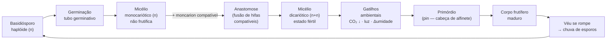
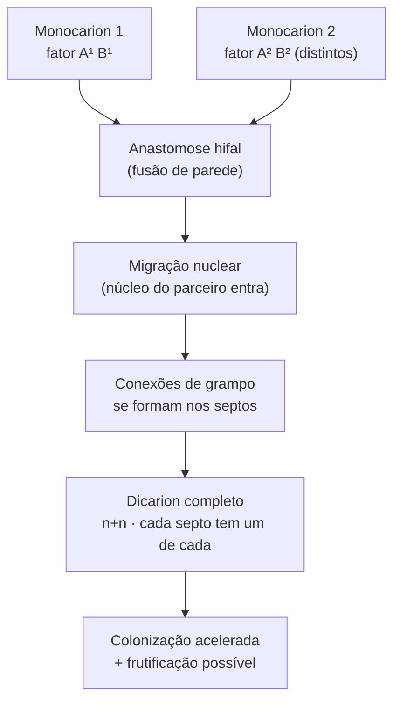
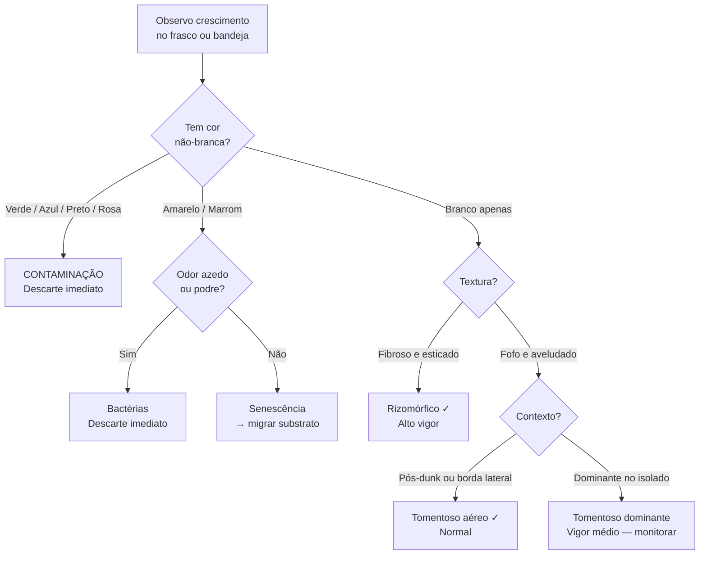
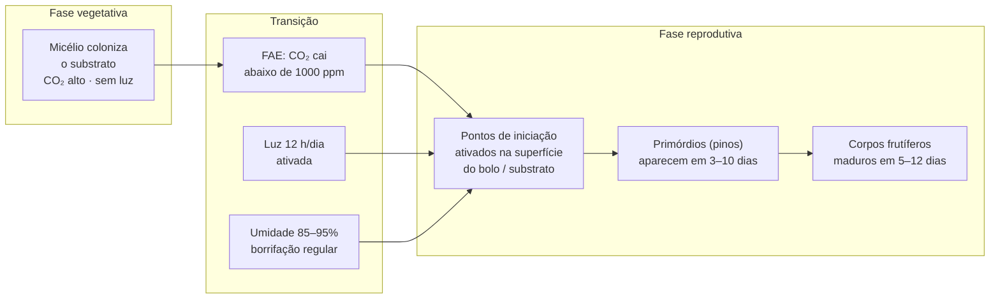
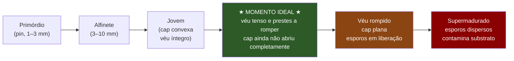

# Noções básicas sobre cogumelos

## Definição e enquadramento

O cogumelo que vemos é apenas o **corpo frutífero temporário** de um organismo maior: o micélio. Entender o ciclo de vida completo — esporo → monocarion → dicarion → primórdio → fruto → esporo — é o único fundamento real para controlar cada etapa do cultivo. Sem esse mapa, cada decisão (quando nascer o bolo, por que borrifar, quando colher) é cargo-cult: copiado sem compreensão, quebrado sem diagnóstico.

*Psilocybe cubensis* é a espécie de trabalho padrão para cultivo indoor. O motivo não é arbitrário: é a espécie com o melhor retorno por esforço (alta tolerância a erros, maior variedade de substratos aceitos, esporos amplamente disponíveis, frutificação vigorosa mesmo em condições subótimas).

---

## Ciclo de vida completo

**Nota sobre o dicarion:** cada compartimento hifal do micélio dicariótico abriga dois núcleos haplóides geneticamente distintos, mantidos em divisão síncrona pelas conexões de grampo. É essa coexistência nuclear que confere maior vigor, velocidade de colonização e capacidade de frutificação. [EFG p. 13] → [[Dicarionte]]

---

## O organismo real: o micélio

O que popularmente chamamos de "cogumelo" é equivalente à maçã de uma macieira — uma estrutura reprodutiva temporária. O **organismo real** é o micélio: uma rede tridimensional de hifas filiformes que coloniza o substrato por digestão extracelular.

**Como o micélio se alimenta:**
1. As pontas das hifas em crescimento secretam enzimas hidrolíticas (celulases, ligninases, proteases) diretamente no substrato.
2. Os polímeros do substrato (celulose, lignina, amido, proteínas) são clivados em monômeros.
3. Os monômeros são absorvidos por transporte ativo através da parede hifal para o citoplasma.
4. A energia produzida alimenta a extensão contínua das pontas das hifas em direção às zonas não colonizadas.

Essa digestão extracelular é o motivo pelo qual o micélio avança em frente da área já colonizada: ele está literalmente "abrindo caminho" enzimático. → [[Micélio como fenótipo emergente]]

**Implicação para o cultivo:** o substrato não é "terra" — é o alimento do organismo. A escolha de substrato (arroz, grão de centeio, coco, palha) determina quais enzimas o fungo precisa expressar e, portanto, quão bem um isolado específico vai se sair naquele meio.

---

## Do monocarion ao dicarion: a fusão que torna a frutificação possível

Basidiósporos germinam em micélio **monocariótico**: cada compartimento tem um único núcleo haploide. Esse estado é vegetativamente funcional — o micélio cresce, coloniza, compete — mas **não frutifica**.

A frutificação exige o estado **dicariótico**, formado pela fusão física (anastomose) entre duas hifas de micélios monocarióticos com fatores de acasalamento compatíveis:

**Por que o dicarion coloniza mais rápido:** a complementação de alelos entre os dois núcleos — cada um carregando versões diferentes dos genes metabólicos — resulta em maior diversidade enzimática e vigor heterótico. [EFG p. 39] → [[Anastomose hifal e dikaryotização]], [[Heterose vegetativa]]

**Conexões de grampo como marcador visual:** os grampos (clamp connections) são estruturas microscopicamente visíveis nos septos hifais. Sua presença confirma o estado dicariótico; ausência significa monocarion. Em *P. cubensis* cultivado a partir de esporos comerciais, a dikaryotização ocorre espontaneamente quando dois monocariontes compatíveis se encontram no substrato — na prática, o cultivador não precisa induzi-la deliberadamente. [EFG p. 14] → [[Conexão de grampo]]

---

## Morfologia colonial: leitura do micélio em crescimento

O fenótipo de crescimento micelial é o principal diagnóstico de vigor disponível sem equipamento especializado. Ele é visível a olho nu ao inspecionar frascos ou bandejas durante a colonização.

### Tabela diagnóstica completa

| Fenótipo | Aparência visual | Tato (quando aplicável) | Odor | Interpretação | Ação |
|---|---|---|---|---|---|
| **Rizomórfico** | Fibroso, ramificado, estrias longas; "aranhas de seda" sobre o substrato | Firme, tenaz | Nenhum / terroso suave | Alto vigor; probabilidade alta de frutificação | Selecionar; preservar genótipo |
| **Tomentoso** | Fofo, aveludado, denso; similar a algodão comprimido | Macio, solto | Nenhum / levemente fúngico | Normal; vigor mediano; frutificação possível mas mais lenta | Tolerar; monitorar; descartar se dominante no isolado |
| **Tomentoso pós-dunk** | Cobertura branca e aérea sobre o bolo após reidratação | Aéreo, fácil de soprar | Nenhum | Crescimento aéreo de proteção — NORMAL | Não descartar; aguardar |
| **Trichoderma** | Verde brilhante ou verde-escuro, pó superficial | — | Nenhum / doce | Contaminação grave | Descarte imediato fora de casa |
| **Penicillium** | Azul-verde, às vezes pó | — | Nenhum / mofo | Contaminação grave | Descarte imediato |
| **Aspergillus niger** | Preto úmido, circulares | — | Mofo/terra | Contaminação grave | Descarte imediato |
| **Bactérias** | Limo amarelo, marrom ou transparente; placas viscosas | Pegajoso | **Azedo, podre** | Contaminação por excesso de umidade + bactérias | Descarte; reduzir hidratação |
| **Senescência micelial** | Micélio ficando amarelo-palha, retraindo-se | — | Nenhum / envelhecido | Esgotamento de substrato ou subcultivo excessivo | Migrar para substrato fresco ou descartar |

### Árvore de diagnóstico rápido

→ [[Morfologia colonial do micélio]], [[Crescimento rizomórfico]], [[Crescimento tomentoso]]

---

## Gatilhos ambientais de frutificação

A transição do micélio vegetativo para a produção de primórdios não ocorre espontaneamente — exige sinais ambientais específicos que simulam a chegada do micélio à superfície do solo após colonizar o substrato subterrâneo.

| Gatilho | Sinal para o micélio | Resposta fisiológica | Ação no cultivo |
|---|---|---|---|
| **Queda de CO₂** | O micélio chegou a um espaço aberto (superfície do solo ou câmara de frutificação) | Ativação de genes de morfogênese reprodutiva | FAE (fresh air exchange): abrir câmara 2–3× por dia mínimo |
| **Luz (fotoperiodo)** | Sinal de "superfície exposta" — referência para orientação dos primórdios | Direcionamento do crescimento vertical dos pinos; fototaxia positiva | 12 h/dia de luz indireta (fluorescente ou LED branco, 6000K) |
| **Variação de umidade** | Simulação de ciclos naturais (orvalho, chuva, seca relativa) | Estimulação de expansão celular nos pontos de iniciação de primórdio | Borrifação 2–3× por dia; umidade 85–95% dentro da câmara |
| **Queda de temperatura** | Em *P. cubensis*: efeito secundário (tolerante); em *P. cyanescens*: gatilho primário | Estimula set de primórdios em espécies sensíveis à temperatura | Para *P. cubensis*: não essencial; para espécies avançadas: essencial |
| **Conteúdo de O₂** | Oxigênio suficiente para metabolismo aeróbico intenso do estágio reprodutivo | Sustenta a energia demandada pela diferenciação celular acelerada | Garante via FAE — O₂ chega com a renovação de ar |

→ [[Indução de frutificação — sinais ambientais]]

---

## Anatomia do corpo frutífero e timing de colheita

### Estrutura do cogumelo maduro

| Estrutura | Função | Relevância para colheita |
|---|---|---|
| **Píleo (cap / chapéu)** | Protege as lamelas e maximiza dispersão de esporos pelo vento | Forma convexa = imaturo; umbonada ou plana = maturando |
| **Lamelas / guelras** | Superfície de produção e liberação dos basidiósporos | Devem estar fechadas no momento da colheita |
| **Véu (anel parcial)** | Membrana que une a borda do píleo ao caule; protege as lamelas | Quando se rompe → chuva de esporos começa |
| **Estipe (caule)** | Sustentação estrutural e transporte de nutrientes do micélio ao píleo | Comprimento não indica maturidade; CO₂ alto = caule longo e fino |
| **Base do estipe** | Ponto de conexão com o micélio; massa de hifas | Torcer + puxar em rotação ao colher para não rasgar o substrato |

### Timing preciso de colheita

**Regra prática:** colher quando o véu está **esticado e prestes a romper, mas ainda íntegro**. Nesse ponto o concentrado de psilocibina está no pico e as lamelas ainda estão fechadas. Aguardar a ruptura do véu:
- Contamina o substrato com chuva de esporos (reduz a velocidade de colonização dos flushes seguintes)
- Permite a degradação enzimática da psilocibina em norbaeocystina e outros produtos secundários

**Coloração azul (bruising):** ao tocar ou pressionar o micélio ou o caule, pode surgir coloração azul-esverdeada rapidamente. Esse "azulamento" é a oxidação enzimática da psilocina ao contato com o oxigênio — é um **indicador indireto de presença de psilocina**, não de dano ou contaminação.

---

## Seleção de espécie: o princípio do ROI

O critério de seleção de espécie não é a potência mais alta possível — é o **retorno por esforço total investido** (dificuldade de cultivo + disponibilidade de esporos + tolerância a erro ambiental × potência por colheita).

| Espécie | Dificuldade | Esporos | Tolerância a erro | Potência relativa | Para quem |
|---|---|---|---|---|---|
| *P. cubensis* | ★☆☆☆☆ | Amplamente disponível | Alta | Média-alta | Qualquer nível; padrão de entrada |
| *P. cyanescens* | ★★★☆☆ | Disponível | Baixa (exige queda de temp) | Muito alta | Intermediário com espaço outdoor |
| *P. azurescens* | ★★★★★ | Restrito | Muito baixa (outdoor, litoral) | Máxima | Avançado com clima controlado |
| *P. semilanceata* | ★★★★★ | Difícil | Muito baixa (só cresce em prado com dewpoint específico) | Alta | Coleta selvagem — quase impossível de cultivar |
| *Psilocybe spp. tropicais* | ★★★☆☆ | Variável | Média | Variável | Intermediário+ com ambiente tropical |

**Por que *P. cubensis* vence para iniciantes:**
- Substrato: aceita BRF (arroz integral), grão de trigo/centeio, coco+verm, palha — praticamente tudo
- Temperatura: frutifica em 20–28°C (faixa doméstica sem controle)
- Umidade: tolera variações de 75–95% sem colapso imediato
- Velocidade: colonização em 2–3 semanas, frutificação em mais 1–2 semanas

---

## Integração com o bloco genético (EFG)

Os conceitos deste capítulo fundamentam diretamente o bloco genético do vault:

| Conceito prático | Fundamento genético | Nota de conceito |
|---|---|---|
| Dicarion frutifica; monocarion não | "It is only dikaryons that fruit in normal circumstances" [EFG p. 46] | [[Dicarionte]], [[Fatores de acasalamento A e B]] |
| Fusão de hifas compatíveis forma o dicarion | Anastomose hifal + migração nuclear dirigida por fatores A e B | [[Anastomose hifal e dikaryotização]] |
| Grampos como marcador do dicarion | "A specimen of this structure [clamp connection] has been identified in a fossil...290-million-years old" [EFG p. 14] | [[Conexão de grampo]] |
| Vigor maior no dicarion | "Recessive alleles will not be expressed by heterozygous dikaryotic mycelia, and such mycelia may show hybrid vigor" [EFG p. 39] | [[Heterose vegetativa]] |
| Fenótipos rizomórfico e tomentoso variam por cepa | Plasticidade fenotípica mediada por genótipo e condições de substrato | [[Plasticidade morfológica e dimorfismo fenotípico]] |

---

## Fronteira aberta

**Quantificação da luz como gatilho de primórdio:** a recomendação de "12 h de luz" é empírica consolidada no cultivo doméstico mas sem publicação de curva dose-resposta controlada por cepa para *P. cubensis* indoor. Não se sabe: qual espectro específico (azul/vermelho/branco) é mais eficiente; qual irradiância mínima em lux dispara a fototaxia; se o fotoperíodo importa ou apenas a presença de luz durante qualquer período.

**Azulamento como marcador quantitativo:** a correlação entre intensidade e velocidade do bruising e concentração de psilocina no tecido não foi padronizada. O azulamento rápido é interpretado como sinal de maior concentração, mas não há método colorimétrico calibrado disponível para uso doméstico.

---

## Recall

O que diferencia micélio monocariótico de dicariótico, e por que apenas um deles frutifica?
?
Monocariótico: um único núcleo haploide por compartimento hifal; não frutifica. Dicariótico (n+n): dois núcleos haplóides compatíveis por compartimento, sincronizados por conexões de grampo; é o único estado que produz primórdios e corpos frutíferos. O dicarion é formado pela fusão de dois monos compatíveis via anastomose hifal seguida de migração nuclear. [EFG p. 13, 46]

Qual é o momento ideal de colheita e o que acontece se o véu romper antes?
?
Colher quando o véu está esticado e prestes a romper, mas ainda íntegro — nesse ponto o pico de psilocibina coincide com lamelas fechadas. Após a ruptura: chuva de esporos sobre o substrato retarda os flushes seguintes (bactérias aceleram colonização do substrato espuriamente) e a psilocibina começa a ser degradada enzimaticamente.

O que significa crescimento tomentoso pós-dunk e por que não deve ser descartado?
?
Após a reidratação do bolo (dunk), o micélio frequentemente produz uma camada de crescimento aéreo fofo e branco sobre a superfície — é crescimento tomentoso de proteção, normal e esperado. Não indica contaminação. Contamination real tem COR (verde, preto, azul, rosa) e/ou ODOR (azedo, podre). Tomentoso é sempre branco sem odor.

Por que *Psilocybe cubensis* é a escolha padrão para iniciantes?
?
ROI: alta tolerância a erros ambientais (temperatura 20–28°C doméstica, umidade 75–95% tolerada), aceita substrato variado (BRF, grão, coco+verm, palha), esporos amplamente disponíveis, colonização rápida (2–3 semanas) e frutificação vigorosa sem controle preciso de gatilhos. Espécies mais potentes (*P. cyanescens*, *P. azurescens*) exigem controle ambiental avançado que invalida o ganho de potência para iniciantes.

Quais são os três gatilhos ambientais que disparam a produção de primórdios?
?
(1) Queda de CO₂ — FAE (fresh air exchange) 2–3× por dia simula chegada à superfície; (2) Luz indireta — 12 h/dia orienta o crescimento vertical dos pinos e sinaliza superfície exposta; (3) Variação de umidade — borrifação regular estimula pontos de iniciação de primórdio. Em *P. cubensis*, queda de temperatura não é gatilho obrigatório (diferente de *P. cyanescens*).

O que é o azulamento (bruising) do micélio e o que ele indica?
?
A coloração azul-esverdeada que aparece ao pressionar ou cortar micélio ou corpo frutífero é a oxidação enzimática da psilocina ao contato com o oxigênio atmosférico. Indica presença de psilocina no tecido — não é dano nem contaminação. A velocidade e intensidade do azulamento são usadas empiricamente como indicador qualitativo de potência, mas sem padronização analítica calibrada.
