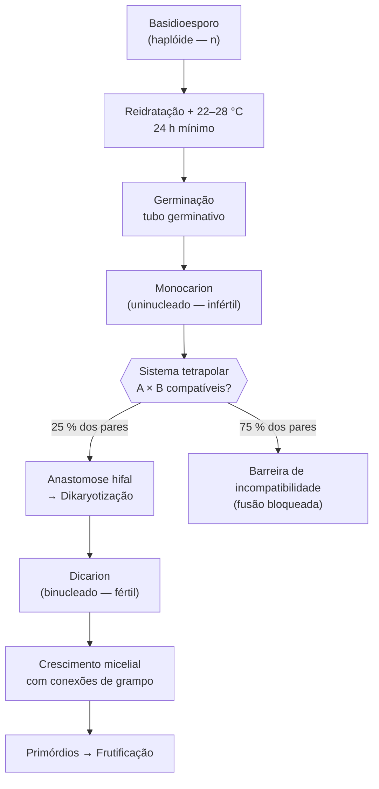
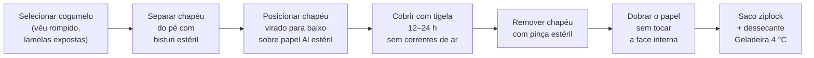
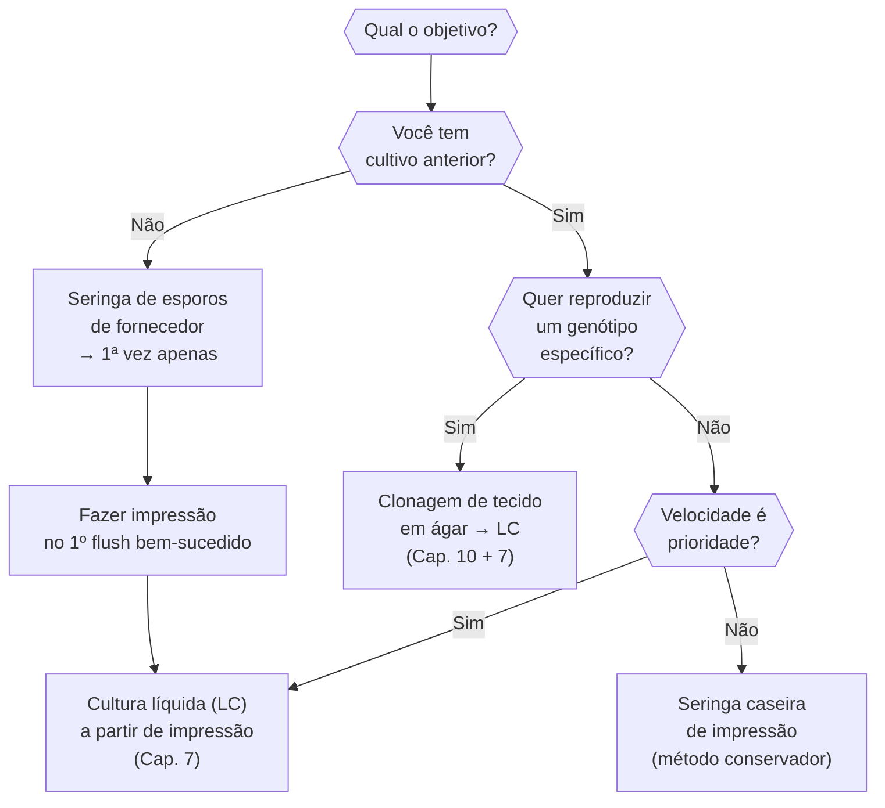
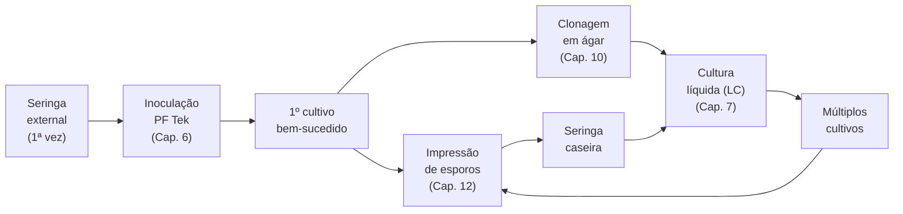
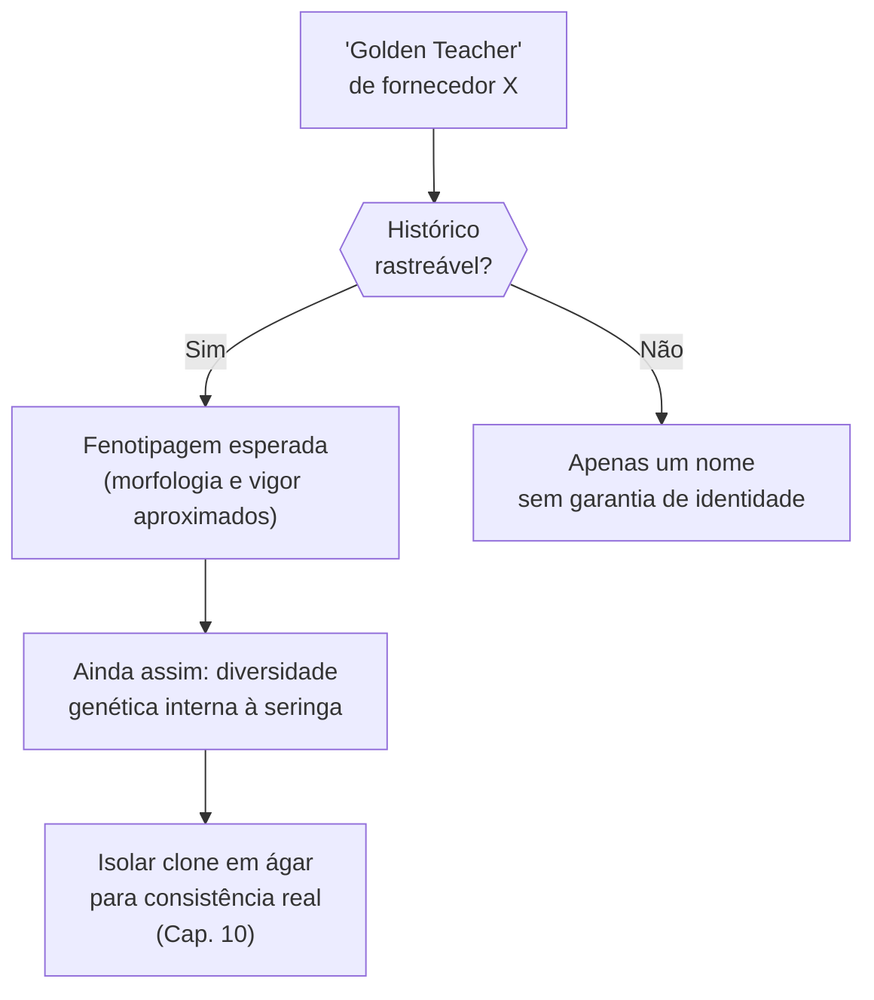

# Obtendo esporos

## Definição e enquadramento

Esporos são o ponto de entrada biológico e logístico do ciclo de cultivo. O desafio inicial — o **problema do bootstrap** — é que para cultivar você precisa de inóculo, e para ter inóculo você precisa de um cultivo anterior. A seringa de esporos de fornecedor confiável resolve essa contradição uma única vez; a partir do primeiro cultivo bem-sucedido, o objetivo passa a ser **autossuficiência genética**: criar o próprio ciclo de impressões, seringas e culturas líquidas sem dependência externa.

A escolha do inóculo não é só logística — é uma decisão genética. Uma seringa multi-espore traz diversidade genética irreprodutível; uma clonagem de tecido preserva o genótipo exato de um fruto eleito. Entender essa distinção é o que separa quem cultiva com consistência de quem depende da sorte do esporo. (PMB, Cap. 2)

## Biologia do esporo — do haploide ao dicarion

O basidioesporo de *P. cubensis* é uma célula **haploide** (n) encerrada em parede dupla de quitina e β-glucanos que permite sobrevivência anidrobiótica por anos em condições secas e frias. A germinação exige apenas dois gatilhos: reidratação e temperatura favorável (22–28 °C). Não há fotoperíodo obrigatório, estratificação a frio nem dormência química.

Ao germinar, o esporo emite um tubo germinativo que se ramifica em **monocarion** — micélio uninucleado, incapaz de frutificar. O monocarion só adquire capacidade reprodutiva ao se fundir com outro monocarion geneticamente compatível (**anastomose hifal**), formando o **dicarion**, em que dois núcleos de linhagens diferentes coexistem sincronizados por conexões de grampo. ([[Anastomose hifal e dikaryotização]], [[Dicarionte]])

**Por que 25%?** O sistema tetrapolar de *P. cubensis* possui dois loci de acasalamento independentes (A e B), cada um com múltiplos alelos. Dois monocarions são compatíveis apenas quando diferem nos dois loci simultaneamente — probabilidade de ½ × ½ = ¼ = 25%. Em uma seringa multi-espore com milhões de esporos, a dikaryotização ocorre espontaneamente dentro do substrato, pois a densidade é alta o suficiente para que pares compatíveis se encontrem. Em clonagem de tecido, o estado dicariótico já está estabelecido. ([[Fatores de acasalamento A e B]], EFG p. 37)

## Hierarquia de confiabilidade de fontes

| Fonte | Confiabilidade | Custo | Risco operacional | Razão |
|---|---|---|---|---|
| Próprio cultivo anterior (impressão caseira) | Máxima | Zero | Mínimo | Origem rastreável; histórico de vigor conhecido |
| Amigo cultivador confiável | Alta | Zero | Baixo | Reputação verificável por relação pessoal |
| Fornecedor online com histórico em comunidade | Boa | Baixo | Médio | Reputação pública; sem verificação laboratorial |
| Loja especializada | Variável | Médio | Médio | Qualidade inconsistente; sem rastreabilidade genética |
| Natureza (coleta direta) | Baixa | Zero | Alto | Risco de ID errada; contaminantes ambientais |

**Regra operacional:** rastreabilidade é o proxy de confiança. Fornecedores com histórico público verificável em fóruns como Shroomery são preferíveis a qualquer venda anônima. Seringas de fontes não verificadas devem passar por isolamento em ágar ([[Cap. 10 — Cultivo em ágar e isolamento clonal]]) antes de entrar no cultivo principal.

## Leitura e diagnóstico da seringa

Antes de inocular, inspecionar a seringa contra luz:

| Aspecto | Indicação | Ação |
|---|---|---|
| Suspensão acastanhada uniforme | Esporos em suspensão normal | Prosseguir |
| Partículas brancas visíveis flutuando | Possivelmente micélio iniciado — seringa ativa | Usar imediatamente ou refrigerar |
| Turvação leitosa difusa | Crescimento bacteriano | Descartar |
| Flocos verdes ou negros | Contaminação fúngica | Descartar imediatamente |
| Líquido completamente transparente | Esporos ausentes ou muito poucos | Verificar validade; isolar em ágar antes de usar |

Seringas de esporos saudáveis podem apresentar pequeno sedimento acastanhado no fundo — esporos mais densos que água sedimentam com o tempo. Agitar vigorosamente 30 segundos antes de usar para redistribuir.

## Protocolo — Impressão de esporos

A impressão captura basidioesporos por deposição gravitacional direta sobre superfície estéril. É o método de armazenamento de maior longevidade e o ponto de entrada para fazer seringas caseiras.

**Material:**
- Cogumelo maduro (véu rompido, lamelas expostas, sem apodrecimento)
- Folha de papel alumínio ou papel cartão esterilizado (autoclave ou forno 160 °C por 1 h)
- Tigela de vidro ou bowl suficiente para cobrir o chapéu
- Luvas e máscara

**Pontos críticos:**
- Nunca falar, tossir ou espirrar sobre a montagem aberta — aerossóis humanos são o principal vetor de contaminação em ambiente aberto
- Um ambiente limpo com janela fechada e sem movimentação de ar é suficiente; não é necessária câmara de fluxo para a deposição
- Uma única impressão contém 10⁷–10⁹ esporos — quantidade suficiente para dezenas de cultivos e seringas ao longo de anos
- O timing ideal é logo após a ruptura do véu: esporos ainda aderidos às lamelas; cogumelo ainda firme o suficiente para manipulação sem contaminação por líquido de apodrecimento

## Protocolo — Seringa caseira (de impressão para suspensão aquosa)

**Material:**
- Impressão de esporos
- Água destilada estéril (esterilizada por autoclave ou fervura 30 min com tampa fechada)
- Seringa estéril 10–20 mL + agulha 18G
- Frasco de vidro estéril (Mason jar pequeno) ou saco de seringa estéril

**Procedimento:**
1. Com agulha flambada e resfriada, raspar pequena área da impressão sobre 10 mL de água destilada estéril no frasco
2. Tampar o frasco e aguardar **24 h** à temperatura ambiente — reidratação obrigatória
3. Agitar suavemente antes de carregar a seringa
4. Aspirar com seringa, vedar agulha com cap estéril; refrigerar a 4 °C
5. Vida útil: 6–12 meses refrigerada; agitar antes de cada uso

**Por que esperar 24 h?** A parede do basidioesporo é composta por quitina e β-glucanos com permeabilidade muito baixa ao vapor d'água. A reidratação lenta restaura o turgor celular e ativa enzimas dormentes envolvidas na germinação. Esporos não reidratados germinam com taxa substancialmente reduzida mesmo em substrato ideal.

## Tipos de inóculo — comparativo

| Inóculo | Velocidade de colonização | Fidelidade genética | Preparo necessário | Vida útil refrigerado |
|---|---|---|---|---|
| Seringa de esporos | Lenta (germinação + dikaryotização in situ) | Baixa (diversidade multi-espore) | Zero — uso direto | 6–12 meses |
| Cultura líquida (LC) | Muito rápida (micélio ativo em suspensão) | Alta (clonal a partir do inóculo) | 3–7 dias em stirplate | 4–8 semanas |
| Slant em ágar (cultura oblíqua) | Rápida após retomada de crescimento | Alta (genótipo preservado) | 1–2 semanas em placa | 3–6 meses |
| Clonagem de tecido | Rápida após crescimento em ágar | Máxima (genótipo materno exato) | 2–4 semanas via ágar | Igual ao slant |

## Ciclo de autossuficiência

Uma seringa de qualidade é o suficiente para iniciar um ciclo indefinido — o investimento externo é feito uma única vez:

**LC como multiplicador de inóculo:** seringa de esporos = 1× de potência (esporos dormentes); LC bem estabelecida = 100×+ (micélio ativo que coloniza sem barreira de germinação, permite inocular dezenas de frascos a partir de um único frasco de 250 mL). ([[Cap. 07 — Cultura líquida fúngica]])

## Genética da multi-espore vs clonagem de tecido

### Multi-espore — diversidade como vantagem inicial

Uma seringa multi-espore contém esporos de múltiplos basídios, cada um produto de meiose com recombinação cromossômica independente. Ao inocular substrato, os monocarions germinados dikaryotizam aleatoriamente com parceiros compatíveis — resultado: **vários dicarions geneticamente distintos competindo no mesmo substrato**. O mais adaptado às condições do cultivador "vence" e produz a maioria dos frutos.

Esta heterogeneidade é favorável ao iniciante: a diversidade aumenta a chance de que pelo menos um genótipo se adapte às condições locais. É desfavorável para quem busca consistência: o "genótipo vencedor" muda a cada novo lote de multi-espore, e o vigor de um flush não garante o vigor do seguinte.

### Clonagem de tecido — preservação do genótipo

A clonagem transfere fragmento de tecido micelial interno de um cogumelo diretamente para ágar. As células são **dicarióticas já diferenciadas** — o clone herda o par de núcleos do cogumelo-mãe, incluindo o perfil epigenético daquele fruto específico. A dikaryotização não precisa ocorrer: o organismo já está no estado fértil.

**Custo da clonagem no longo prazo:** a propagação vegetativa sem recombinação meiótica acumula epimutações progressivamente. O fenômeno é registrado como [[Senescência clonal]] — declínio gradual de vigor após 5–15 gerações vegetativas. A prevenção é renovar o clone via esporo (reset meiótico) a cada 5–10 gerações, ou cruzar com outro clone para introduzir diversidade nuclear, sempre guardando impressão como seguro.

### Resumo comparativo

| Parâmetro | Multi-espore | Clonagem de tecido |
|---|---|---|
| Estado nuclear do inóculo | Haplóide → dikaryotização in situ | Dicariótico (já estabelecido) |
| Diversidade genética | Alta (recombinação meiótica) | Nula (cópia clonal) |
| Reprodutibilidade entre lotes | Baixa | Alta |
| Velocidade de colonização | Lenta (barreira da germinação) | Rápida (micélio ativo) |
| Risco de senescência clonal | Nenhum (reset meiótico a cada ciclo) | Moderado (acúmulo de epigenética) |
| Melhor uso | 1º cultivo; diversidade; seleção de genótipos | Escalonamento de cepa eleita com vigor confirmado |

## Armazenamento e viabilidade

| Formato | Viabilidade estimada | Condições | Reativação |
|---|---|---|---|
| Impressão em papel alumínio | 2–10 anos (anedótico) | Saco ziplock + dessecante, geladeira 4 °C | Seringa: raspar + reidratar 24 h |
| Seringa de esporos | 6–12 meses | Geladeira 4 °C, cap fechado | Agitar 30 s, usar diretamente |
| Cultura líquida | 4–8 semanas | Geladeira 4 °C; agitar antes de usar | Agitar, inocular diretamente |
| Slant em ágar | 3–6 meses | Geladeira; repassar a cada 6 meses | Transferir para novo slant ou LC |
| Sawdust block (−85 °C) | Anos | Ultrafreezer com glicerol 15% | Descongelar lentamente, ágar |

**Estratégia de redundância:** manter sempre **impressão** (backup de longo prazo, independente de energia) + **slant** (cópia operacional rápida) de pelo menos 2 cepas distintas. Nunca confiar somente em LC como único backup — vida útil curta e sensível a falha de refrigeração.

## Integração com genética fúngica (EFG)

| Conceito | Conexão com EFG | Referência |
|---|---|---|
| Basidioesporo haplóide | Produto de meiose do basídio; contém um único núcleo recombinado | EFG p. 13 |
| Germinação ativada por reidratação | Basidioesporos não requerem fotoperíodo; apenas água e temperatura | EFG p. 14 |
| Sistema tetrapolar A × B | Apenas pares com A diferente E B diferente dikaryotizam — probabilidade ¼ | EFG p. 37 |
| Anastomose como dikaryotização | Fusão hifal não é automática — barreiras de incompatibilidade vegetativa existem | EFG p. 45 |
| Clonagem preserva estado epigenético | Tecido dicariótico carrega padrões de metilação do ciclo de frutificação anterior | EFG p. 39 |

## Anti-padrões críticos

| Anti-padrão | Consequência | Solução |
|---|---|---|
| Comprar de vendedor anônimo sem histórico | Alto risco de material contaminado, inerte ou de identidade incorreta | Usar fornecedores com reputação verificável em fóruns públicos |
| Discutir cultivo com fornecedor | Viola o enquadramento legal de "exame microscópico"; encerra a relação comercial | Comunicação estritamente técnica |
| Descartar cogumelos do 1º flush sem impressão | Quebra do ciclo de autossuficiência; força nova compra externa | Reservar 1–2 cogumelos maduros por flush antes da colheita final |
| Usar multi-espore para escalonamento sem isolamento | Inconsistência genética entre lotes; queda de vigor sem causa aparente | Isolar clone em ágar (Cap. 10) antes de escalar com LC |
| Propagar vegetativamente sem renovação | Senescência clonal: declínio de vigor em 10–15 gerações; eventual colapso do cultivo | Renovar via esporo a cada 5–10 gerações; guardar impressão sempre |
| Não reidratar esporos de impressão 24 h antes | Taxa de germinação reduzida; falha de colonização sem causa diagnosticada | Aguardar 24 h em água estéril antes de usar |
| Inocular com seringa turva ou com flocos coloridos | Introdução direta de contaminante no substrato | Inspecionar à luz; descartar qualquer sinal atípico; isolar em ágar se dúvida |

## Cepas — o que o nome representa e o que não representa

Uma **cepa** (strain) é uma linhagem genética nomeada dentro de uma espécie. Em *P. cubensis*, os nomes populares (Golden Teacher, B+, Penis Envy, Albino A+) referem-se a **populações de esporos** estabelecidas por cultivadores, não a linhagens clonais definidas laboratorialmente. O que o nome garante:

- Uma consistência fenotípica aproximada entre coleções que têm histórico rastreável (fornecedor → fornecedor)
- Um perfil de crescimento e morfologia que se repete quando a origem é confiável

O que o nome **não garante**:
- Identidade genética precisa (cada seringa multi-espore é geneticamente única)
- Potência específica (sem padronização laboratorial de metabólitos secundários)
- Desempenho idêntico ao de outra fonte com o mesmo nome

**Implicação prática:** o nome da cepa é um ponto de partida, não um destino. A consistência real só vem com isolamento clonal em ágar e seleção fenotípica. Uma cepa sem nome mas originada de isolado clonal bem documentado é mais confiável do que qualquer nome famoso sem rastreabilidade.

### Características fenotípicas de cepas comuns de P. cubensis

| Cepa | Velocidade colonização | Morfologia | Observação |
|---|---|---|---|
| Golden Teacher | Moderada | Chapéus amplos, pé espesso | Tolerante a variações; boa para iniciantes |
| B+ | Rápida | Primórdios abundantes, frutos grandes | Alta produtividade em substrato rico |
| Penis Envy | Lenta | Pé espesso, chapéu pequeno, véu tardio | Difícil; multi-spore tem germinação irregular |
| Albino A+ | Moderada | Ausência de pigmento; leucístico | Fenotipicamente estável; esporos albinos raros |
| Ecuador | Moderada-rápida | Robusta, tropical | Tolera temperaturas mais altas |

**Nota sobre Penis Envy:** é um fenótipo recessivo com dificuldade de germinação em multi-espore — a maioria das seringas comerciais contém cruzamentos de PE com outras cepas para facilitar. Para manter o fenótipo puro, é necessário isolamento clonal rigoroso. (PMB, Cap. 2)

## Avaliação de risco ao receber esporos de fonte externa

Antes de usar qualquer seringa de origem externa no cultivo principal, uma avaliação de risco simples evita perdas:

| Critério | Positivo | Negativo | Ação se negativo |
|---|---|---|---|
| Fornecedor com histórico em fórum público | Sim | Não | Não comprar ou isolar em ágar obrigatório |
| Seringa com aparência visual normal | Transparente/levemente turva | Turva leitosa, flocos coloridos | Descartar ou isolar em ágar |
| Data de fabricação conhecida | Dentro de 12 meses | Desconhecida ou > 18 meses | Isolar em ágar, verificar viabilidade |
| Múltiplas compras com resultado consistente | Sim | Primeira vez | Isolar em ágar antes de escalar |

**Protocolo de quarentena:** para qualquer seringa de origem nova ou duvidosa, inocular primeiro uma placa de ágar MEA/PDA antes de usar em substrato. Observar por 7–14 dias. Apenas monocarions de aspecto saudável (micélio branco fluido, sem setorização, sem contaminação visível) avançam para cultivo. ([[Cap. 10 — Cultivo em ágar e isolamento clonal]])

## Fronteira aberta

A afirmação de viabilidade de impressões por "vários anos" é anedótica para *P. cubensis* — não há estudos com controles de temperatura, umidade relativa e densidade de viáveis versus total ao longo do tempo. Também permanece sem caracterização precisa o mecanismo de senescência clonal em basidiomicetos: se segue o padrão epigenético de *Neurospora crassa* (ascomicotos, H3K27me3) ou opera por vias distintas ainda não descritas. A taxa de germinação de esporos em suspensão aquosa versus esporos secos em impressão como função do tempo também não foi quantificada para esta espécie. (PMB, Cap. 2; EFG p. 39)

## Recall

Qual a diferença fundamental entre inocular com seringa multi-espore vs cultura líquida, do ponto de vista genético e de velocidade?
?
Multi-espore: esporos haplóides dormentes que precisam germinar, encontrar parceiro compatível (25% dos pares) e dikaryotizar in situ — diversidade genética alta, colonização lenta, resultado variável entre lotes. LC: micélio dicariótico ativo — genótipo preservado do inóculo, sem barreira de germinação, colonização muito mais rápida, resultado consistente. LC é sempre superior para escalonamento; multi-espore é o ponto de entrada quando não há cultivo anterior.

---

Por que apenas 25% dos pares de esporos de uma mesma impressão conseguem dikaryotizar entre si?
?
P. cubensis tem sistema tetrapolar com dois loci de acasalamento independentes (A e B), cada um com múltiplos alelos. Para dikaryotizar, dois monocarions devem diferir SIMULTANEAMENTE nos dois loci — probabilidade ½ × ½ = ¼ = 25%. Pares que diferem em apenas um lócus ou não diferem em nenhum formam barreira de incompatibilidade vegetativa e não fundem. Em substrato com alta densidade de esporos, a dikaryotização ocorre espontaneamente porque os pares compatíveis acabam se encontrando.

---

Qual o protocolo correto para seringa caseira a partir de impressão, e por que o tempo de reidratação de 24 h importa?
?
(1) Raspar fragmento de impressão com agulha flambada sobre 10 mL de água destilada estéril; (2) aguardar 24 h à temperatura ambiente — basidioesporos têm parede de quitina de alta impermeabilidade; a reidratação restaura turgor celular e ativa enzimas dormentes; sem essa etapa, a taxa de germinação cai substancialmente mesmo com esporos viáveis; (3) agitar 30 s; (4) aspirar e vedar; (5) refrigerar.

---

Quando usar clonagem de tecido em vez de seringa multi-espore, e qual o risco principal no longo prazo?
?
Clonagem é indicada quando se quer reproduzir um genótipo específico com vigor ou fenótipo confirmado — preserva o estado nuclear dicariótico exato do cogumelo-mãe. Risco principal: senescência clonal. A propagação vegetativa sem recombinação meiótica acumula epimutações que causam declínio gradual de vigor após 5–15 gerações. Tratamento: renovar o clone via esporo (reset meiótico) a cada 5–10 gerações; manter sempre impressão de backup.

---

Qual a hierarquia de armazenamento de inóculo por vida útil e qual deve ser o backup de longo prazo?
?
Impressão em papel alumínio (2–10 anos, geladeira com dessecante) > slant em ágar (3–6 meses, geladeira) > seringa aquosa (6–12 meses, geladeira) > LC (4–8 semanas, geladeira). Impressão é o backup de longo prazo por combinar vida útil máxima, baixo custo e independência de energia. LC é o inóculo operacional de curto prazo para cultivo ativo. Nunca manter apenas LC como único backup.

---

Quais os dois anti-padrões mais custosos ao final do primeiro cultivo, e como evitá-los?
?
(1) Não fazer impressão de esporos — quebra o ciclo de autossuficiência; força nova compra externa. Solução: reservar 1–2 cogumelos maduros de cada flush antes da colheita final. (2) Não isolar clone em ágar antes de escalar — propaga diversidade multi-espore, gerando inconsistência genética entre lotes e queda de vigor sem diagnóstico. Solução: após o primeiro flush, clonar o melhor cogumelo em ágar (Cap. 10) e usar esse clone como base para LC e grain spawn nos ciclos seguintes.
