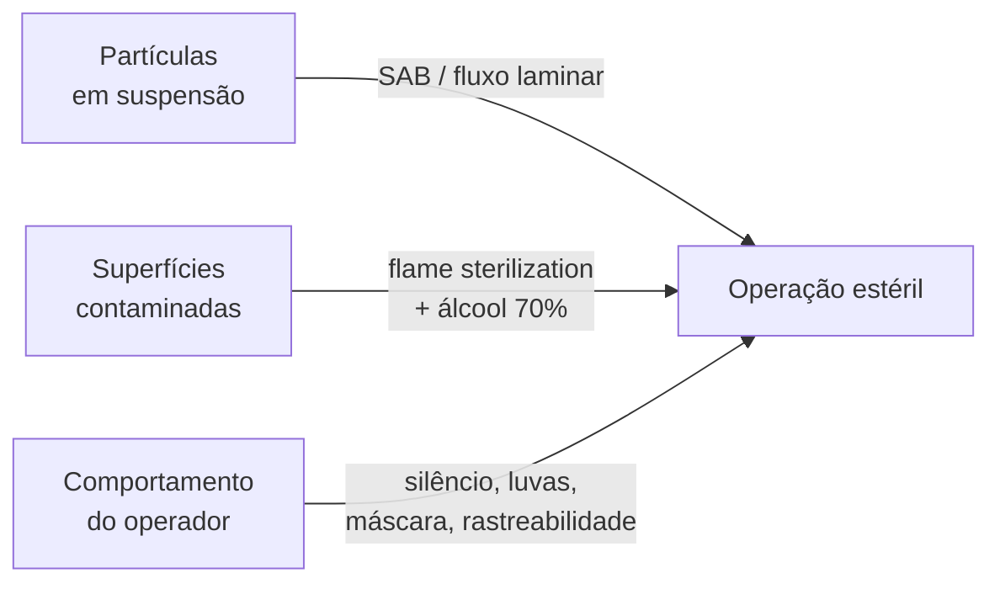

# Técnica estéril no cultivo fúngico

## Definição

Conjunto de práticas que minimizam a introdução de microrganismos competidores em substratos de cultivo fúngico, fundamentado no controle de três vetores — partículas em suspensão no ar, superfícies não esterilizadas e comportamento do operador — em um ambiente de trabalho adequado ao nível de risco da operação. (PMB, Cap. 3, p. 31)

## Hierarquia de ambientes de trabalho

| Nível | Ambiente | Operações adequadas | Limitação |
|---|---|---|---|
| 1 — Ideal | Copa de fluxo laminar HEPA | Todas — remove 99,9% de partículas ≥ 0,3 µm | Custo elevado |
| 2 — Bom | Porta-luvas (glove box) | Inoculação de grão, transferência ágar, G2+ | Sem filtro HEPA |
| 3 — Aceitável | SAB (Still Air Box) | Inoculação com seringa (PF Tek, LC) | Ar parado, não filtrado |
| 4 — Arriscado | Bancada limpa (sala preparada) | Apenas operações de baixíssimo risco | Exposição ao ar ambiente |

## Protocolo SAB — Still Air Box

A SAB usa o banheiro como câmara de trabalho por ser o menor cômodo da casa — menos ar, menos partículas em suspensão.

1. Remover toalhas, escovas, papel e produtos de prateleira.
2. Preparar solução bleach 10%: 100 ml de água sanitária + 900 ml de água em borrifador.
3. Pulverizar de cima para baixo e de trás para frente; sair pela porta borrifando; tampar fresta inferior com toalha.
4. Aguardar 10 min para a névoa assentar os contaminantes.
5. Entrar devagar sem correntes de ar; usar máscara cirúrgica e luvas de látex.
6. Trabalhar rapidamente; não falar em direção ao substrato aberto.

**Escolha de desinfetante:** bleach 10% para desinfecção de ambientes; álcool 70% para instrumentos e pele. Nunca usar álcool em névoa em espaço fechado com chama — risco de explosão.

## Tríade de vetores e controles

**Flame sterilization:** aquecer agulha de seringa até ficar vermelha; esfriar 3 seg tocando borda de ágar vazia antes de inserir em substrato. Realizar antes de *cada* introdução, não apenas na abertura do frasco.

## Rastreabilidade como controle sistêmico

Cada frasco, saco ou placa deve registrar: data de inoculação, fonte do inóculo (LC/esporo + data da fonte), substrato e cepa. Padrões de contaminação sistemática só são identificáveis em registros escritos — memória falha sob carga cognitiva de múltiplos cultivos. → [[Cap. 11 — Contaminantes — diagnóstico e prevenção]]

## Fronteira aberta

O limiar mínimo de UFC/mL de contaminante aéreo capaz de causar perda detectável de colônia em substrato de grão de centeio a 26 °C não foi determinado para *Psilocybe cubensis* em condições de cultivo doméstico. (PMB, Cap. 3)

## Recall

Qual o agente desinfetante correto para ambientes versus instrumentos no protocolo SAB, e por quê não se troca?
?
Bleach 10% para ambientes (não inflamável, eficaz em névoa, barato); álcool 70% para instrumentos e pele. Álcool em névoa dentro de espaço fechado com chama cria atmosfera explosiva — os dois desinfetantes têm aplicações distintas e não são intercambiáveis.
