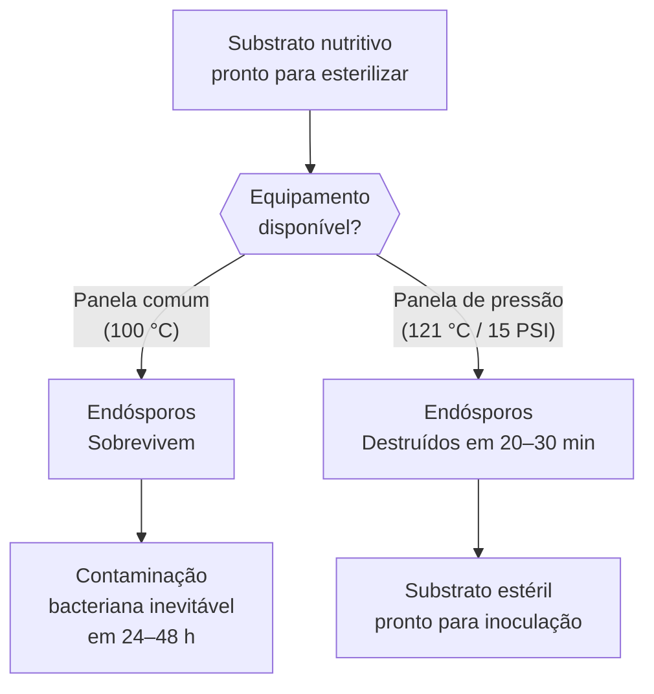
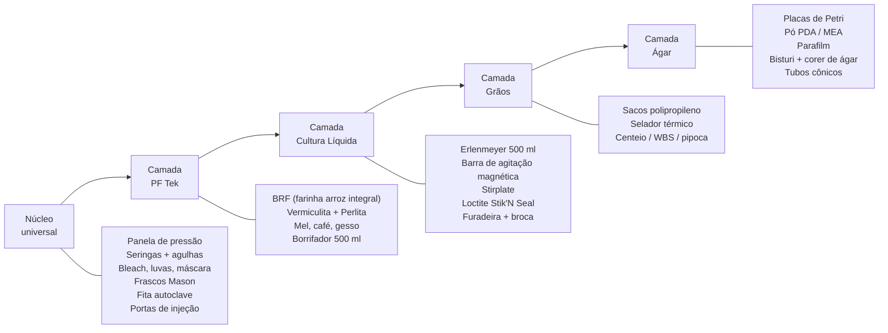
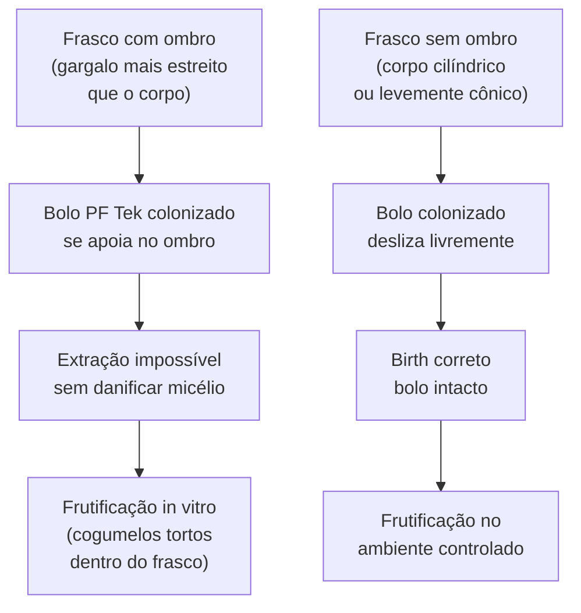
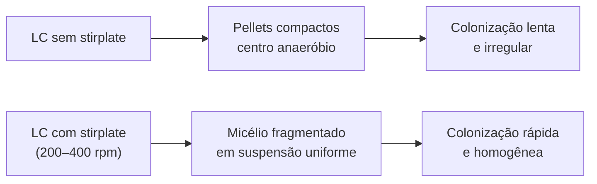

# Equipamentos e suprimentos

## Definição e enquadramento

O inventário de equipamentos escala diretamente com o nível de complexidade do método escolhido: PF Tek básico exige apenas itens de supermercado e horticultura; métodos intermediários (LC, grãos, ágar) adicionam camadas progressivas. O erro mais comum do iniciante é **superdimensionar na compra inicial** — adquirir stirplate, Erlenmeyer e placas de Petri antes de dominar a técnica básica da panela de pressão.

A lógica inversa também é um erro: tentar economizar omitindo equipamentos de controle de esterilidade é falsa economia. A panela de pressão é o único item com investimento real; o restante do núcleo universal é barato. (PMB, Cap. 4)

## Física da esterilização — por que 121 °C importa

O obstáculo central da esterilização não são bactérias vegetativas (mortas acima de 65–80 °C) — são os **endósporos bacterianos** de *Bacillus* spp. e *Clostridium* spp. O endósporo é uma estrutura de dormância com parede multilaminada resistente ao calor, radiação e dessecação. A 100 °C (ponto de ebulição da água em pressão atmosférica), endósporos sobrevivem indefinidamente.

A 121 °C sob 15 PSI (1 atm de pressão manométrica), a temperatura superaquece o vapor úmido o suficiente para desnaturar as proteínas estruturais do endósporo em minutos. O parâmetro de eficácia é o **valor D** — tempo em minutos a temperatura T necessário para reduzir a população em 90%. Para endósporos de *B. stearothermophilus* (referência microbiológica):

| Temperatura | Valor D aprox. | Efeito em 20 min |
|---|---|---|
| 100 °C (panela comum) | > 60 min | População reduzida < 1 log — insuficiente |
| 115 °C | ~5 min | Redução 4 log — parcialmente eficaz |
| 121 °C | ~1 min | Redução > 12 log — esterilização comercial |

**Por que isso importa na prática:** substratos nutritivos ricos em amido e proteína (BRF, grãos) são o habitat ideal para *Bacillus* spp. Uma única falha na esterilização não produz contaminação imediata visível — o frasco parece limpo até 48–72 h após inoculação, quando a população bacteriana explode e turbidece o substrato. O diagnóstico tardio é o motivo pelo qual cultivadores inexperientes culpam a inoculação quando o problema estava na esterilização. (PMB, Cap. 4; [[Reação de Maillard em esterilização úmida de grãos]])

## Panela de pressão — o equipamento central

A panela de pressão é o único equipamento sem substituto real no cultivo além do PF Tek mais básico. Toda técnica que usa substrato nutritivo (BRF, grãos, LC em frasco) requer esterilização a 121 °C.

### Tipos e escolha

| Tipo | Capacidade útil | Adequação | Observação |
|---|---|---|---|
| Panela de pressão doméstica 4–6 L | 4–6 frascos ½ L | Iniciante | Suficiente para PF Tek; limitada para grãos |
| Panela de pressão doméstica 8–10 L | 8–10 frascos ½ L | Padrão recomendado | Margem para lotes maiores sem superdimensionar |
| Panela de pressão 15–23 L | 12–20 frascos | Intermediário-avançado | Exige fogão de alta potência; mais cara |
| Autoclave laboratório | Ilimitada | Avançado | Custo elevado; temperatura e tempo programáveis |

**Critério de capacidade:** usar no máximo 75% da capacidade volumétrica total da panela para garantir circulação de vapor. Frascos empilhados diretamente sobre o fundo podem não atingir 121 °C no centro da pilha — usar grelha separadora e verificar após ≥ 30 min a pressão estabilizada para BRF, ≥ 90 min para grãos em sacos.

### Parâmetros de operação por substrato

| Substrato | Pressão alvo | Tempo mínimo | Risco de sub-esterilização |
|---|---|---|---|
| BRF + vermiculita (frascos PF) | 15 PSI | 60–90 min | Moderado — BRF tem alto conteúdo de amido |
| Grãos (WBS, centeio, pipoca) | 15 PSI | 90–120 min | Alto — endósporos em cascas de grãos |
| Cultura líquida (mel em água) | 15 PSI | 20–30 min | Baixo — solução diluída, penetração rápida |
| Ágar (PDA/MEA em placa) | 15 PSI | 20 min | Baixo — camada fina, penetração total |

## Escalonamento de equipamentos por método

| Camada | Método | Itens essenciais |
|---|---|---|
| 1 — Núcleo universal | Todos | Panela de pressão 8–10 L, seringas 10 ml + agulhas 18G, bleach, luvas látex, frascos Mason boca-larga ½ L sem ombros, fita autoclave, máscaras |
| 2 — PF Tek | PF Tek | BRF, vermiculita, perlita, mel, café instantâneo, gesso, borrifador 500 ml |
| 3 — Cultura líquida | LC | Erlenmeyer 500 ml, barra de agitação magnética, Loctite Stik'N Seal, furadeira + broca, stirplate |
| 4 — Grãos | Spawn de grão | Sacos de polipropileno (PP), selador térmico, centeio / WBS / pipoca |
| 5 — Ágar | Isolamento clonal | Placas de Petri, pó PDA / MEA, Parafilm, bisturi, corer de ágar, tubos cônicos |

## Equipamentos de inoculação — portas de injeção e seringas

### Por que portas de injeção eliminam o risco de abertura

A abertura do frasco para inoculação é o momento de maior risco de contaminação — expõe o substrato estéril ao ar ambiente por segundos. As **portas de injeção de silicone** eliminam esse risco: a agulha perfura o plug, injeta o inóculo e o plug se fecha pelo próprio elasticidade do silicone. Nenhuma troca de ar ocorre.

| Componente | Material | Propriedade crítica | Alternativa inferior |
|---|---|---|---|
| Plug de injeção | Silicone autoclavável | Autovedante após retirada da agulha; sobrevive 121 °C | Borracha natural (degrada no autoclave) |
| Cola de fixação | Loctite Stik'N Seal / Unibond | Impermeável + resistente a 121 °C | Colas genéricas (falham sob vapor) |
| Agulha | Inox 18G | Calibre ideal: inóculo flui sem pressão excessiva | Calibre menor (entope com esporos/micélio) |

### Seringas — uso e reesterilização

- **Entre frascos do mesmo lote (mesma cepa, mesma fonte):** flambar a agulha na chama por 5–10 s e resfriar antes de cada frasco. Não trocar de seringa.
- **Entre lotes distintos:** usar seringa diferente. Cruzamento de micélio entre lotes pode mascarar contaminações iniciais.
- **Nunca reutilizar agulha sem reesterilização:** agulha usada retém micélio e contaminantes no bisel; inoculação seguinte introduz os contaminantes do frasco anterior.

## Frascos de contenção — geometria importa

### Frascos Mason — o problema do ombro

**Regra:** frascos Mason devem ter boca larga (wide mouth) e corpo cilíndrico. Frascos tipo "regular mouth" com ombros pronunciados aprisionam o bolo e impossibilitam o birth adequado. ([[Cap. 06 — Método PF (Brown Rice Flour Tek)]])

### Erlenmeyer para cultura líquida

O formato cônico com gargalo estreito do Erlenmeyer serve dois propósitos simultâneos: (1) concentra o vapor durante esterilização no topo, onde a tampa está — reduz pressão diferencial que poderia comprometer a vedação; (2) permite agitação vigorosa no stirplate sem derramamento, mesmo com volume até 60% da capacidade nominal.

Para LC, usar volumes de 250–500 ml como padrão de trabalho. Volumes maiores aumentam o risco de contaminação por manuseio e a massa térmica dificulta a esterilização uniforme.

## Perlita e vermiculita — umidade passiva vs estrutura

Dois minerais com funções distintas que frequentemente são confundidos:

| Mineral | Composição | Mecanismo | Aplicação no cultivo |
|---|---|---|---|
| **Perlita** | Vidro vulcânico expandido | Alta área superficial → evaporação rápida de água depositada → umidade relativa passiva alta | Camada base do shotgun FC e Martha tent para manutenção de HR 80–95% |
| **Vermiculita** | Silicato de magnésio expandido termicamente | Estrutura laminar porosa → retenção de água + aeração do substrato | Componente do BRF Tek (estrutura do bolo) + camada protetora superior nos frascos |

**Perlita:** umedecer com água não clorada e escorrer o excesso. A evaporação de 1–2 cm de perlita úmida no fundo de uma banheira de plástico mantém HR de 80–95% sem nebulizador, por simples transpiração. ([[Cap. 05 — Fazendo seu próprio hardware]])

**Vermiculita:** não possui valor nutricional — o micélio não a coloniza. Funciona exclusivamente como suporte mecânico e buffer de umidade no bolo. A camada protetora de 1–2 cm de verm seca sobre o substrato BRF no frasco retarda a invasão por contaminantes vindos pelo topo.

## BRF — farinha de arroz integral

BRF (Brown Rice Flour) é o substrato nutricional do PF Tek. A granulometria fina (< 0,5 mm) aumenta a área superficial de contato do micélio, acelerando a colonização. Duas regras operacionais:

1. **Moer no dia da preparação:** farinha fresca tem odor neutro e umidade controlada. Farinha moída com antecedência absorve umidade do ar, desenvolve rancidez e cria microambiente favorável a contaminantes antes mesmo da esterilização.
2. **Usar moedor de café dedicado:** não usar o moedor familiar sem limpeza prévia rigorosa — resíduos de café criam substrato diferenciado que altera pH e pode inibir o micélio.

## Fita autoclave — lendo o indicador corretamente

A fita autoclave contém tiras de tinta que mudam de cor quando expostas a temperatura e vapor acima de certo limiar. A mudança de cor confirma que **a superfície externa do pacote atingiu temperatura adequada** — não que o interior esteja estéril.

**O que a fita indica:** o processo de esterilização foi iniciado e a temperatura de superfície foi atingida.  
**O que a fita não indica:** que o centro do frasco ou do saco atingiu 121 °C pelo tempo necessário; que o conteúdo está isento de endósporos viáveis.

**Uso correto:** colar fita em cada frasco ou saco antes de autoclavar. Após o ciclo, verificar se todas as fitas mudaram de cor. Se alguma não mudou, o lote inteiro deve ser re-esterilizado — a fita que não mudou indica posição de baixa temperatura no interior da panela (geralmente centro da pilha ou fundo sem grelha).

## Selador térmico e sacos de polipropileno

Para spawn de grão, os sacos de polipropileno substituem os frascos Mason porque: (1) acomodam volumes maiores por ciclo de autoclave; (2) o polipropileno suporta 121 °C sem deformar; (3) o selador térmico cria vedação hermética sem necessidade de tampa rosqueada.

**Escolha do saco:** polipropileno (PP) transparente de espessura 3–5 mil (milésimos de polegada). Polietileno (PE) não suporta autoclave — derrete ou distorce a 121 °C. O marcador de identificação: PP é semi-rígido e "estalinha" ao ser dobrado; PE é flácido e silencioso.

**Selador térmico:** modelos de barra de solda (impulse sealers) de 20–30 cm são adequados para sacos de até 25 cm de largura. Configuração correta: tempo de pulso suficiente para fundir as duas camadas sem carbonizar — teste em saco vazio antes de usar nos lotes. Uma selagem dobrada (duas passadas) aumenta a segurança de vedação.

**Portas de filtro FAP nos sacos:** sacos de grão mais avançados têm um filtro FAP (0,3–0,5 μm) embutido na lateral que permite troca gasosa (O₂ + CO₂) sem entrada de esporos contaminantes. São a escolha profissional; o selador fecha apenas a abertura superior. ([[Cap. 08 — Spawn de grão]])

## Checklist — primeiro cultivo PF Tek (6 frascos)

| Local de compra | Item | Qtd | Observação |
|---|---|---|---|
| Supermercado | Frascos Mason boca-larga ½ L sem ombros | 6 | Verificar formato antes de comprar |
| Supermercado | Arroz integral, mel, café instantâneo, gesso | 1 un. cada | Moer arroz no dia de uso |
| Horticultura | Vermiculita, perlita | 1 saco cada | Vermiculita: granulometria fina preferida |
| Online / especializada | Panela de pressão 8–10 L | 1 | Investimento principal; reutilizável por anos |
| Online / especializada | Portas de injeção de silicone autoclaváveis | 6 | 1 por frasco |
| Online / especializada | Fita autoclave | 1 rolo | Indicador por lote |
| Online / especializada | Seringas 10 ml + agulhas 18G | 3 | 1 por cepa + 2 reserva |
| Farmácia / loja | Bleach sem perfume, luvas látex, máscara cirúrgica | — | Renovar a cada cultivo |
| Online | Borrifador 500 ml | 1 | Álcool 70% + água para superfícies |

**Itens a evitar na primeira compra:** microscópio, stirplate, Erlenmeyer, placas de Petri. Estes fazem parte das camadas 3–5 e só trazem retorno quando a técnica básica estiver dominada.

## Stirplate e equipamentos de cultura líquida

A stirplate é o equipamento-chave da camada 3 que transforma a LC de "inóculo lento" para "multiplicador de alta velocidade". Sem agitação, o micélio em suspensão forma pellets densos que crescem na periferia mas têm centro anaeróbio e inativo — má penetração ao inocular substrato. Com stirplate, o movimento constante fragmenta os pellets, distribui oxigênio e mantém toda a biomassa ativa.

**Velocidade de rotação:** 200–400 rpm é a faixa ideal. Abaixo de 200 rpm, pellets se formam novamente. Acima de 500 rpm, fragmentação excessiva das hifas produz fragmentos muito pequenos (< 100 μm) que perdem viabilidade. Stirplates com controle de velocidade graduado são preferíveis a modelos de liga/desliga com velocidade fixa.

**Cola Loctite Stik'N Seal nas tampas de Erlenmeyer:**

O ponto crítico da montagem do frasco de LC é a vedação entre a tampa e os tubos de injeção/ventilação. A cola deve:
- Ser impermeável a vapor d'água (não inchar sob pressão)
- Resistir a 121 °C por 20–30 min sem descolar
- Secar em 24 h antes do primeiro ciclo de autoclave

Colas instantâneas de cianoacrilato (Super Bonder) falham sob vapor — a ligação cianoacrilato hidrolisa em ambiente úmido quente. Silicone de aquário (não acetico) é alternativa aceitável a Loctite para tampas não metálicas.

## Ambiente de trabalho e zona estéril

O ambiente de trabalho é a primeira linha de defesa contra contaminação. Dois setups são usados dependendo do nível:

| Setup | Custo | Eficácia | Limitação |
|---|---|---|---|
| SAB (Still Air Box) — caixa de ar parado | Baixíssimo | Alta para iniciante | Sem filtração; depende de sedimentação gravitacional de partículas |
| Câmara de fluxo laminar | Alto | Profissional | Exige filtro HEPA + blower; manutenção periódica |
| Área limpa improvisada (banheiro pós-banho quente) | Zero | Moderada | Não recomendada para trabalho com grãos ou ágar |

**Como o SAB funciona:** uma caixa plástica translúcida (banheira de 60–80 L) virada de lado cria um volume de ar confinado. Sem movimento, as partículas > 1 μm sedimentam em ~15 min. A inoculação ocorre nesse período de ar "parado" — não estéril, mas com densidade de partículas muito menor que o ambiente aberto. Spray de álcool 70% nas paredes internas e nas luvas antes de iniciar reduz ainda mais a carga. ([[Cap. 03 — Técnica estéril no cultivo fúngico]])

**Protocolo de uso do SAB:**
1. Spray álcool 70% em todas as superfícies internas
2. Aguardar 5 min (sedimentação + evaporação do álcool)
3. Inserir todos os materiais necessários (seringa, frasco, álcool, isqueiro)
4. Não mexer desnecessariamente dentro da caixa
5. Não falar, tossir, espirrar
6. Trabalhar em movimentos lentos e deliberados — movimentos rápidos geram turbulência e ressuspendem partículas

## Integração com Notas do vault

| Equipamento | Fenômeno biológico ligado | Nota |
|---|---|---|
| Panela de pressão (tempo/pressão de grãos) | Reação de Maillard cria cor marrom e compostos de Maillard que podem inibir micélio se excessivos | [[Reação de Maillard em esterilização úmida de grãos]] |
| Tempo de autoclave em grãos | Subprodutos furânicos (HMF) formados em temperaturas altas inibem crescimento micelial | [[Resposta micelial a subprodutos furânicos]] |
| Escolha do grão para spawn | Composição de amido e proteína varia por cereal — afeta velocidade de colonização e risco de Maillard | [[Composição química de cereais para spawn]] |
| Concentração de ágar nas placas | Rigidez do gel altera morfologia colonial — instrumento de seleção fenotípica | [[Reologia do ágar como seletor fenotípico]] |

## Anti-padrões críticos

| Anti-padrão | Consequência | Solução |
|---|---|---|
| Usar panela comum (100 °C) | Endósporos sobrevivem; contaminação bacteriana em 24–48 h após inoculação | Panela de pressão sem substituto |
| Frascos com ombros | Bolo preso; frutificação in vitro ou dano ao micélio na extração | Frascos Mason boca-larga, corpo cilíndrico |
| Cola inadequada nas portas de injeção | Vedação falha sob vapor; lote inteiro contaminado de forma difusa | Loctite Stik'N Seal ou Unibond exclusivamente |
| Moer BRF com antecedência | Farinha absorve umidade; acidifica; contaminantes estabelecidos antes da esterilização | Moer no dia da preparação |
| Reutilizar agulha sem flambar | Micélio do frasco anterior é transferido; cruzamento de contaminantes | Flambar antes de cada frasco; nova seringa entre lotes |
| Frascos com resíduos de uso anterior | Resíduo orgânico = substrato extra para contaminantes | Lavar + esterilizar em dishwasher; inspecionar antes de usar |
| Comprar microscópio antes de panela de pressão | Nenhum impacto na taxa de sucesso inicial; gasto deslocado | Microscópio é camada 6+; panela é camada 1 |
| Pilha de frascos sem grelha separadora | Centro da pilha pode não atingir 121 °C; fitas de fundo sem mudança de cor | Sempre usar grelha metálica; checar fitas após ciclo |

## Equipamentos para trabalho em ágar

O trabalho em ágar (camada 5) exige precisão em escala milimétrica — qualquer abertura desnecessária de placa cria ponto de contaminação. O conjunto mínimo:

| Equipamento | Função | Detalhe técnico |
|---|---|---|
| Placas de Petri (90 mm, plástico descartável ou vidro) | Superfície de crescimento de colônia | Plástico: descartável; vidro: reutilizável após autoclave |
| Parafilm | Vedar placa após inoculação | Esticar 30–40% para vedação hermética; não dobrar sobre si mesmo |
| Bisturi #22 ou #10 | Recortar e transferir fragmento de colônia | Flambar na chama + resfriar 5 s antes de cada corte |
| Corer de ágar (4–8 mm diâmetro) | Recortar discos uniformes para transferência | Resultado mais uniforme que bisturi para transferências em série |
| Tubos cônicos de 50 ml com tampa rosqueada | Armazenar slants (culturas oblíquas) de longo prazo | Autoclave com tampa levemente afrouxada; apertar após resfriamento |

**Parafilm:** o erro mais comum é não esticar ao aplicar — Parafilm sem tensão não veda; Parafilm bem esticado (levemente translúcido) adere à placa criando barreira semi-impermeável que reduz drasticamente a desidratação e a entrada de esporos do ar.

## Fronteira aberta

O impacto exato do tempo de esterilização além do mínimo (60 min para BRF, 90 min para grãos) sobre a formação de subprodutos de Maillard e inibidores furânicos não está quantificado para cada cereal em particular. A recomendação de 90–120 min para grãos é empírica; estudos controlados medindo concentração de HMF e viabilidade micelial em função do tempo de autoclave ainda não foram publicados para *P. cubensis* em condições domésticas. (PMB, Cap. 4; [[Resposta micelial a subprodutos furânicos]])

## Recall

Qual equipamento é o único indispensável para qualquer método além de PF Tek básico, e por que panela comum não é substituta?
?
A panela de pressão. Panelas comuns atingem no máximo 100 °C (pressão atmosférica) — temperatura insuficiente para destruir endósporos de *Bacillus* spp. A panela de pressão mantém 121 °C a 15 PSI, onde o valor D de endósporos é ~1 min. Em 20–30 min a 121 °C, a população de endósporos é reduzida > 12 log — esterilização efetiva. Sem isso, qualquer substrato nutritivo (BRF, grãos) é colonizado por bactérias antes do micélio.

---

Por que frascos com ombros comprometem o PF Tek, e qual o critério correto de seleção de frasco?
?
O ombro (gargalo mais estreito que o corpo do frasco) aprisionam o bolo de BRF colonizado depois que o micélio cresceu e o bolo ficou ligeiramente maior que o gargalo. A extração (birth) danifica o micélio ou é impossível, forçando frutificação in vitro (cogumelos tortos dentro do frasco). Critério correto: frasco Mason boca-larga com corpo cilíndrico ou levemente cônico divergindo do fundo para o topo — o bolo desliza para fora sem resistência.

---

O que a fita autoclave confirma e o que ela não confirma?
?
Confirma que a superfície externa do frasco ou saco atingiu temperatura suficiente para a mudança de cor da tinta — indicador de que o ciclo de esterilização foi realizado. NÃO confirma que o interior do substrato atingiu 121 °C pelo tempo necessário para destruir endósporos; não garante esterilidade. Uso correto: colar em cada item; após o ciclo, qualquer fita sem mudança de cor indica posição fria na panela — relançar o lote inteiro.

---

Qual a diferença funcional entre perlita e vermiculita no cultivo, e onde cada uma é usada?
?
Perlita (vidro vulcânico expandido): alta área superficial → evaporação passiva de água depositada → manutenção de umidade relativa alta (80–95%) sem nebulizador. Usada na base do shotgun FC e Martha tent. Vermiculita (silicato expandido termicamente): estrutura laminar porosa → retenção de água + aeração do substrato; sem valor nutricional para o micélio. Usada no bolo BRF Tek (estrutura) e como camada protetora superior no frasco. Confundir as duas leva a umidade insuficiente no FC ou bolo denso demais que colapsa.

---

Por que o BRF deve ser moído no dia da preparação, e qual o risco de moer com antecedência?
?
Farinha fresca tem granulometria controlada, umidade interna baixa e pH neutro. Farinha armazenada absorve umidade do ar, o que: (1) eleva o teor de água acima do ideal para o bolo PF Tek; (2) favorece oxidação de lipídios do arroz integral (rancidez); (3) cria microhabitat para contaminantes que começam a colonizar antes mesmo da esterilização. Usar moedor de café dedicado (não o doméstico com resíduos) e moer 30 min antes de misturar.

---

Qual a sequência correta de escalonamento de equipamentos, e por que seguir essa ordem protege o investimento inicial?
?
Camada 1 (universal): panela de pressão + seringas + frascos + bleach + luvas. Camada 2 (PF Tek): BRF + verm + perlita + borrifador. Camada 3 (LC): Erlenmeyer + stirplate + Loctite. Camada 4 (grãos): sacos PP + selador térmico. Camada 5 (ágar): placas + bisturi + Parafilm. Seguir a ordem protege porque cada camada só agrega valor se a anterior foi dominada — comprar stirplate antes de dominar PF Tek resulta em equipamento parado e potencial de desperdício em técnica mais complexa antes de ter base sólida de esterilidade.
