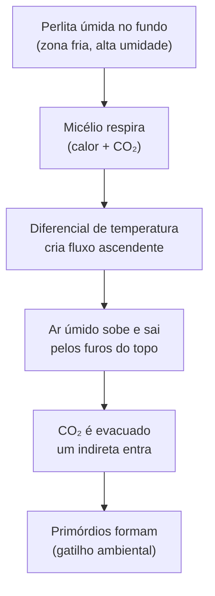

# Fazendo seu próprio hardware

## Definição

Três itens de hardware são essenciais para cultivo doméstico: terrário shotgun (câmara de frutificação), porta-luvas (glove box) e câmara Martha tent (para escala maior). Todos podem ser construídos com materiais baratos por uma fração do custo do equivalente comprado. A sequência de construção reflete a sequência de necessidade no cultivo. (PMB, Cap. 5)

## Hierarquia de construção

| Prioridade | Item | Quando necessário | Custo relativo |
|---|---|---|---|
| 1 | Terrário shotgun | Antes do primeiro flush (PF Tek) | Muito baixo |
| 2 | Porta-luvas (glove box) | Melhora esterilidade em todos os processos | Baixo |
| 3 | Stirplate | Somente se adotar cultura líquida | Baixo |
| 4 | Martha tent | Somente para substrato a granel em escala | Médio |

## Princípio do terrário shotgun

O terrário funciona por **gradiente de pressão passivo** — sem ventilador nem umidificador elétrico:

**Recipiente:** banheira de plástico **transparente** com tampa. Transparência não é estética — é gatilho funcional: a luz indireta é sinal de fixação para primórdios. Recipiente opaco reduz rendimento. Furos de ¼ polegada a cada 5 cm em todas as faces (topo, laterais e fundo): ~200–250 furos no total.

## Especificações dos 4 itens DIY

| Item | Materiais principais | Parâmetro crítico |
|---|---|---|
| Terrário shotgun | Banheira transparente + broca ¼ polegada | Transparência obrigatória; furos uniformes sem forçar (evitar rachaduras) |
| Porta-luvas | Banheira 60 L + tubos PVC 4" + silicone + clipes Jubilee | Luvas levemente maiores que as mãos; sem etanol aceso dentro |
| Stirplate | Ventilador PC 12V + 2 ímãs de terras raras + caixa | Controlador de velocidade obrigatório — velocidade excessiva rompe micélio |
| Martha tent | Armário portátil + tubo PVC perfurado + nebulizador de névoa fria | Névoa **fria** (não vapor quente) — umidificador de vapor altera temperatura |

## Preparação do terrário para uso

1. Enxaguar perlita — correr água fria até parar de pingar.
2. Espalhar perlita enxaguada no fundo: camada de 3–5 cm nivelada.
3. Posicionar quadrados de papel alumínio sobre a perlita (base dos bolos — impede micélio de penetrar na perlita).
4. Elevar o terrário 2,5 cm com 4 objetos iguais nos cantos (fluxo de ar por baixo).
5. Posicionar com luz solar indireta — parede perpendicular à janela, nunca voltado direto para ela. → [[Cap. 06 — Método PF (Brown Rice Flour Tek)]]

## Fronteira aberta

A densidade de furos (espaçamento, diâmetro) e sua relação com a taxa de troca de ar no terrário shotgun não foi medida experimentalmente; o design de ¼ polegada a cada 5 cm é empírico. A eficácia do gradiente de pressão passivo pode variar com o volume do recipiente e a umidade relativa ambiente. (PMB, Cap. 5)

## Recall

Por que o recipiente do terrário shotgun deve ser transparente e não pode ser substituído por um opaco mesmo que perfurado da mesma forma?
?
A luz indireta é um dos gatilhos de fixação (formação de primórdios) — sinaliza ao micélio que atingiu a superfície do solo. Recipiente opaco bloqueia esse gatilho, resultando em rendimentos abaixo do padrão mesmo com CO₂, umidade e temperatura corretos. Os furos perfuram a câmara mas não substituem o estímulo luminoso.
