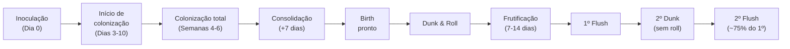

# Método PF (Brown Rice Flour Tek)

## Definição

Protocolo de cultivo indoor criado por Robert McPherson ("Psylocybe Fanaticus") em 1991: substrato de farinha de arroz integral (BRF) + vermiculita em frascos Mason esterilizados a 15 PSI, inoculados via seringa, colonizados a ~21 °C e frutificados em câmara de shotgun após dunk & roll. Da inoculação à primeira colheita: 6–8 semanas; 2–3 flushes por bolo. (PMB, Cap. 6, p. 77)

## Formulação do substrato por frasco

| Componente | Volume | Função |
|---|---|---|
| Vermiculita | 120 ml | Aeração, retenção de umidade, barreira física |
| BRF (farinha de arroz integral) | 60 ml | Fonte de carbono e nitrogênio |
| Água + café instantâneo | 55 g + 1 col. chá | Hidratação; café = suplemento nitrogenado opcional |
| Gesso (CaSO₄) | ½ col. chá | Antiaderente, estabilizador de pH |

**Preparo:** misturar água + café → adicionar à vermiculita → incorporar BRF e gesso. Encher até o pescoço do frasco, não até o topo. Camada de vermiculita seca até o topo como barreira protetora. Cobrir com papel alumínio + fita autoclave em cruz (cria 4 pontos de injeção).

## Esterilização e inoculação

**Esterilização:** panela de pressão a 121 °C / 15 PSI por 20 min, frascos sobre tripé acima da água. Resfriar completamente dentro da panela antes de inocular — inocular quente mata os esporos. → [[Cap. 03 — Técnica estéril no cultivo fúngico]]

**Inoculação em SAB:** aquecer agulha até vermelho, esfriar 3 seg; inserir nos 4 pontos marcados pela fita; inclinar a ponta para o vidro. Total: 2 cc por frasco (0,5 cc por ponto). Rotular com data, cepa e fonte.

## Fases da colonização

**Critério de birth:** 100% de colonização visual (sem pontos brancos, incluindo o fundo) + 7 dias extras de consolidação. Birth precoce aumenta contaminação; consolidação incompleta reduz produção de primórdios.

## Dunk & Roll — reidratação e frutificação

**Dunk:** mergulhar o bolo extraído em água fria por 24 h na geladeira. Cogumelos são ~90% água; o dunk recarrega a umidade perdida durante o flush e é a principal alavanca de rendimento dos flushes subsequentes.

**Roll:** rolar o bolo reidratado em vermiculita seca; aumenta retenção de umidade superficial. No 2.º flush: dunk sem roll — vermiculita nova aprisionaria contaminantes adquiridos na superfície.

**Câmara de frutificação (shotgun FC):** bolos sobre quadrados de papel alumínio na perlita enxaguada; borrifar paredes internas 2–3×/dia (nunca os bolos); soprar CO₂ a cada borrifada; luz indireta 12 h/dia. Colher antes do véu romper. → [[Indução de frutificação — sinais ambientais]]

## Fronteira aberta

A taxa de conversão entre biomassa de BRF colonizada e rendimento seco acumulado em 3 flushes não foi padronizada por isolado de *P. cubensis*; variação genotípica e condições de câmara tornam comparações diretas entre cultivos domésticos não confiáveis. (PMB, Cap. 6)

## Recall

Qual o critério correto de birth no PF Tek e o que acontece se for feito 7 dias antes do prazo?
?
100% de colonização visual + 7 dias adicionais de consolidação. Birth precoce expõe o bolo antes que a rede hifal periférica esteja firmada — maior risco de contaminação superficial e menor formação de primórdios no primeiro flush.
