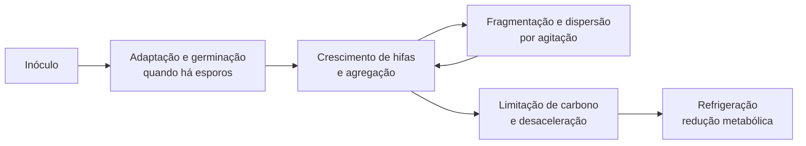

# Cultura líquida fúngica

## Definição e função

Cultura líquida (LC, *liquid culture*) é um meio aquoso com uma fonte diluída
de carbono no qual se mantém micélio vivo em suspensão. Ela converte uma
pequena quantidade de inóculo em numerosos fragmentos hifais distribuíveis por
seringa. Ao contrário de uma seringa de esporos, que contém propágulos
dormentes, uma LC micelial contém biomassa metabolicamente ativa e elimina a
etapa de germinação no substrato receptor. (PMB, Cap. 7, pp. 125–126)

A LC é uma etapa de expansão, não um método de isolamento ou uma garantia de
pureza. Sua principal vantagem é multiplicar rapidamente um inóculo já
caracterizado; sua principal limitação é que bactérias, leveduras e fungos
competidores também podem se multiplicar no mesmo volume sem produzir sinais
visuais inequívocos. Por isso, ela deve permanecer subordinada à
[[Cap. 03 — Técnica estéril no cultivo fúngico|técnica asséptica]], à inspeção
em [[Cap. 10 — Cultivo em ágar e isolamento clonal|ágar]] e a um teste
funcional antes do escalonamento.

## Posição na cadeia de cultivo

O uso de LC reduz o tempo entre inoculação e crescimento visível, mas também
amplifica qualquer erro presente na cultura de origem. Um frasco contaminado
pode atuar como fonte comum de falha para todo o lote de
[[Cap. 08 — Spawn de grão — preparação e uso|spawn de grão]].

## Formulação do meio

O protocolo do PMB usa 12 g de mel e 288 g de água, totalizando 300 g de meio.
Isso corresponde a **4% de mel em massa no meio final**, não a 4% de açúcares
puros. Como o mel contém água e sua composição varia entre lotes, a
concentração efetiva de carboidratos é inferior e variável. O livro também
aceita extrato de malte claro e xaropes, mas a mesma massa de produtos
distintos não fornece necessariamente a mesma quantidade de açúcar. (PMB,
pp. 128, 132–133)

| Componente ou parâmetro | Referência do PMB | Interpretação técnica |
|---|---:|---|
| Mel | 12 g | Fonte heterogênea de glicose, frutose e compostos minoritários |
| Água | 288 g | Água de torneira é aceita pelo livro; não exige água destilada |
| Meio final | 300 g | Formulação com 4% m/m de mel |
| Barra magnética | 1 por frasco | Permite dispersão sem abertura do recipiente |
| Frasco de referência | 16 oz | O volume nominal não deve ser confundido com volume útil |

O livro prefere mel porque ele combina açúcares e componentes minoritários,
mas não demonstra experimentalmente que sacarose ou dextrose isoladas
produzam menor biomassa em *P. cubensis*. Portanto, essa preferência deve ser
lida como recomendação prática do manual, não como comparação controlada.
Também não há dados no capítulo que sustentem um limiar universal no qual
concentrações abaixo de 4% impeçam germinação ou concentrações acima de 4%
causem necessariamente escurecimento.

## Recipiente e barreiras físicas

O sistema descrito utiliza um frasco resistente ao calor, uma porta de injeção
de silicone e um orifício de troca gasosa protegido por Tyvek. A porta reduz a
necessidade de abrir o frasco; o filtro permite difusão gasosa e precisa
permanecer seco e íntegro. A construção, os materiais e a resistência térmica
das vedações pertencem ao conjunto de
[[Cap. 04 — Equipamentos e suprimentos|equipamentos de cultura líquida]].

| Componente | Função | Falha relevante |
|---|---|---|
| Porta de injeção | Entrada e retirada por agulha | Perfuração repetida, fissura ou vedação incompleta |
| Filtro de Tyvek | Troca gasosa com retenção de partículas | Umidade, rasgo, descolamento ou contato com líquido |
| Barra magnética | Dispersão de agregados hifais | Agitação excessiva ou barra sem esterilização |
| Espaço de cabeça | Reserva para gás e mistura | Frasco excessivamente cheio reduz mistura e aumenta respingos |

A tampa é uma barreira de redução de risco, não uma superfície
intrinsecamente estéril. O septo deve ser desinfetado antes de cada acesso, e a
agulha e a seringa não devem introduzir material de um recipiente anterior.

## Processamento térmico

O PMB recomenda pressão de 15 psi, correspondente aproximadamente a 121 °C,
mas apresenta uma inconsistência interna: o texto afirma que **15 minutos**
seriam suficientes, enquanto o procedimento ilustrado manda manter a pressão
por **10 minutos**. O capítulo não fornece validação microbiológica, curva de
letalidade, volume máximo nem posição do sensor. Esses valores são, portanto,
parâmetros do protocolo descrito, não um limite universal de esterilização.
(PMB, pp. 133–135)

O livro chama o escurecimento de “caramelização” e o atribui a uma reação entre
açúcares e aminoácidos. Quimicamente, essa descrição corresponde melhor à
[[Reação de Maillard em esterilização úmida de grãos|reação de Maillard]].
Caramelização estrita é degradação térmica de açúcares sem participação
obrigatória de grupos amino. Em um meio aquoso de mel, podem coexistir:

- reação de Maillard entre açúcares redutores e compostos nitrogenados;
- degradação de hexoses e formação de compostos furânicos;
- desnaturação e agregação de proteínas, percebidas como flocos;
- escurecimento crescente conforme tempo, temperatura, pH e composição.

Meio âmbar indica processamento térmico mais intenso, mas não prova, sozinho,
que todos os carboidratos se tornaram não metabolizáveis. Flocos claros após o
aquecimento também não demonstram contaminação: o próprio livro os atribui à
agregação de proteínas e outros compostos naturais do mel. A decisão deve ser
baseada em controle não inoculado, crescimento subsequente e teste de pureza.

## Origem do inóculo e estado nuclear

### LC iniciada por esporos

Uma suspensão multiespórica introduz numerosos genomas haploides. Os esporos
precisam germinar; hifas compatíveis devem realizar
[[Anastomose hifal e dikaryotização|anastomose e dikaryotização]] antes que se
estabeleçam linhagens dicarióticas. O frasco pode conter múltiplos
pareamentos, setores e genótipos competindo no mesmo meio. Ele não constitui
uma linhagem clonal apenas porque a biomassa cresce em um único recipiente.

O PMB relata germinação em aproximadamente três a sete dias, mas a duração
depende da viabilidade dos esporos, da temperatura, da composição do meio e da
carga inicial. Crescimento tardio não distingue baixa viabilidade de
contaminação ou condição ambiental inadequada.

### LC iniciada por cultura em ágar

Um fragmento de ágar colonizado transfere a organização nuclear e o citoplasma
da região amostrada. Quando a cultura de origem é um
[[Dicarionte|dicarionte]] produtivo, a expansão líquida propaga
vegetativamente esse estado n+n, sem meiose e sem a recombinação associada à
produção de novos esporos.

Isso aumenta a repetibilidade, mas “clonal” não significa identidade absoluta
e indefinida. A [[Propagação vegetativa]] conserva a composição presente no
inóculo ao mesmo tempo que permite mutações somáticas, segregação de núcleos,
alterações de proporção nuclear e seleção de variantes adaptadas ao meio.
Segundo EFG p. 39, núcleos de heterocariontes podem responder à pressão
seletiva e originar ramos com proporções nucleares diferentes.

| Origem | Estado inicial | Variabilidade esperada | Melhor interpretação |
|---|---|---|---|
| Suspensão multiespórica | Esporos haploides dormentes | Alta | População em formação |
| Ágar multiespórico | Micélio já pareado, possivelmente setorizado | Moderada a alta | Cultura mista selecionada em placa |
| Isolado dicariótico em ágar | Micélio vegetativo n+n | Menor, não nula | Propagação de uma linhagem selecionada |
| Tecido de basidiocarpo em ágar | Dicarião do tecido amostrado | Menor após purificação | Clone vegetativo do indivíduo amostrado |

## Crescimento submerso e agitação

Após a inoculação, fragmentos hifais formam agregados suspensos, descritos no
PMB como “nuvens”. A agitação fragmenta agregados, redistribui nutrientes e
gases e aumenta o número de extremidades capazes de retomar crescimento. O
livro recomenda iniciar após o aparecimento dos primeiros aglomerados e usa
uma agitação diária como referência, sem definir velocidade ou duração.

O gráfico de fases usado pelo livro é um modelo geral de crescimento
microbiano. Líquido mais claro e agregados densos são sinais operacionais de
consumo do meio, mas não medem biomassa, açúcar residual nem entrada exata em
fase estacionária. Turbidez homogênea, película superficial, sedimento fino ou
alteração de cor exigem investigação, pois podem refletir organismos que não
formam agregados semelhantes ao micélio-alvo.

## Inoculação e transferência

O PMB usa 1–2 ml de suspensão de esporos para iniciar o frasco e 1–2 ml de LC
para inocular recipientes de PF Tek ou grãos. Esses volumes são referências do
manual, não doses universais: a quantidade adequada depende da concentração de
biomassa e do teor de água tolerado pelo substrato receptor.

Para retirar agregados, o livro recomenda agulhas entre 14 e 21 gauge,
aproximadamente 1,6 a 0,8 mm de diâmetro externo, e cerca de 40 mm de
comprimento. Quanto maior o número gauge, menor o diâmetro. Obstrução recorrente
indica agregados grandes demais, agitação insuficiente ou geometria inadequada
para a porta, e não deve ser resolvida com pressão abrupta sobre o êmbolo.

## Controle de qualidade

### O que a inspeção visual pode e não pode afirmar

Micélio branco, agregados densos e líquido progressivamente claro são
compatíveis com uma LC saudável, mas não comprovam identidade ou pureza.
Mofos jovens podem ser brancos; bactérias e leveduras podem permanecer
discretas; precipitados do mel podem ficar incorporados aos agregados. A
distinção completa pertence ao diagnóstico de
[[Cap. 11 — Contaminantes — diagnóstico e prevenção|contaminantes]].

### Fluxo de liberação

1. Manter um controle de meio processado, mas não inoculado, para comparar
   turbidez, cor e precipitados.
2. Transferir uma pequena amostra da LC para ágar e observar se surge uma única
   morfologia micelial sem colônias bacterianas, leveduriformes ou fúngicas
   divergentes.
3. Inocular um recipiente-piloto de substrato e acompanhar velocidade, odor,
   distribuição e morfologia de colonização.
4. Escalar apenas após resultados concordantes; ágar avalia pureza aparente,
   enquanto o piloto avalia desempenho funcional.

O teste em ágar também pode introduzir contaminação durante a amostragem. Um
resultado positivo isolado deve ser interpretado junto de controles da
transferência, e não atribuído automaticamente ao frasco de origem.

## Armazenamento e estabilidade

O PMB recomenda refrigerar depois de formada uma quantidade suficiente de
biomassa, manter o frasco na prateleira superior e proteger a tampa com papel
alumínio quando houver risco de gotejamento sobre o filtro. O frio desacelera o
metabolismo; não interrompe completamente consumo de reservas, envelhecimento
ou seleção interna.

O relato de culturas viáveis por “até um ano” é experiência prática dos
autores, sem curva de viabilidade, número de réplicas ou ensaio específico para
*P. cubensis*. Não deve ser convertido em prazo de validade garantido. A
retomada deve ser confirmada em ágar e em pequeno lote antes do uso.

Subcultivos sucessivos também não equivalem a preservação genética ilimitada.
EFG pp. 156–157 documenta rearranjos mitocondriais associados a alterações de
crescimento em ascomicetos mantidos por longo tempo e senescência causada por
plasmídeos mitocondriais em *Podospora anserina*. Esses mecanismos não foram
demonstrados como causa de [[Senescência clonal]] em *P. cubensis*, mas
impedem tratar estabilidade vegetativa indefinida como fato estabelecido.

## Diagnóstico de falhas

| Observação | Hipóteses compatíveis | Decisão técnica |
|---|---|---|
| Nenhum crescimento aparente | Inóculo inviável, baixa carga, temperatura inadequada ou meio excessivamente processado | Aguardar o intervalo esperado e testar a fonte em ágar |
| Meio âmbar após pressão | Escurecimento térmico e formação de produtos de reação | Comparar com controle e verificar crescimento; não inferir esterilidade ou inviabilidade apenas pela cor |
| Flocos logo após aquecimento | Proteínas ou compostos do mel agregados | Usar controle não inoculado para distinguir de crescimento |
| Manchas escuras estáveis dentro dos agregados | Esporos, precipitados ou partículas do inóculo | Monitorar; testar em ágar antes de escalar |
| Manchas que aumentam ou mudam de cor | Crescimento de contaminante | Isolar o frasco e não usar no lote |
| Turbidez uniforme ou película | Bactéria, levedura ou outro organismo disperso | Reprovar até investigação em ágar |
| Filtro molhado | Perda da barreira seca e possível entrada de contaminantes | Isolar; não considerar o frasco confiável |
| Agulha obstruída | Agregados grandes ou dispersão insuficiente | Interromper a transferência; não forçar o êmbolo |
| Piloto coloniza de modo irregular ou com odor atípico | Inóculo misto ou substrato contaminado | Reprovar o escalonamento e revisar controles |

## Limites da evidência

- O PMB é um manual prático e não apresenta ensaios comparativos para fonte de
  carbono, concentração, intensidade de agitação ou prazo de armazenamento.
- Os tempos de pressão de 10 e 15 minutos são internamente divergentes e não
  vêm acompanhados de validação de esterilidade.
- A genética de EFG descreve princípios de basidiomicetos e organismos-modelo;
  a transferência de cada mecanismo para *P. cubensis* deve ser indicada como
  inferência quando não houver medição direta.
- Aparência da LC não resolve identidade taxonômica, estado nuclear, pureza
  microbiológica nem capacidade de frutificação.
- A estabilidade por um ano, o comportamento após congelamento e a taxa de
  perda de vigor permanecem sem quantificação específica no material usado.

## Recall

Por que uma cultura líquida iniciada com esporos não deve ser chamada de clone?
?
Porque ela começa com numerosos genomas haploides que germinam, anastomosam e
formam diferentes dicariões dentro do mesmo frasco. É uma população em
formação, não a expansão vegetativa de um único isolado previamente definido.

Por que uma LC visualmente branca ainda precisa ser testada?
?
Porque micélio-alvo, mofos jovens, leveduras, bactérias e precipitados do meio
podem produzir sinais visuais ambíguos. O ágar avalia pureza aparente e o
substrato-piloto avalia desempenho funcional antes do escalonamento.

O que a LC preserva quando é iniciada por um isolado dicariótico em ágar?
?
Ela propaga vegetativamente a organização nuclear e o citoplasma presentes no
fragmento inoculado, sem meiose. Isso aumenta a repetibilidade, mas não impede
mutação somática, seleção nuclear, segregação ou alterações durante subcultivos.
