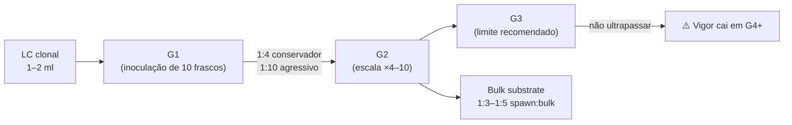

# Spawn de grão — preparação e uso

## Definição

Grãos de cereal (WBS, centeio, milho pipoca) hidratados a field capacity, esterilizados a 15 PSI por 90 min e inoculados com LC ou esporos, usados como veículo de inóculo de alta superfície de contato para inoculação de bulk substrates em proporção 1:3–1:5. (PMB, Cap. 8, p. 143)

## Capacidade de umidade por tipo de grão

| Grão | Capacidade de umidade | Observações de preparo |
|---|---|---|
| Centeio | 43% | Clássico; método imersão: 220 g seco + 200 ml água + gesso; 24 h molho |
| Milho pipoca | 37,5% | Colonização visualmente clara; ferver 30 min + drenar |
| WBS (Wild Bird Seed / alpiste) | 28,5% | Mais econômico; molho máximo 12 h (risco de fermentação); remover sementes de girassol que flutuam |

**Gesso (CaSO₄):** ~1 g por frasco de 1 qt; previne aglomeração dos grãos durante e após esterilização; facilita agitação e colonização uniforme.

**Esterilização:** 15 PSI por 90 min (frasco 1 qt) ou 120 min (maiores volumes); frascos sobre tripé, não em contato com água do fundo da panela. → [[Reação de Maillard em esterilização úmida de grãos]]

## Break & Shake — redistribuição de inóculo

**Critério:** realizar a 30–50% de colonização visual. Nunca antes de 20% (micélio fraco, ruptura prejudica) nem depois de 80% (ganho marginal não compensa risco).

**Efeito:** redistribui fragmentos miceliais por todo o substrato, elimina zonas de CO₂ acumulado e duplica a velocidade de colonização do restante. Inverter o frasco a 80% de colonização para drenar CO₂ acumulado até colonização total.

## Cadeia geracional G1 → G2 → G3

**Regra:** máximo 3 gerações de transferência; G4 mostra queda perceptível de vigor e velocidade de colonização. Refrigerar frascos colonizados se não usar imediatamente; remover da geladeira na noite anterior para aquecer. → [[Cap. 07 — Cultura líquida fúngica]]

## Inoculação e controle de contaminação

**Inoculação de G1:** 1–2 ml de LC por frasco de 1 qt, via porta de injeção de silicone em porta-luvas esterilizado. → [[Cap. 03 — Técnica estéril no cultivo fúngico]]

**Transferência G1 → G2:** 100% de colonização + bater o frasco em pneu de bicicleta para fragmentar; dentro do porta-luvas, despejar ~1/5 do G1 colonizado em cada frasco G2; fechar imediatamente. Nunca transferir fora de porta-luvas ou SAB.

**Sinal de contaminação:** qualquer cor verde, azul-verde ou preta → descarte imediato. Wet spot (gosma cinza com odor podre) = Bacillus; causa: esterilização insuficiente ou aditivos com endósporos. → [[Cap. 11 — Contaminantes — diagnóstico e prevenção]]

## Fronteira aberta

A relação entre tamanho médio de grão (WBS × centeio × pipoca) e velocidade de colonização de *P. cubensis* a 26 °C não foi quantificada sistematicamente mantendo constante o protocolo de hidratação e esterilização. (PMB, Cap. 8)

## Recall

Quando realizar break & shake e qual é o efeito fisiológico sobre a colonização?
?
A 30–50% de colonização visual: redistribui fragmentos miceliais, elimina bolsões de CO₂ que inibem o crescimento e duplica a velocidade de colonização do substrato restante. Antes de 20% o micélio está fraco e a ruptura prejudica; depois de 80% o ganho é marginal.
