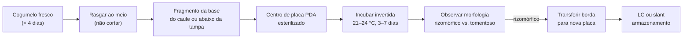

# Cultivo em ágar e isolamento clonal

## Definição

Uso de placas de ágar (MEA, PDA ou PDYA) para crescimento, inspeção visual, seleção fenotípica e clonagem de micélio fúngico, permitindo fixação de isolados de alto desempenho, purificação de culturas contaminadas e armazenamento de linhagens por 1–2 anos em inclinações de ágar (slants). (PMB, Cap. 10, p. 215)

## Meios de ágar

| Meio | Formulação (por 200 ml de água) | Perfil | Indicado para |
|---|---|---|---|
| PDA (Potato Dextrose Agar) | 12 g de pó PDA | Extrato de batata + dextrose; crescimento robusto | Cultivo padrão e clonagem |
| MEA (Malt Extract Agar) | 20 g extrato de malte + 15 g ágar | Perfil neutro | Fenotipagem comparativa |
| PDYA | PDA + extrato de levedura (0,5 g/L) | Suplementação nitrogenada | Isolados com vigor reduzido |

**Esterilização:** frasco Mason com tampa solta a 15 PSI por 20 min; despejar placas a ~45–55 °C (viscoso mas fluido); solidifica abaixo de 32–40 °C. Selar com Parafilm após solidificação (5–10 min). Rendimento: 12 g PDA + 200 ml → até 30 placas de 90 mm.

**Atenção:** nunca aquecer ágar no micro-ondas sem vigilância constante — superaquecimento sem ebulição visível causa erupção ao abrir o frasco.

## Morfologia colonial como critério de seleção

| Morfologia | Aspecto | Velocidade | Decisão |
|---|---|---|---|
| Rizomórfica | Filamentos grossos, ramificados como árvore, borda regular | Rápida | **Selecionar** |
| Tomentosa | Penugem fofa, semelhante a nuvem, borda irregular | Lenta | Descartar |

Transferir sempre da borda da colônia (ponta das hifas — zona de divisão ativa), não do centro. → [[Validade preditiva do cultivo em ágar]]

## Técnica de clonagem de tecido

Inserir fragmento de 3–5 mm da base do caule ou da porção abaixo da tampa de cogumelo recém-colhido (< 3–4 dias após colheita) no centro de placa PDA:

**Rasgar, não cortar:** a faca arrasta contaminantes de superfície para o local de inserção; rasgar expõe o interior estéril. Clonar de cogumelo fresco — viabilidade do tecido cai drasticamente após 3–4 dias.

## Isolamento monospórico vs. clonagem de tecido

| Método | Resultado genético | Uso |
|---|---|---|
| Isolamento monospórico | Monocarionte (haploide) — não frutifica sozinho | Cruzamentos experimentais |
| Clonagem de tecido | Dicarião original — frutifica como o progenitor | Propagação de fenótipo selecionado |

Para manutenção de cultivo produtivo: clonagem de tecido preserva o dicarião. Isolamento monospórico é relevante apenas para trabalho genético. → [[Anastomose hifal e dikaryotização]]

## Armazenamento em slants

Inocular tubos de inclinação (slants) com disco de ágar colonizado; guardar em caixa plástica fechada na prateleira intermediária da geladeira (evitar porta — oscilações de temperatura). Validade: 1–2 anos. Testar em placa fresca antes de usar para confirmar vitalidade.

**Senescência por clonagem repetida:** vigor cai progressivamente após 3+ ciclos de clonagem sem introdução de esporos frescos — alternar clonagem, LC e impressões de esporos para manter vigor. → [[Propagação vegetativa]]

## Fronteira aberta

A correlação entre fenotipagem em ágar (densidade colonial rizomórfica, taxa de crescimento medida em mm/dia) e produtividade em bulk substrate não foi validada sistematicamente para isolados de *P. cubensis*; a seleção em ágar elimina fenótipos claramente inferiores mas não prediz o rendimento máximo possível. (PMB, Cap. 10)

## Recall

Qual a diferença entre isolamento monospórico e clonagem de tecido em termos de resultado genético, e qual é preferível para manutenção de cultivo?
?
Isolamento monospórico produz monocarionte (genótipo haploide — não frutifica sozinho; requer parear com outro monocarionte compatível). Clonagem de tecido preserva o dicarião original do isolado selecionado. Para manutenção de cultivo produtivo: clonagem de tecido, sempre.
