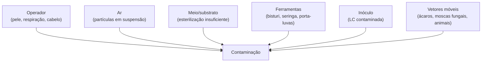

# Contaminantes — diagnóstico e prevenção

## Definição

Microrganismos competidores (fungos, bactérias) que colonizam substratos de cultivo e suprimem ou eliminam o micélio alvo; identificáveis por cor, textura, odor e localização no substrato. A contaminação não tratada esporula e eleva progressivamente a carga de contaminante no ambiente de cultivo, comprometendo cultivos subsequentes (contaminação em cascata). (PMB, Cap. 11, p. 247)

## Tabela diagnóstica

| Contaminante | Cor | Textura | Odor | Vetor principal | Risco à saúde | Ação |
|---|---|---|---|---|---|---|
| *Trichoderma harzianum* | Verde-esmeralda (inicia branco) | Penugem densa | Ausente | Bulk mal pasteurizado | Baixo (parasita fúngico) | Descarte imediato |
| *Penicillium* spp. | Azul-verde | Feltro denso | Leve, terroso | Ar / esterilização inadequada | Moderado | Descarte imediato |
| *Aspergillus* spp. | Preto, amarelo ou verde | Pulverulento | Ausente | Qualquer falha de esterilização | **ALTO** — esporos inaláveis; risco respiratório e renal | Descarte c/ máscara; re-esterilizar antes de abrir |
| *Neurospora* spp. | Rosa brilhante | Fofo, expansivo | Ausente | Ar; atravessa filtros Tyvek | Baixo | Descarte — cresce placa inteira em 24 h |
| *Hypomyces* spp. | Cinza-branco (parece micélio) | Filamentos muito finos, teia | Ausente | Casing | Baixo | Distinguir do micélio pela espessura — Hypomyces é visivelmente mais fino |
| *Bacillus* spp. (wet spot) | Cinza-marrom, gosma | Viscoso, encharcado | Podre, fétido | Grão mal esterilizado (endósporos) | Baixo direto | Descarte — único contaminante que resiste a esterilização padrão |
| *Pseudomonas* spp. | Marrom-amarelado | Viscoso, lesões nas tampas | Muito fétido | Excesso de umidade nas tampas | Baixo; destrói colheita | Ajustar umidade + FAE |
| Levedura | Branco oval | Filiforme, pontual | Fermentação | Transferências em ar não controlado | Baixo | Descarte da placa ou frasco |

**Trichoderma começa branco:** não presumir que branco = saudável antes de 48–72 h de observação. Verificar velocidade (Trichoderma cresce mais rápido que micélio em substrato colonizado) e textura.

**Endósporos de Bacillus:** estruturas resistentes ao calor que sobrevivem ao ciclo padrão de 15 PSI / 20 min; único contaminante que requer ciclos mais longos ou aditivos antimicrobianos (CaCO₃) para controle. → [[Reação de Maillard em esterilização úmida de grãos]]

## Seis vetores de contaminação (Stamets)

Endereçar todos os seis vetores antes de inocular como lista de conferência. LC contaminada é o vetor mais silencioso — compromete todos os frascos subsequentes sem sintoma visual imediato. → [[Cap. 07 — Cultura líquida fúngica]]

## Protocolo de descarte seguro por tipo

| Tipo | Procedimento |
|---|---|
| Mofo verde/azul/preto | Não abrir; selar em saco plástico; re-esterilizar frasco fechado na panela de pressão; despejar em compostagem longe do espaço de cultivo |
| *Aspergillus* preto | Usar máscara respiratória; re-esterilizar antes de abrir |
| Wet spot (Bacillus) | Selar e descartar; ajustar protocolo de esterilização para próximo lote |
| Placas de ágar e seringas | Selar em saco de desova; esterilizar antes de descartar |

**Regra operacional:** manter todos os materiais entre 60–90 cm do chão ou mais alto — o chão é "pântano de contaminantes"; cada passo agita partículas em suspensão. → [[Cap. 03 — Técnica estéril no cultivo fúngico]]

## Fronteira aberta

A concentração mínima infectante (UFC/m³ de ar) de esporos de *Trichoderma harzianum* capaz de causar perda de flush completo em câmara de frutificação doméstica (monotub aberto por 30 seg) não foi determinada experimentalmente. (PMB, Cap. 11)

## Recall

Como diferenciar Trichoderma de micélio saudável em frasco de grão, considerando que Trichoderma inicia branco?
?
Velocidade e textura: micélio saudável cresce de forma gradual e rizomórfica (filamentos visíveis); Trichoderma cresce mais rápido que o micélio em substrato já colonizado e desenvolve cor verde-esmeralda em 2–4 dias. Qualquer mancham branca que cresce visivelmente em 24 h em substrato colonizado deve ser tratada como suspeita até prova em contrário.
