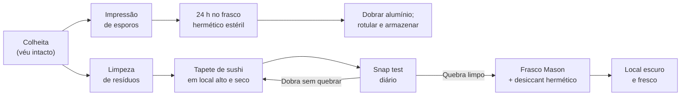

# Secagem e armazenamento de esporos

## Definição

Secar corretamente até o **snap test** positivo e fazer impressão de esporos de pelo menos um cogumelo por cultivo são os dois atos finais que fecham o ciclo: o primeiro preserva a colheita por anos com potência estável; o segundo garante autossuficiência genética para o próximo ciclo sem custo externo. (PMB, Cap. 12)

## Protocolo pós-colheita

## Parâmetros críticos

| Parâmetro | Valor | Observação |
|---|---|---|
| Teor de água fresco | ~90% | Cogumelos secos pesam ~10% do peso fresco |
| Critério de secagem | Snap test (caule quebra limpo) | Não usar tempo ou aparência visual como critério |
| Temperatura máxima no desidratador | 49 °C (120 °F) | Acima decompõe psilocibina |
| Armazenamento de impressão | Local seco, escuro, temp. ambiente | Viabilidade de vários anos |
| Seringa caseira — armazenamento | Geladeira (4 °C) | Viabilidade de anos |
| Reidratação antes de inocular | 24 h em água destilada estéril | Esporos são anidrobióticos |

## Impressão de esporos — procedimento

**Seleção:** cogumelo com véu ainda intacto (antes de rasgar). Uma vez roto, os esporos já caíram — não serve para impressão.

**Dentro do porta-luvas esterilizado:**
1. Bisturi esterilizado a chama → cortar logo abaixo da tampa, remover caule.
2. Papel alumínio estéril (~15 × 15 cm) no fundo de frasco Mason esterilizado.
3. Tampa com brânquias voltadas para baixo sobre o alumínio, centralizada.
4. Fechar hermético; aguardar 24 h sem mover.
5. Remover alumínio com padrão radiante → dobrar ao meio (impressão para dentro) → dobrar bordas.
6. Rotular: espécie + cepa + data. Armazenar em local seco e escuro. → [[Cap. 02 — Obtendo esporos]]

## Estabilidade de psilocibina vs. psilocina

| Composto | Estabilidade | Estado preferencial |
|---|---|---|
| Psilocibina (pró-droga) | Estável — resistente a luz e O₂ | Dominante em cogumelos secos |
| Psilocina (ativo direto) | Instável — degradada por luz e O₂ | Mais concentrada em cogumelos frescos |

Cogumelos frescos têm relação psilocibina:psilocina ~10:1; cogumelos secos perdem psilocina mas mantêm psilocibina com potência estável por anos se armazenados corretamente.

## Fronteira aberta

A taxa de degradação de psilocibina em função de temperatura, umidade e exposição à luz durante o armazenamento de longo prazo não foi quantificada com metodologia HPLC padronizada para *P. cubensis* seco; a afirmação de "sem perda perceptível em 3 anos" dos autores é anedótica, sem controles de umidade residual. (PMB, Cap. 12)

## Recall

Qual o único critério confiável para saber que o cogumelo está pronto para armazenamento de longo prazo, e por que não basta o aspecto visual?
?
O snap test — segurar o caule e dobrar: quebra limpa com estalo = seco; dobra sem quebrar = ainda úmido. O aspecto visual falha porque em ambientes com alta umidade relativa o cogumelo pode parecer seco na superfície mas reter umidade residual internamente, suficiente para desenvolver mofo no frasco hermético ao longo do armazenamento.
