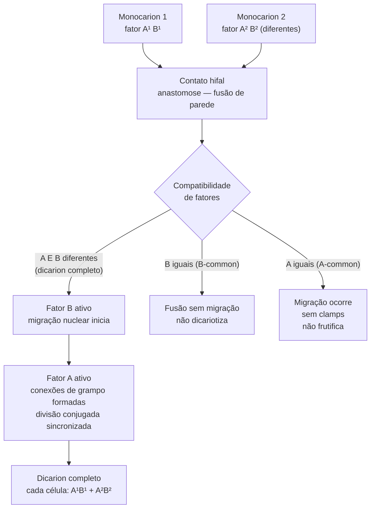

# Anastomose hifal e dikaryotização

## Definição

Anastomose hifal é a fusão física entre duas hifas — o processo que transforma dois monocariontes compatíveis em um dicarion funcional. O resultado é um estado n+n onde cada célula carrega dois núcleos haplóides sincronizados. A dikaryotização não é instantânea: é um processo direcionado por sinais moleculares codificados nos fatores de acasalamento A e B.

## Sequência do processo

## O papel de cada fator

**Fator B** — controla a migração nuclear: permite que os núcleos do parceiro se movam ao longo das hifas receptoras. Sem diferença em B, os núcleos ficam presos no ponto de fusão. [EFG p. 46]

**Fator A** — controla a divisão conjugada e a formação de conexões de grampo: garante que cada septo receba um núcleo de cada tipo. Sem diferença em A, a migração ocorre mas os núcleos não se distribuem corretamente. [EFG p. 46]

**Exigência para frutificação:** A E B devem ser diferentes nos dois monocariontes. Em sistema tetrapolar (60% dos basidiomicetos), apenas 25% dos irmãos são mutuamente compatíveis. [EFG p. 37]

## Reconhecimento antes da fusão

Em fungos filamentosos, o reconhecimento quimiotático entre hifas compatíveis ocorre via gradientes de feromônios codificados pelo locus de acasalamento. Em basidiomicetos, o reconhecimento pré-fusão é menos estudado que em ascomicetos, mas a especificidade dos fatores A e B garante que a dikariotização progressiva se estabeleça somente com parceiro compatível.

## O que acontece em cada heterocarion incompleto

| Situação | Migração | Clamps | Dicarion? | Frutifica? |
|---|---|---|---|---|
| A² B² (A e B diferentes) | Sim | Sim | Sim | Sim |
| A-common (B dif., A igual) | Sim | Não | Não | Não |
| B-common (A dif., B igual) | Não | Sim (parcial) | Não | Não |
| A e B iguais | Não | Não | Não | Não |

## Relevância para cultivo

- Confirmar dikaryotização por microscopia: verificar presença de conexões de grampo nas hifas em crescimento — marcador visual direto e confiável
- Cruzamentos entre monocariontes irmãos: apenas 1 em 4 pares produz dicarion completo em sistema tetrapolar
- Seleção de monocariontes para cruzamento deve incluir teste de compatibilidade antes de investir em trials de substrato

## Fronteira aberta

O mecanismo molecular de reconhecimento quimiotático pré-anastomose em basidiomicetos cultivados (*Pleurotus ostreatus*, *Lentinula edodes*) não está resolvido com a mesma resolução que em *C. cinereus* ou *S. commune*. → [[Lacunas de evidência e protocolos de pesquisa]]

## Recall

Qual a diferença funcional entre os fatores A e B na dikaryotização?
?
Fator B controla a migração nuclear (movimento dos núcleos pelas hifas após fusão). Fator A controla a divisão conjugada e a formação de conexões de grampo (distribuição correta dos núcleos em cada septo). Ambos diferentes = dicarion completo. Um igual = heterocarion incompleto que não frutifica.
