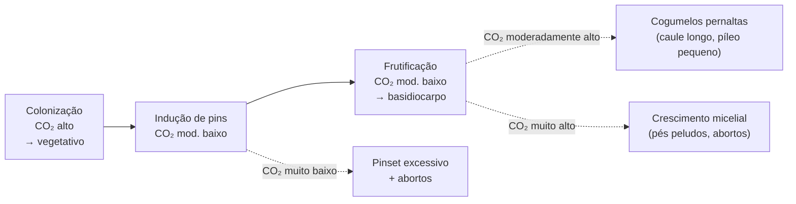

# CO2 como ponto de controle por fase de cultivo

## Definição

O CO₂ acumula dentro da câmara de frutificação como subproduto da respiração micelial. Em cultivo doméstico, a concentração de CO₂ é controlada indiretamente pela taxa de troca de ar fresco (FAE — *Fresh Air Exchange*). Manipular CO₂ por fase é uma das alavancas mais importantes para orientar o fungo entre crescimento vegetativo e reprodutivo.

## Framework: CO₂ por fase

| Fase | Nível de CO₂ | Efeito desejado | Resultado de erro |
|---|---|---|---|
| **Colonização** | Alto | Crescimento vegetativo rápido das hifas | — |
| **Indução de primórdios** | Moderadamente baixo | Formação de pins | Muito baixo → pinset excessivo + alta taxa de abortos; muito alto → pinset esparso + colheita reduzida |
| **Frutificação** | Moderadamente baixo | Cogumelos compactos com píleo desenvolvido | Alto → pernaltas (caule longo, píleo pequeno); muito alto → crescimento micelial dominante, abortos; baixo → curtos e gordos |

## O confundimento FAE–Umidade

A maioria dos setups domésticos faz FAE com ar ambiente (<95% de UR). Aumentar FAE:
- ↓ CO₂ (efeito desejado para indução de frutificação)
- ↑ taxa de evaporação da superfície do substrato
- cria ciclos de UR alta/baixa acoplados a nebulizações/ventilações manuais

Isso torna **CO₂ e umidade confundidos** no mesmo controle. Cultivadores sem controle independente dos dois fatores não conseguem atribuir um dado desfecho a uma única causa.

> **Hipótese em discussão**: há relatos de que a evaporação da superfície do substrato facilita a formação de pins. A literatura industrial enfatiza níveis de CO₂ sem mencionar evaporação superficial como sinal independente. A confusão pode ser fruto da correlação entre FAE, CO₂ e umidade. Evidência de nível industrial com publicação revisada por pares seria necessária para separar os fatores.

## Ancoragem no PMB

- **ch01** — "queda de CO₂, exposição à luz e variação de umidade" como gatilhos de frutificação. → [[Indução de frutificação — sinais ambientais]]
- **ch05** — shotgun FC funciona por "CO₂ baixo, umidade alta, luz difusa" via gradiente de pressão passivo; FAE ocorre sem ventilador.
- **ch06** — PF Tek prescreve "soprar CO₂ a cada borrifada" — FAE manual acoplado à borrifação; CO₂ e umidade confundidos por design.
- **ch09** — monotub com 4–6 furos de 1,3 cm com algodão como filtro → FAE passiva mínima, CO₂ moderadamente alto durante colonização.

## Conexão com morfologia

A morfologia do cogumelo (comprimento do caule, tamanho do píleo) responde ao CO₂, mas tem também componente genético forte. Para ver variações ambientais claras, é necessário usar genótipo clonal único — variação interstrain mascara o efeito ambiental. → [[Plasticidade morfológica e dimorfismo fenotípico]]

## Status experimental e próximos passos

Observações do cultivador: consistentes com resultados próprios e de outros cultivadores. Controle atual: apenas CO₂ (não umidade). Plano: adicionar controle de umidade à fonte de FAE para isolar os dois fatores.

## Recall

Por que aumentar FAE em ambiente doméstico não é controle puro de CO₂?
?
Porque o ar ambiente está abaixo de 95% de UR. Mais FAE = mais evaporação da superfície do substrato = ciclos de umidade acoplados à ventilação. CO₂ e umidade ficam confundidos no mesmo ajuste — para isolá-los seria necessário controlar a umidade da fonte de FAE de forma independente.
