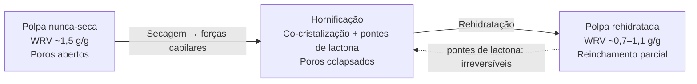
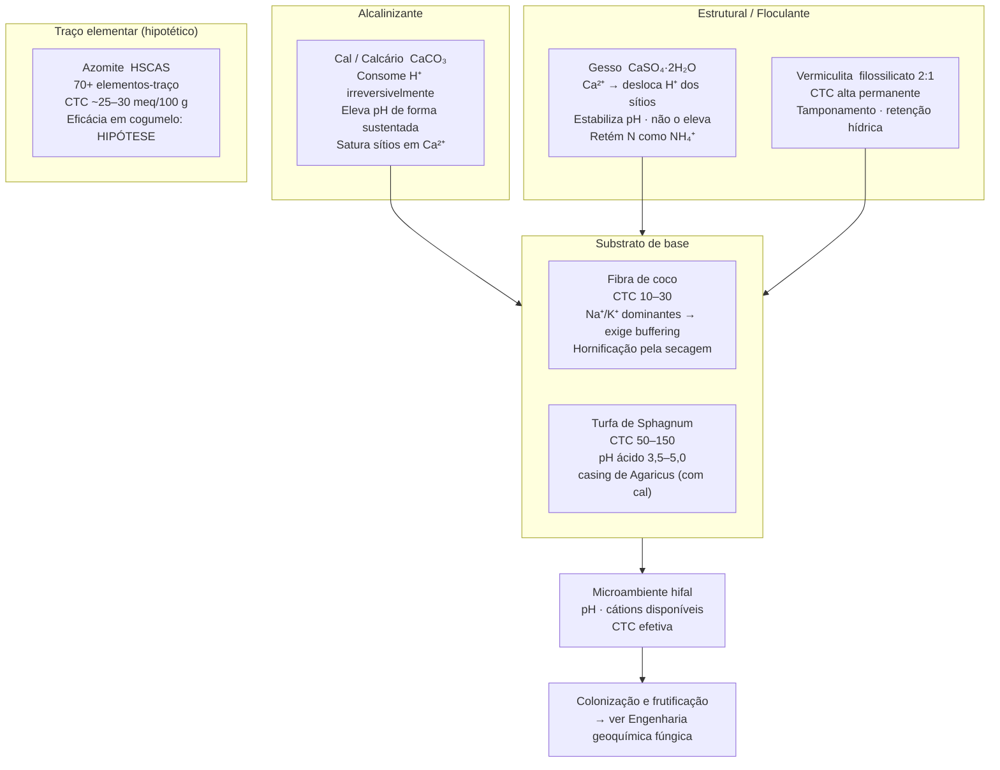

# Capacidade de troca catiônica em substratos fúngicos

## Definição

A capacidade de troca catiônica (CTC) — medida em centimoles de carga por quilograma, cmol(p⁺)/kg, historicamente meq/100 g — quantifica a carga negativa de interface de um material sólido úmido, expressa como capacidade máxima de reter cátions positivos (K⁺, Ca²⁺, Mg²⁺, NH₄⁺, H⁺, Na⁺) de forma **reversível e trocável**. Não mede o teor total de nutrientes; mede a **dinâmica de disponibilidade**: a velocidade e a ordem com que os cátions entram e saem da solução em contato com o sólido. Dois materiais com idêntico potássio total podem ter comportamento de cultivo oposto se diferem em CTC. [CONSENSO — Sposito 1989; Sparks 1995]

A CTC existe operacionalmente apenas com o material **hidratado**: a troca acontece na fronteira sólido/solução; sítios de carga negativos em material seco são latentes, ativados ao contato com água. Consequência central: a água não é detalhe de preparo — é a condição que faz a química existir.

## Origem da carga negativa por tipo de material

| Material | Tipo de carga | Origem mecanística | CTC típica (meq/100 g) |
|---|---|---|---|
| Argilas 1:1 (caulinita) | Permanente | Substituição isomórfica de Si⁴⁺ por Al³⁺ | 3–15 |
| Argilas 2:1 (montmorilonita) | Permanente + dependente de pH | Substituição isomórfica; grupos Si-OH de borda | 80–120 |
| Vermiculita (filossilicato 2:1) | Permanente alta | Substituição isomórfica; Mg²⁺ na entrecamada | 100–150 |
| Matéria orgânica humificada | Dependente de pH | Grupos -COOH e -OH fenólicos que ionizam | 100–300 |
| Turfa de *Sphagnum* | Dependente de pH | Ácidos húmicos e fúlvicos; -COOH predominante | 50–150 |
| Fibra de coco (*coir*) | Mista (baixa permanente + pH) | Lignina + hemicelulose + grupos superficiais | 10–30 |

**Advertência epistêmica:** "CTC" nomeia o resultado de um protocolo, não uma essência do material. O valor depende do cátion-índice de saturação e do pH do ensaio, porque parte da carga orgânica é **dependente de pH** — grupos carboxílicos protonam abaixo de ~4,5 e perdem carga. Comparar CTC de fontes distintas só é válido quando os métodos são idênticos. [CONSENSO — Sparks 1995]

## As três funções da CTC (nenhuma é "alimentar o fungo")

1. **Tamponamento de pH:** o complexo de troca absorve e libera H⁺; materiais de alta CTC resistem a oscilações bruscas de acidez, estabilizando o microambiente ao redor da hifa.
2. **Retenção contra lixiviação:** cátions ligados nos sítios são liberados devagar para a solução, prolongando a disponibilidade e reduzindo perdas por percolação em substratos úmidos.
3. **Controle de dinâmica:** a série de afinidade governa quais cátions saem primeiro — Ca²⁺ e Mg²⁺ (divalentes) deslocam K⁺ e Na⁺ (monovalentes); o equilíbrio final depende das concentrações relativas, não da velocidade de adição.

> **Distinção crítica:** alta CTC não significa "mais nutrição". Uma CTC alta também *trava* cátions mais fortemente. A camada de cobertura (*casing*) do *Agaricus* é intencionalmente pobre em nitrogênio para inibir primórdios; sua CTC alta serve para estabilizar pH e reter água, não para nutrir. Uma CTC baixa libera os mesmos cátions de forma mais abrupta — pode ser vantajosa ou prejudicial dependendo da fase. [TÉCNICA]

## Os condicionadores minerais e seus papéis na CTC

### Gesso — CaSO₄·2H₂O

Sal neutro (pH ~6,8–7,2 em solução). Função primária histórica em composto de *Agaricus*: **floculação de coloides** — o Ca²⁺ agrega partículas finas, abre a estrutura para aeração e evita o colapso anaeróbio da palha compostada. [CONSENSO]

O elo com a CTC é mecanístico e quase nunca enunciado corretamente: o **Ca²⁺ do gesso desloca H⁺ adsorvido nos sítios de troca** — isso *é* troca catiônica. O gesso **não eleva pH**; estabiliza-o injetando Ca²⁺ divalente que compete pelos sítios com H⁺ e Na⁺. Efeito secundário: ao reduzir o pH local, diminui a dissociação de NH₄⁺ → NH₃ gasosa, retendo nitrogênio no composto. [CONSENSO]

A relevância operacional do gesso caiu com compostagens mais curtas e aeradas, mas o rendimento de *Agaricus* ainda melhora com sua adição; a explicação aceita é a retenção de nitrogênio, não o efeito físico original.

### Cal e calcário — Ca(OH)₂ e CaCO₃

Agentes **alcalinizantes ativos**: o carbonato consome H⁺ de forma sustentada:

$$CaCO_3 + 2H^+ \rightarrow Ca^{2+} + H_2O + CO_2$$

Eleva o pH e satura o complexo de troca com Ca²⁺. [CONSENSO] Na camada de cobertura (*casing*) do *Agaricus*, a cal de beterraba mantém pH 7,4–8,0 no microambiente de formação de primórdios.

**Distinção operacional gesso × cal:** ambos fornecem Ca²⁺ e ocupam sítios de troca, mas apenas a cal move o pH. Confundir os dois é a fonte recorrente de erros de formulação em fóruns de cultivo.

### Vermiculita

Filossilicato 2:1 com **carga permanente alta** (~100–150 meq/100 g), entrecamada balanceada por Mg²⁺ hidratado expandida a ~1,4 nm. Função em substrato: tamponamento de cátions, retenção hídrica, aeração estrutural. [CONSENSO]

Detalhe mineralógico relevante para o cultivo: a identidade do cátion altera a estrutura física do mineral. O K⁺ "fixa" a camada, colapsando a entrecamada para ~1,0 nm e dificultando trocas subsequentes; o Ca²⁺ mantém a entrecamada expandida (~1,2 nm). Isso não é efeito de velocidade de hidratação — é consequência do raio iônico e da energia de hidratação do cátion sobre a geometria cristalina. Vermiculita saturada em K⁺ tem CTC efetiva menor que vermiculita Ca-saturada, mesmo que o cátion seja tecnicamente trocável. [CONSENSO]

**Limitação operacional:** a vermiculita desintegra sob vapor prolongado de autoclave — inadequada como insumo esterilizado em alta pressão; adequada para bulk substrate pasteurizado ou casing. [TÉCNICA]

### Azomite

Aluminossilicato de sódio e cálcio hidratado (HSCAS) de origem vulcânica, com CTC declarada ~25–30 meq/100 g pelo fabricante e mais de 70 elementos-traço incluindo terras raras. [TÉCNICA]

Distinção epistêmica obrigatória: a **composição elementar** é fato razoavelmente documentado; o **benefício funcional em cultivo de cogumelo** não tem evidência robusta revisada por pares — e o próprio fabricante ressalva não poder fazer alegações de eficácia em seu material. O aporte de traços é real; o salto para "melhora o cultivo" permanece **[HIPÓTESE] não demonstrada** em basidiomicetos cultivados.

## Hidratação de insumos secos: hornificação e hidrofobicidade

### Por que "desnaturação de fibra" é erro de categoria

O termo "desnaturação" aplicado a substratos refere-se erroneamente a polímeros estruturais. Celulose, hemicelulose e lignina **não têm conformação nativa dobrada** para desnaturar — esse conceito é restrito a proteínas e DNA com estrutura terciária funcional. [CONSENSO] A água não degrada a fibra ao hidratá-la; ao contrário, ela precisa ser hidratada para assumir seu estado funcional intumescido. "Desnaturação por hidratação" de fibra é erro de categoria, não de gradação.

### Hornificação: a lesão que vem da secagem

O fenômeno real, documentado em ciência de polpa e papel, é a **hornificação** — e sua direção causal é contraintuitiva. [CONSENSO — Hubbe et al.; Lindström; Newman; Diniz et al.]

Quando a água deixa a parede celular vegetal:
1. Forças capilares aproximam as microfibrilas de celulose;
2. Formam-se novas pontes de hidrogênio interfibrilares entre as superfícies;
3. Ocorre co-cristalização parcial (aumento do índice de cristalinidade da celulose);
4. Em parte formam-se **pontes de lactona** — ligações covalentes irreversíveis entre grupos -OH e -COOH adjacentes.

Resultado mensurável: o índice de retenção de água (WRV — *water retention value*) cai de ~1,5 g/g em polpa nunca-seca para ~0,7 g/g em polpa seca. Na rehidratação, apenas as pontes de hidrogênio se rompem; as pontes de lactona e parte da co-cristalização são **irreversíveis**. O reinchamento é parcial por natureza — nunca restaura o WRV original.

**Consequência prática para o cultivo:** a fibra de coco, turfa e palha embaladas e secas já carregam a lesão estrutural da hornificação. Molhar — rápido ou devagar — **reverte parcialmente** esse estado, mas não restaura o WRV original. A velocidade da rehidratação afeta apenas a **uniformidade do molhamento** (risco de núcleos secos internos em hidratação muito rápida) e não a química da troca catiônica nem o valor final de WRV. [TÉCNICA]

### O segundo efeito da secagem: hidrofobicidade superficial

Matéria orgânica muito seca reorganiza suas substâncias húmicas anfifílicas, expondo domínios hidrofóbicos e passando a repelir água. O risco de hidratação rápida demais **não é degradação química** — é a água escorrer sem penetrar, deixando núcleos secos e umedecimento desigual. Mitiga-se com imersão prolongada, água morna e agentes molhantes quando necessário. É cinética de molhamento, não reação química prejudicial. [TÉCNICA]

As "oscilações de pH" observadas ao molhar coco seco são um **transiente esperado**: dissolução de sais residuais, reação de carbonatos residuais, troca H⁺↔Na⁺/K⁺ com os sítios latentes saindo do estado seco. É ativação da CTC, não degradação. O pH se estabiliza quando o sistema atinge equilíbrio; a velocidade de hidratação muda apenas quão depressa esse equilíbrio é atingido, não seu valor final.

## Fibra de coco e a série de afinidade catiônica

A fibra de coco concentra todos os fenômenos anteriores. Nasce com sítios de troca saturados em **Na⁺ e K⁺** por duas razões: o coqueiro é costeiro (absorção de Na⁺ do solo salinizado) e a casca é frequentemente curtida em água do mar ou salmoura no processamento industrial. [CONSENSO]

A série de afinidade governa o que ocorre quando se adiciona Ca²⁺ e Mg²⁺ ao sistema:

$$Ca^{2+},\ Mg^{2+}\ \gg\ K^+,\ NH_4^+\ >\ Na^+,\ H^+$$

Os divalentes ligam-se mais fortemente; eles **deslocam Na⁺ e K⁺ para a solução**, gerando o chamado *nutrient lockout*: Ca²⁺ e Mg²⁺ ficam imobilizados nos sítios ao mesmo tempo que Na⁺ e K⁺ ficam livres em concentração potencialmente tóxica. O micélio enfrenta simultaneamente deficiência de Ca/Mg e excesso de Na/K. [CONSENSO]

### Buffering: operação de troca catiônica deliberada

O *buffering* da fibra de coco é uma **troca catiônica prévia ao cultivo**: encharca-se o coco em solução rica em Ca²⁺ (tipicamente nitrato de cálcio 5–10 g/L) para que o Ca²⁺ exógeno em excesso desloque quantitativamente o Na⁺ e K⁺ antes de o micélio chegar. Drena-se o percolado carregado de monovalentes; o coco entra no cultivo com sítios dominantemente Ca-saturados.

| Parâmetro | Coco não bufferizado | Coco bufferizado |
|---|---|---|
| Cátions dominantes nos sítios | Na⁺, K⁺ | Ca²⁺, Mg²⁺ |
| K⁺ na solução intersticial | Alto → potencial tóxico | Baixo |
| Disponibilidade de Ca/Mg ao fungo | Baixa (preso nos sítios pelo K⁺ externo) | Alta |
| Risco de lockout | Alto | Baixo |
| pH do extrato 1:5 | Variável (4,5–6,5) | Mais estável (~6,0–6,8) |
| Condutividade elétrica (EC) | Alta | Reduzida após drenagem |

O ponto de equilíbrio final (quais cátions ficam, qual o pH) é o mesmo quer se bufferize rápido ou devagar; a velocidade muda apenas quão depressa se chega lá e se o molhamento é uniforme.

## Framework integrador: papéis dos condicionadores

## Conexão com a dinâmica biológica

A CTC, os minerais e o estado de hidratação fixam as **condições iniciais** e os tampões do substrato. A partir daí, o micélio não é um usuário passivo dessa química — ele a reescreve via secreção de ácido oxálico, precipitação de Ca²⁺ e acidificação periférica. A premissa de "pH de bulk como variável de controle" é válida apenas antes da colonização; durante e após, o sistema relevante é o microambiente dinâmico que o fungo constrói ao redor das hifas. → [[Engenharia geoquímica fúngica — oxalato de cálcio]]

## Fronteira aberta

- **CTC dinâmica durante a colonização:** os valores tabelados de CTC são medidos antes do cultivo. O micélio secreta oxalato e altera pH local, precipitando Ca²⁺ e modificando a CTC efetiva em torno das hifas. Não há dados sistemáticos de CTC *ao longo* de uma corrida de colonização em substrato real.

- **Buffering de coco: concentração e tempo ótimos não padronizados:** a prática é empírica. A curva de deslocamento (concentração de Ca²⁺ aplicada × fração de Na⁺/K⁺ deslocada × tempo) não foi medida em condições controladas para as principais variedades comerciais de fibra de coco. → [[Lacunas de evidência e protocolos de pesquisa]]

- **Vermiculita comercial vs. mineral de referência:** a CTC de 100–150 meq/100 g refere-se ao mineral de alta carga. Produtos horticultores têm composição geológica variável; a CTC real do produto usado raramente é caracterizada. Comparações entre receitas de cultivo que diferem na origem da vermiculita podem ser confundidas por essa variação não medida. → [[Confundimento de variáveis em sistemas de cultivo]]

## Recall

Por que a CTC não é equivalente ao teor de nutrientes do substrato?
?
A CTC mede sítios de carga negativa que retêm cátions reversivelmente — é propriedade de interface, não de quantidade. Dois materiais com teores idênticos de K⁺ total podem ter CTC radicalmente diferente: o com CTC alta retém K⁺ mais firmemente e o libera mais devagar; o com CTC baixa disponibiliza o mesmo K⁺ mais abruptamente. A dinâmica de disponibilidade é o que governa a colonização, não o total armazenado.

Por que o gesso não eleva pH e a cal sim, se ambos fornecem Ca²⁺?
?
O gesso (CaSO₄·2H₂O) é sal neutro: o Ca²⁺ desloca H⁺ dos sítios de troca, mas não consome H⁺ da solução — há redistribuição entre sítio e solução sem deslocamento do equilíbrio ácido-base global. A cal/calcário (CaCO₃) reage quimicamente com H⁺ (CaCO₃ + 2H⁺ → Ca²⁺ + H₂O + CO₂), consumindo-o irreversivelmente e deslocando o pH para cima de forma sustentada.

O que é hornificação e em que direção causal ela ocorre?
?
Hornificação é a alteração estrutural irreversível da parede celular vegetal causada pela **secagem**, não pela rehidratação. Durante a secagem, forças capilares aproximam microfibrilas de celulose, formando pontes de hidrogênio interfibrilares, co-cristalização e pontes de lactona covalentes. O WRV cai de ~1,5 para ~0,7 g/g. Na rehidratação, apenas as pontes não covalentes se rompem; o reinchamento é parcial e permanentemente incompleto. A lesão estrutural já vem travada no material seco; molhar a reverte parcialmente, mas não a cria.

O que explica o lockout de Ca/Mg na fibra de coco não bufferizada?
?
A série de afinidade catiônica: Ca²⁺ e Mg²⁺ (divalentes) ligam-se mais fortemente aos sítios de CTC que Na⁺ e K⁺ (monovalentes). O coco chega com os sítios saturados de Na⁺/K⁺. Quando Ca²⁺/Mg²⁺ são adicionados na solução de cultivo, eles deslocam Na⁺/K⁺ para a solução — elevando a concentração de monovalentes potencialmente tóxicos — enquanto ficam imobilizados nos sítios, indisponíveis ao micélio. O buffering prévio inverte essa saturação antes da colonização.
