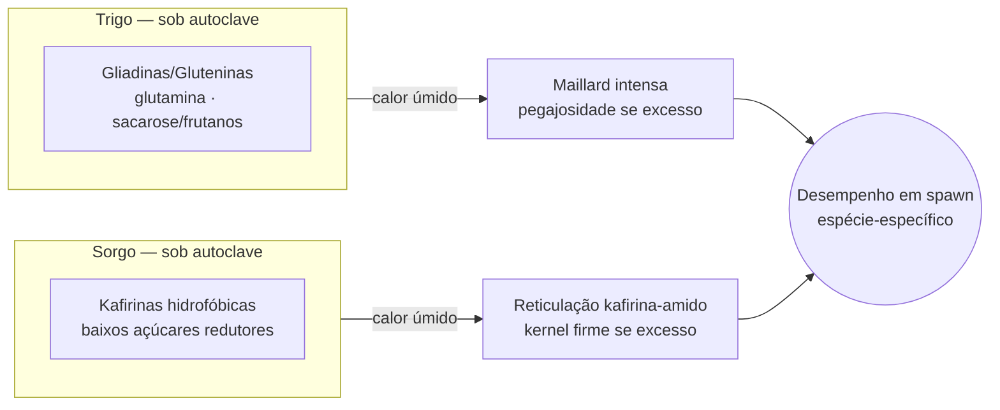

# Composição química de cereais para spawn

## Definição

Trigo e sorgo são os dois grãos cerealíferos mais usados em spawn de grãos (grain spawn). Embora comparáveis em teor bruto de proteína e amido, diferem em sistema proteico, perfil de açúcares solúveis e organização estrutural do endosperma — diferenças com consequências diretas na autoclavagem e na acessibilidade nutricional e mecânica para o micélio.

## Trigo

- Proteína total: ~10–18%; sistema proteico dominado por gliadinas e gluteninas (~75%), ricas em glutamina/prolina, pobres em lisina
- Amido: ~60–75%; amilose ~20–30%; integrado à matriz glutinosa do endosperma
- Açúcares solúveis: sacarose ~0,5–1,6%, rafinose ~0,2–0,7%, frutanos ~0,8–1,9%; açúcares redutores livres <0,1%
- Anatomia: endosperma dominante (~80–85% do grão); pericarpo fino e não tecnologicamente relevante
- Lisina é o aminoácido limitante, como na maioria dos cereais

## Sorgo

- Proteína total: ~11,4%; sistema proteico dominado por kafirinas (~50–82%), mais hidrofóbicas, ricas em leucina/alanina; lisina é o 1.º aminoácido limitante — limitação particularmente documentada
- Amido: ~56–75%; amilose ~21–30%; convive com corpos proteicos kafirínicos → maior resistência à expansão e à difusão de água
- Açúcares solúveis totais: 0,7–4,2%; açúcares redutores: 0,05–0,53% (sacarose como açúcar predominante)
- Pericarpo tecnologicamente saliente: determina comportamento na hidratação, cocção e integridade do grão pós-esterilização
- Cultivares pigmentadas: polifenóis/taninos presentes; podem interferir na leitura visual do escurecimento não enzimático

## Consequência estrutural principal

Mesmos teores brutos de proteína não equivalem ao mesmo comportamento térmico. No sorgo, o calor promove reticulação kafirina-amido por pontes dissulfeto, criando uma matriz coesa e fechada. No trigo, o endosperma é mais aberto, mas a fração glutinosa responde ao calor com exposição de grupos amino e maior vulnerabilidade à Reação de Maillard e à pegajosidade superficial. → [[Reação de Maillard em esterilização úmida de grãos]]

## Implicações operacionais

- Trigo: risco de supercozimento se hidratação ou tempo são excessivos → grão pegajoso, menor aeração intergranular
- Sorgo: risco de kernel excessivamente fechado se processamento é severo → menor difusão interna para o micélio
- Sorgo apresenta grão mais firme e discreto quando bem conduzido → maior número de pontos de inoculação por unidade de massa, o que favorece espécies de colonização rápida
- Nenhum cereal é universalmente superior: resultado depende da espécie e do manejo térmico [DR — Spawn cerealífero]

## Fluxo comparativo

## Fronteira aberta

Qual o efeito quantificável da razão amilose/amilopectina e da reticulação kafirina na taxa de colonização micelial, controlando independentemente espécie e protocolo térmico? → [[Lacunas de evidência e protocolos de pesquisa]]

## Recall

Qual diferença proteica entre trigo e sorgo explica o comportamento distinto de cada um no superprocessamento térmico?
?
No trigo, gliadinas/gluteninas são ricas em glutamina/prolina e têm grupos amino expostos que participam da Maillard e se tornam pegajosos sob excesso de calor. No sorgo, kafirinas são mais hidrofóbicas e respondem ao calor com reticulação por dissulfeto, formando uma matriz proteína-amido fechada que limita a acessibilidade mecânica ao micélio — o problema é de difusão, não de pegajosidade.
