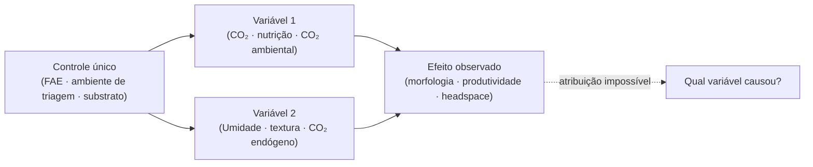

# Confundimento de variáveis em sistemas de cultivo

## Definição

Confundimento ocorre quando dois fatores causais distintos são acoplados ao mesmo mecanismo de controle, tornando impossível atribuir um efeito observado a uma única causa. Em sistemas de cultivo de basidiomicetos, esse problema aparece de forma recorrente em pelo menos três contextos independentes — todos com a mesma estrutura lógica.

## Os três confundimentos recorrentes

### 1. Ágar–substrato real

**Variáveis acopladas:** composição química, textura mecânica, gradientes de CO₂/O₂, temperatura e umidade são todos distintos entre ágar e substrato lignocelulósico. Mudar de ágar para substrato altera tudo simultaneamente.

**Consequência:** velocidade de crescimento em placa ≠ produtividade em substrato. Nenhum parâmetro medido em ágar pode ser atribuído isoladamente como preditor de frutificação.

→ [[Validade preditiva do cultivo em ágar]]

### 2. FAE–umidade (setup doméstico)

**Variáveis acopladas:** em setups domésticos com ar ambiente (<95% UR), a taxa de troca de ar fresco (FAE) controla simultaneamente CO₂ (remove) e umidade relativa (aumenta evaporação superficial do substrato). Aumentar FAE = ↓CO₂ + ↑evaporação.

**Consequência:** não é possível atribuir formação de primórdios ou morfologia do corpo frutificante ao CO₂ isolado quando FAE e umidade são o mesmo ajuste.

→ [[CO2 como ponto de controle por fase de cultivo]]

### 3. CO₂ ambiental–CO₂ endógeno

**Variáveis acopladas:** a concentração de CO₂ no headspace resulta de dois termos: CO₂ removido pelo FAE (controlável pelo cultivador) + CO₂ produzido pela respiração micelial (depende do substrato, temperatura e fase de crescimento). FAE idêntico produz concentrações distintas em substratos diferentes.

**Consequência:** comparar frutificação entre substratos sem medir CO₂ real confunde efeito do substrato com efeito do CO₂.

→ [[CO₂ endógeno e ritmo respiratório micelial]]

## Estrutura comum

## Como quebrar o confundimento

| Instância | Solução mínima |
|---|---|
| Ágar–substrato | Teste obrigatório em substrato real antes de qualquer decisão de seleção |
| FAE–umidade | Controlar umidade da fonte de FAE (ar umidificado ≥95% UR) ou medir CO₂ com sensor |
| CO₂ ambiental–endógeno | Sensor NDIR para medir [CO₂] real; ou normalizar substrato entre comparações |

## Implicação para confiança das notas do vault

Toda afirmação causal sobre CO₂ na frutificação, substrato na morfologia ou ágar na seleção deve ser avaliada contra este padrão antes de ser registrada como `confiança: alta`. Observações consistentes com o efeito esperado, mas obtidas sem controle independente das variáveis, são `confiança: média` no máximo.

## Recall

Qual é a estrutura comum dos três confundimentos recorrentes no cultivo?
?
Em todos os casos, um único mecanismo de controle afeta duas variáveis causais simultaneamente — tornando impossível atribuir o efeito observado a uma única causa. Ágar–substrato, FAE–umidade e CO₂ ambiental–endógeno são três instâncias do mesmo problema lógico.
