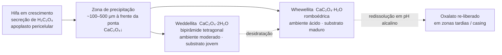
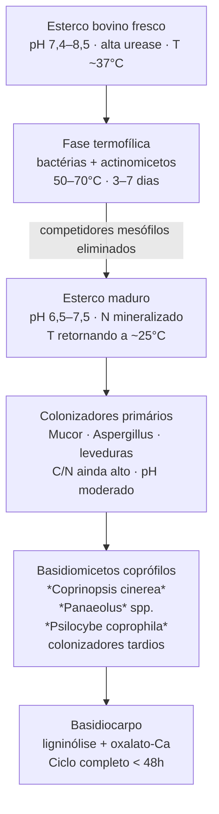
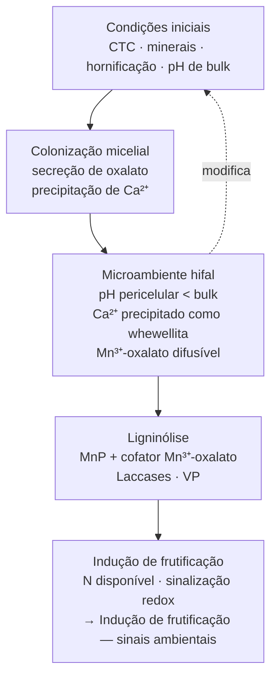

# Engenharia geoquímica fúngica — oxalato de cálcio

## Definição

Muitos basidiomicetos secretam **ácido oxálico (H₂C₂O₄)** que precipita Ca²⁺ como cristais de **oxalato de cálcio** nas imediações das hifas — principalmente whewellita (CaC₂O₄·H₂O, monohidrato) e weddellita (CaC₂O₄·2H₂O, dihidrato). A ubiquidade desses cristais em espécies ligninolíticas, coprófilas e ectomicorrízicas indica vantagem seletiva forte. O fungo não é um inquilino passivo da química do substrato: ele a **reescreve ativamente**, criando gradientes de pH e distribuições de cátions ao redor das hifas que podem divergir agudamente do *bulk* do substrato. [CONSENSO — Graustein et al. 1977; Gadd]

## Química da precipitação: o Ca²⁺ da CTC como matéria-prima

O ácido oxálico, secretado para o apoplasto, ioniza em oxalato (C₂O₄²⁻) e reage com o Ca²⁺ presente na solução do substrato ou recrutado dos sítios de troca catiônica:

$$Ca^{2+} + C_2O_4^{2-} \rightarrow CaC_2O_4 \downarrow \quad (K_{sp} \approx 2{,}3 \times 10^{-9})$$

O produto de solubilidade extremamente baixo (Ksp ~10⁻⁹) garante que a precipitação seja praticamente completa sempre que Ca²⁺ e oxalato coexistem em concentração suficiente. Isso tem uma implicação direta sobre a [[Capacidade de troca catiônica em substratos fúngicos]]: o Ca²⁺ que a CTC segura nos sítios de troca — e que adicionamos como gesso e cal — **não é apenas tolerado pelo fungo; é a matéria-prima de uma engenharia geoquímica ativa**. A premissa de "substrato como matriz estática" e a premissa de "pH de bulk como variável de controle" caem juntas aqui: o sistema relevante é o microambiente dinâmico que o micélio constrói. [CONSENSO]

## Morfologia dos cristais e posição em relação à hifa

A forma do cristal (whewellita vs. weddellita) é indicadora das condições locais de pH, temperatura e concentração de Ca²⁺. Em tapetes de *Hysterangium crassum* (ectomicorriza), Cromack et al. (1979) documentaram acumulações de **9,7 g CaC₂O₄/kg solo seco** — concentrações macroscopicamente detectáveis que alteram o ciclo geoquímico do Ca no ecossistema. Esses dados são a evidência seminal de que a engenharia fúngica de oxalato tem escala de campo, não só de laboratório.

## Funções propostas: evidência e grau epistêmico

| Função | Mecanismo proposto | Tipo de evidência | Grau |
|---|---|---|---|
| Regulação de pH intracelular e pericelular | Secreção de H⁺ como oxalato remove carga ácida do citossol; acidifica zona de intemperismo ao redor da hifa | Correlação direta entre taxa de secreção e pH pericelular | CONSENSO |
| Detoxificação e sumidouro de Ca²⁺ | Precipitação remove Ca²⁺ em excesso — inibidor de enzimas Ca-sensíveis e de trocas iônicas | Crescimento melhorado em alta [Ca²⁺] quando via oxalato ativa | CONSENSO |
| Sequestro de metais pesados | Oxalato precipita Cu²⁺, Al³⁺, Fe³⁺ como sais pouco solúveis | Documentado in vitro e em solos contaminados | CONSENSO |
| Reservatório geoquímico de Ca | CaC₂O₄ mineralizado = estoque lento de Ca no ecossistema; redissolve em pH alcalino | Dados de campo (Graustein 1977; Cromack 1979) | CONSENSO |
| Cofator indireto de Mn-peroxidase | Oxalato quelante Mn³⁺ → estabiliza o mediador difusível da degradação de lignina | Mecanismo bioquímico documentado em white-rots | CONSENSO |
| Intemperismo de minerais primários | Acidificação local dissolve feldspatos e silicatos → libera P, K, Ca — amplia disponibilidade de nutrientes | Correlação em tapetes ectomicorrízicos; causalidade inferida | CONSENSO/HIPÓTESE |
| Inibição de competidores bacterianos | Acidez local inibe bactérias alcalofílicas; quelação de Fe remove cofatores bacterianos | Observação ecológica; experimento de causalidade direta ausente | HIPÓTESE |

### Elo com as enzimas lignocelulolíticas: o sistema multifuncional

A manganês-peroxidase (MnP) requer Mn³⁺ como mediador difusível para oxidar lignina. O Mn²⁺ liberado do substrato é oxidado a Mn³⁺ pela peroxidase; o Mn³⁺ é instável em solução livre e precisa ser quelado para difundir até o alvo. **O oxalato é o quelante primário do Mn³⁺** in vivo, estabilizando-o como complexo Mn³⁺-oxalato e ampliando o raio de ação da peroxidase para além da superfície hifal.

O mesmo fungo usa oxalato para regulação de pH, precipitação de Ca²⁺ e extensão do alcance das enzimas ligninolíticas — é **sistema convergente multifuncional** emergente da secretoma de uma mesma molécula simples. → [[Enzimas lignocelulolíticas]] [CONSENSO]

## A ecologia coprófila do *Coprinopsis cinerea*: estudo de caso

### Química do esterco bovino como nicho de partida

O esterco bovino fresco opera como sistema tampão alcalino com perfil característico:

| Parâmetro | Valor típico | Origem mecanística |
|---|---|---|
| pH | 7,4–8,5 | Urease hidrolisa ureia → NH₃; bicarbonato e carbonato da dieta |
| CTC (matéria orgânica) | ~30–80 meq/100 g | Fração humificada rica em ácidos húmicos |
| Cátions dominantes | Ca²⁺, K⁺ | Dieta bovina rica em Ca; potássio de forragem |
| N total | Alta disponibilidade | Relação C/N 15–25 (vs. 30–50 da palha crua) |
| Lignocelulose | Pré-digerida (rúmen) | Hidrólise parcial de hemicelulose; amolecimento da celulose |
| Fases minerais possíveis | Estruvita, hidroxiapatita, whitlockite, K₂SO₄ | Digestão de minerais da dieta |

A lignocelulose do esterco é parcialmente pré-digerida pelo rúmen: hemicelulose hidrolisada, celulose amolecida, lignina parcialmente oxidada. A barreira que white-rots enfrentam na madeira está mecanicamente atenuada antes de o fungo chegar.

### A sucessão ecológica coprófila

*Coprinopsis cinerea* (syn. *Coprinus cinereus*) — organismo-modelo central do texto-base de genética (Moore & Novak Frazer 2003) — é no campo o **colonizador tardio** dessa sucessão. Ela não chega primeiro: exploração do nicho de alta temperatura residual (ótimo de crescimento ~37°C, tolerância a 45°C), pH neutro-alcalino e lignocelulose pré-digerida. Selecionada pelo nicho, não presente por acaso. [CONSENSO]

### *Coprinopsis* como white-rot coprófilo

*C. cinerea* é white-rot: produz lacase, MnP e VP que degradam o componente lignínico do esterco (13–38% da matéria seca). A ligninólise recruta o sistema oxalato-Mn³⁺ descrito acima. A particularidade coprófila é a **velocidade**: o ciclo de vida completo (esporo → basidiocarpo → novo esporo) pode completar-se em menos de 48 horas em condições favoráveis — uma das taxas de desenvolvimento mais rápidas entre basidiomicetos, compatível com um recurso efêmero de alta competição. [CONSENSO]

## O silogismo do nicho: da lógica à predição falsificável

A ecologia do *Coprinopsis* pode ser comprimida numa forma silogística explícita com valor metodológico autônomo:

**Premissa maior [CONSENSO]:** um basidiomiceto saprotrófico coloniza e frutifica preferencialmente onde coincidem (a) lignocelulose pré-digerida com C e N disponíveis, (b) pH e cátions trocáveis dentro de sua janela de tolerância, e (c) carga reduzida de competidores.

**Premissa menor [empírica]:** o esterco bovino compostado reúne (a) lignocelulose pré-digerida rica em N, (b) pH 7–8,5 tamponado por carbonato/amônia e CTC alta Ca-saturada, e (c) competidores reduzidos pós-fase termofílica.

**Conclusão:** o esterco compostado é nicho seletivo para basidiomicetos coprófilos.

A forma é **válida**; a *soundness* depende das premissas empíricas; a conclusão é **estatística** ("preferencialmente"). A operacionalização dos termos em variáveis mensuráveis é o único modo de transformar o silogismo em predição falsificável:

| Termo lógico | Variável operacional | Unidade |
|---|---|---|
| "Lignocelulose pré-digerida" | Razão C/N; solubilidade de frações celulósicas; grau de lignificação | adimensional; % |
| "Janela de tolerância de pH" | Faixa pH do extrato 1:5 com taxa de colonização ≥ 50% do máximo | unidades de pH |
| "Cátions dentro da tolerância" | EC (condutividade elétrica); [Ca²⁺], [K⁺], [Na⁺] na solução intersticial | mS/cm; mg/L |
| "Carga de competidores reduzida" | UFC/g de substrato de Trichoderma e bactérias gram-negativas | UFC/g |
| "Coloniza preferencialmente" | Taxa de colonização (cm/dia) e % de frutificação vs. controle | cm/dia; % |

Feita a operacionalização, cada elo pode ser testado independentemente. O que era afirmação retórica ("esse substrato é bom") torna-se **programa de medição com predições falsificáveis**. → [[Confundimento de variáveis em sistemas de cultivo]], [[Frutificação como desfecho experimental]]

## Compostagem de *Agaricus* como domesticação do nicho coprófilo

A compostagem de fases I e II do *Agaricus bisporus* é a versão instrumentada e deliberada do processo que ocorre espontaneamente sobre o esterco bovino:

| Etapa natural (esterco) | Equivalente no cultivo industrial |
|---|---|
| Fase termofílica bacteriana (50–70°C, dias) | Fase I: leiras aeradas com T controlada; eliminação de patógenos e competidores |
| Resfriamento e estabilização de pH | Fase II: pasteurização a 57–60°C + condicionamento a 45–50°C por 5–7 dias |
| Nicho Ca-saturado, pH 7–8, alta CTC | Composto final: pH 7,0–7,5; gesso adicionado (Ca²⁺); EC controlada |
| Colonizador tardio (esporos/micélio) | Inoculação com spawn de *Agaricus* após pasteurização seletiva |
| Ligninólise via MnP + oxalato-Mn³⁺ | Degradação de lignina pelo micélio durante a corrida de colonização |

O cultivador de *Agaricus* não inventou um processo — **domesticou uma ecologia** que a evolução havia selecionado sobre o esterco. A compreensão mecanística da química — CTC, Ca²⁺, pH tamponado, gesso, termofilia seletiva — é a mesma em ambos os contextos. A diferença é que no cultivo industrial os parâmetros são instrumentados e controlados; na natureza, o microambiente os impõe. [CONSENSO/TÉCNICA]

## O substrato como sistema dinâmico: síntese

> **Premissa central:** as "alterações" ingenuamente atribuídas à hidratação rápida do substrato pertencem ao **estado inicial** (hornificação pela secagem, equilíbrio de troca por salinidade). A dinâmica subsequente pertence à **biologia**: o fungo é o agente geoquímico ativo que conduz o substrato para longe do equilíbrio enquanto o coloniza.

## Fronteira aberta

- **Escala espacial do gradiente de pH pericelular:** os cristais de whewellita são documentados ao redor de hifas, mas a extensão do gradiente de pH criado em bloco de substrato em colonização — e sua relação com a velocidade de avanço da frente micelial — não foi mapeada in situ em condições de cultivo controlado.

- **Regulação da secreção de oxalato em resposta à CTC do substrato:** a expressão dos genes de oxalato-oxidase e oxalato-descarboxilase em basidiomicetos coprófilos em resposta à razão Ca/K e ao pH inicial é inferida por analogia com white-rots de madeira. Dados para *Coprinopsis cinerea* em substrato com CTC manipulada (Ca-saturado vs. K-saturado) são inexistentes. → [[Lacunas de evidência e protocolos de pesquisa]]

- **Cascata CTC → oxalato → CTC efetiva:** quando o micélio precipita Ca²⁺ como oxalato, reduz o Ca²⁺ disponível na solução, desloca o equilíbrio de troca e libera outros cátions (Mg²⁺, K⁺) dos sítios. Essa cascata — CTC inicial → precipitação → nova CTC efetiva → nova disponibilidade de Mg/K — é teoricamente coerente mas não quantificada em ciclos completos de cultivo. → [[Confundimento de variáveis em sistemas de cultivo]]

- **Oxalato como modulador da microbiota competidora:** se a acidificação pericelular inibe bactérias alcalofílicas, o fungo criaria ativamente seu próprio nicho de baixa competição. A hipótese é ecologicamente plausível e explicaria parte do vigor de colonização de white-rots em substratos bacterialmente ricos, mas carece de experimento de causalidade controlada.

## Recall

Por que o Ca²⁺ adicionado como condicionador não é apenas tampão passivo do ponto de vista do fungo?
?
Porque o fungo secreta ácido oxálico que precipita o Ca²⁺ como oxalato de cálcio (Ksp ~10⁻⁹), recrutando-o como matéria-prima de engenharia geoquímica ativa. O Ca²⁺ que a CTC segura nos sítios — adicionado via gesso e cal — entra no sistema pericelular como substrato para precipitação e fonte de gradiente de pH. O fungo não tolera passivamente o cálcio: usa-o para remodelar o microambiente químico ao redor das hifas.

Qual é o papel do oxalato na atividade da manganês-peroxidase (MnP)?
?
A MnP oxida Mn²⁺ a Mn³⁺, que atua como mediador difusível na oxidação da lignina. O Mn³⁺ é instável em solução livre; o oxalato secretado pelo fungo quelata-o como complexo Mn³⁺-oxalato difusível, estendendo o raio de ação da peroxidase para além da superfície hifal. O oxalato funciona simultaneamente como regulador de pH, precipitante de Ca²⁺ e cofator indireto das enzimas ligninolíticas — sistema multifuncional convergente a partir de uma única molécula.

Por que *Coprinopsis cinerea* é colonizador tardio no esterco bovino e não pioneiro?
?
Porque o nicho que ela explora — temperatura residual alta (~37–45°C), pH neutro-alcalino, lignocelulose pré-digerida, baixa carga de competidores mesófilos — só existe após a fase termofílica bacteriana (50–70°C) ter eliminado os fungos mesófilos que chegariam primeiro. *Coprinopsis* não é superiora de forma geral; é otimizada para condições que a fase termofílica cria — um nicho construído por outros organismos antes de ela chegar.

O que torna o silogismo do nicho uma ferramenta metodológica e não apenas retórica?
?
Porque forçar a explicitação de premissas maiores (leis ecológicas gerais) e premissas menores (dados empíricos do substrato) revela onde estão as lacunas de medição. Cada termo não operacionalizado — "janela de tolerância de pH", "lignocelulose pré-digerida", "competidores reduzidos" — é uma variável ainda não medida. O silogismo converte "esse substrato é bom" em programa de medição: definir cada termo em variável numérica, medir, correlacionar com desfechos de colonização e frutificação. A conclusão deixa de ser qualitativa e vira predição falsificável com teste estatístico associado.

Como a compostagem industrial de *Agaricus* se relaciona com a ecologia coprófila natural?
?
É a domesticação instrumentada do mesmo processo: a fase I de compostagem reproduz a fase termofílica bacteriana natural (50–70°C, eliminação de competidores); a fase II reproduz o resfriamento e condicionamento do esterco maduro; a inoculação com spawn substitui a chegada natural dos esporos coprófilos tardios. Os parâmetros finais (pH 7,0–7,5, Ca²⁺ via gesso, EC controlada) reproduzem o perfil do esterco maduro Ca-saturado. O cultivador não inventou o processo — reproduz e controla o que a evolução já havia selecionado.
