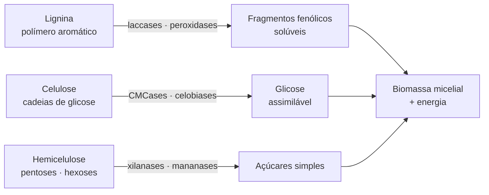

# Enzimas lignocelulolíticas

## Definição

Conjunto enzimático secretado pelos basidiomicetos ligninolíticos para degradar a parede celular vegetal — composta de celulose, hemicelulose e lignina. Em cultivo, essa capacidade determina a eficiência de colonização do substrato e, indiretamente, o rendimento da frutificação. O dicarion amplia essa capacidade via heterose transcricional.

## As enzimas principais

### Laccases (oxidases de cobre, EC 1.10.3.2)

Catalisam a oxidação de compostos fenólicos usando O₂ como aceptor de elétrons, produzindo H₂O. Em *Pleurotus ostreatus*, os genes **lacc6** e **lacc10** apresentam upregulation não aditiva no dicarion em relação aos monocariontes parentais — a expressão dicariótica supera a soma das expressões individuais. [ref. 1] Além da degradação de lignina, as laccases oxidam HMF e compostos furânicos — base da detoxificação de subprodutos da Maillard.

### Peroxidases (MnP, LiP, VP)

- **Manganês-peroxidase (MnP):** oxida Mn²⁺ → Mn³⁺, que por sua vez oxida fenóis de baixo peso molecular. Secretada principalmente por white-rots
- **Lignina-peroxidase (LiP):** oxida diretamente compostos aromáticos não fenólicos; alta capacidade oxidante
- **Peroxidase versátil (VP):** combina atividade de MnP e LiP; presente em *Pleurotus* e *Bjerkandera*

### Aryl-alcohol oxidases (AAO)

Oxidam álcoois aromáticos produzindo H₂O₂ — cofator essencial para a atividade das peroxidases. Expressas em *Pleurotus ostreatus* em resposta a HMF, documentando o papel duplo: degradação de lignina e detoxificação de furânicos. → [[Resposta micelial a subprodutos furânicos]]

### CMCases (endo-glucanases, EC 3.2.1.4)

Hidrolisam celulose (carboximetilcelulose como substrato modelo). Indicam capacidade celulolítica — complementam as oxidases na degradação da celulose exposta após a remoção da lignina.

## Fluxo degradativo simplificado

## Conexão com o dicarion e a heterose

A upregulation de laccases e peroxidases no dicarion de *Pleurotus ostreatus* é o mecanismo molecular que explica a superioridade degradativa do dicarion sobre os monocariontes parentais. O dicarion não é a média dos parentais — é capaz de secreção enzimática em níveis que nenhum dos monocariontes atinge individualmente. → [[Heterose vegetativa]]

**Consequência prática:** avaliar monocariontes individualmente em substrato lignocelulósico subestima o potencial do dicarion que eles formarão.

## Conexão com o substrato de spawn

O substrato condiciona o que o fungo pode acessar. Matéria-prima com matriz proteína-amido muito fechada (sorgo superprocessado) limita mecanicamente o acesso das enzimas, independentemente da capacidade secretória do fungo. → [[Composição química de cereais para spawn]]

## Fronteira aberta

A regulação transcricional das enzimas lignocelulolíticas em resposta à composição química específica do substrato (celulose/lignina/hemicelulose em diferentes proporções) não foi caracterizada em condições de produção comercial para *Pleurotus ostreatus* ou *Lentinula edodes*. → [[Lacunas de evidência e protocolos de pesquisa]]

## Recall

Por que o dicarion degrada substrato lignocelulósico com mais eficiência que os monocariontes que o compõem?
?
O transcriptoma dicariótico exibe upregulation não aditiva de laccases (lacc6, lacc10) e peroxidases — a expressão supera a soma das expressões individuais dos parentais. Esse mecanismo de heterose transcricional traduz-se diretamente em maior capacidade oxidante para degradar lignina e hemicelulose.
