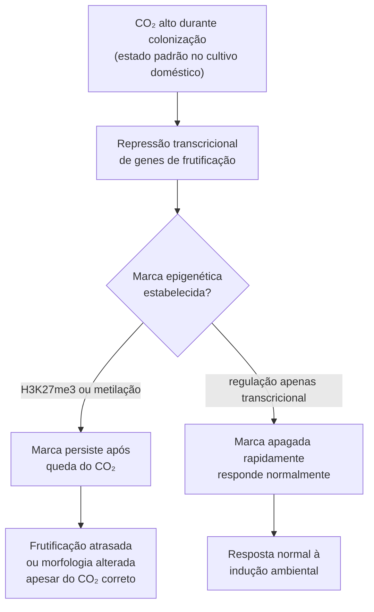

# Epigenética de condições de cultivo

## Definição

A hipótese de epigenética de condições de cultivo propõe que estímulos ambientais experimentados durante a colonização — concentração de CO₂, temperatura, composição do substrato — podem induzir marcas epigenéticas (metilação de DNA, H3K27me3, modificações de histonas) que persistem mitoticamente e afetam o comportamento de frutificação em ciclos subsequentes, mesmo após a mudança das condições ambientais que as induziram.

## Base teórica

Três pilares sustentam a hipótese:

1. **Marcas epigenéticas são mitoticamente herdáveis.** Metilação de DNA e H3K27me3 são mantidas através de divisões celulares por maquinaria de manutenção (PRC2, DNMTs). Uma marca estabelecida durante a colonização persiste nas células descendentes que formarão os primórdios. → [[H3K27me3 e silenciamento epigenético]], [[Metilação de DNA na fase micelial]]

2. **CO₂ alto suprime cronicamente vias de frutificação.** A queda de CO₂ é sinal indutor de frutificação [Indução de frutificação]. Se CO₂ alto durante colonização silencia genes de frutificação via H3K27me3, a marca pode persistir após a queda de CO₂ — explicando atrasos ou morfologias alteradas em cultivos com histórico de CO₂ muito alto na colonização. → [[CO2 como ponto de controle por fase de cultivo]]

3. **Efeito colher de prata em fungos.** Condições de desenvolvimento precoce deixam rastros fenotípicos persistentes detectáveis em gerações seguintes — mecanismo candidato: epigenético. → [[Efeito colher de prata]]

## O elo CO₂ → epigenética → frutificação

Se o ramo D for predominante, o histórico de CO₂ na colonização afeta a frutificação de forma independente do CO₂ atual — e esse efeito é invisível para quem mede apenas o CO₂ no momento da frutificação.

## Implicação para a confusão CO₂–morfologia

A nota de CO₂ documenta que morfologia do cogumelo responde a CO₂ de forma dose-dependente. Se marcas epigenéticas do histórico de colonização também afetam morfologia, o confundimento é ampliado: o observador vê variação morfológica e não pode separar se ela vem de (a) CO₂ atual, (b) histórico de CO₂ na colonização via epigenética, ou (c) genótipo. → [[Confundimento de variáveis em sistemas de cultivo]]

## Conexão com senescência clonal

Se condições de cultivo acumulam marcas epigenéticas indesejadas em genes de vigor reprodutivo ao longo de gerações vegetativas sucessivas, isso provê um mecanismo alternativo (e não excludente) à hipótese do plasmídeo mitocondrial de *P. anserina* para a senescência clonal em basidiomicetos. A degeneração observada seria, parcialmente, acúmulo de silenciamento epigenético em loci de frutificação. → [[Senescência clonal]]

## O sawdust-freezing como congelamento do estado epigenético

A conservação em sawdust-freezing a −85°C preserva tanto o genótipo quanto o estado epigenético acumulado até o momento do congelamento. Isso implica:
- Linhagens preservadas em momentos diferentes do ciclo de subcultivo têm estados epigenéticos distintos
- Reativação de estoques antigos pode revelar o estado "jovem" — mas apenas se as marcas epigenéticas acumuladas forem o mecanismo de degeneração

## Evidência disponível e lacunas

| Afirmação | Base atual | Nível de evidência |
|---|---|---|
| H3K27me3 existe em basidiomicetos | Presente por homologia de PRC2 | Média (inferida, não medida) |
| Metilação de DNA em basidiomicetos | Documentada em alguns isolados | Média (espécies limitadas) |
| CO₂ induz marcas epigenéticas em genes de frutificação | Não medido | Ausente — hipótese pura |
| Marcas persistem >3 gerações vegetativas | Não medido em basidiomicetos | Ausente |

## Como testar

1. **Protocolo de reset epigenético:** cultivar linhagem com histórico de CO₂ alto → tratar com 5-azacitidina (desmetilante) ou TSA (inibidor de HDAC) em concentrações sub-inibitórias → comparar frutificação com controle sem tratamento. Recuperação de fenótipo = evidência de mecanismo epigenético. → [[Lacunas de evidência e protocolos de pesquisa]]

2. **Comparação de gerações:** mesma linhagem — G1 (colonização em CO₂ alto padrão) vs. G2 (colonizada em CO₂ controlado) → medir tempo de frutificação e morfologia. Diferença persistente entre gerações = evidência de herança mitótica.

3. **ChIP-seq ou WGBS** em micélio colonizado sob CO₂ alto vs. CO₂ baixo: mapear diferenças em H3K27me3 e metilação em regiões próximas a genes de frutificação (fatores A/B, genes de primórdio).

## Fronteira aberta

→ [[Lacunas de evidência e protocolos de pesquisa]] (Prioridade 5)

## Recall

Por que o histórico de CO₂ durante a colonização pode afetar a frutificação mesmo após correção das condições ambientais?
?
Hipótese: CO₂ alto durante colonização pode induzir marcas epigenéticas (H3K27me3 ou metilação de DNA) em genes de frutificação que persistem mitoticamente nas células descendentes. Se essas marcas não forem rapidamente apagadas, o fungo mantém genes de frutificação suprimidos por inércia epigenética — resultando em atraso ou morfologia alterada apesar do ambiente estar correto. Isso confunde CO₂ atual, histórico de CO₂ e genótipo em uma única variação fenotípica observada.
