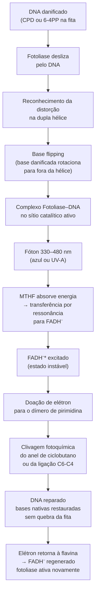

# Fotoliase e fotorreativação

## Definição

Fotoliases são enzimas monoméricas de reparo direto do DNA ativadas por luz visível. Pertencem à superfamília das flavoproteínas e utilizam como cofator catalítico o dinucleotídeo de adenina-flavina em estado totalmente reduzido (FADH⁻). Fungos filamentosos e basidiomicetos expressam duas isoformas nucleares especializadas para tipos distintos de lesão induzida por UV-C.

## Lesões produzidas pelo UV-C (254 nm)

A radiação UV-C é absorvida diretamente pelas bases nitrogenadas do DNA, com eficiência máxima a 254 nm. O dano ocorre entre pirimidinas adjacentes na mesma fita:

| Lesão | Formação | Ligação característica | Consequência estrutural |
|---|---|---|---|
| Dímero de pirimidina de ciclobutano (CPD) | União covalente entre C5-C5 e C6-C6 de timinas ou citosinas vizinhas | Anel de ciclobutano | Distorção local da dupla hélice; bloqueia DNA polimerase e RNA polimerase |
| Fotoproduto pirimidina-pirimidona (6-4PP) | Ligação covalente entre C6 da pirimidina 5' e C4 da pirimidina 3' | Ligação C6-C4 | Distorção estrutural mais severa; ocorre em menor frequência que CPDs |

Ambas as lesões reduzem a distância de ligação do esqueleto de fosfato e bloqueiam fisicamente as enzimas de replicação e transcrição celular.

## As duas fotoliases fúngicas

- **Phr1 (CPD fotoliase):** especializada na detecção e reversão direta dos dímeros de ciclobutano (CPDs), a lesão mais frequente após irradiação UV-C.
- **Phr2 (6-4PP fotoliase):** direcionada ao reparo estrutural das lesões 6-4PP, menos frequentes mas estruturalmente mais disruptivas.

## Mecanismo molecular da fotorreativação

**Cromóforo antena:** o meteniltetraidrofolato (MTHF) absorve fótons na faixa de 330–480 nm e transfere a energia por ressonância ao FADH⁻. O estado excitado FADH⁻* doa um elétron para o dímero, clivando a ligação covalente anômala e restaurando as bases nitrogenadas sem qualquer quebra na fita de DNA.

## Regulação transcricional por Wco1

A expressão de *phr1* e *phr2* é controlada pela proteína fotorreceptora Wco1 (White Collar-1), homóloga ao fator de transcrição WC-1 regulado por luz em *Neurospora crassa*. Sob iluminação natural ou artificial na faixa de 330–480 nm, Wco1 atua como fator de transcrição e induz rapidamente a expressão dos genes das fotoliases, potencializando o reparo celular imediato.

**Consequência direta para o protocolo de mutagênese:** todo o pós-tratamento — da pipetagem à incubação das placas — deve ocorrer em escuro absoluto. Sem o estímulo luminoso, a fotorreativação é totalmente inibida (Phr1 e Phr2 não são ativadas mesmo que já expressas) e a célula recorre às vias de reparo lentas.

## Reparo no escuro: NER e síntese translesão

Quando a fotorreativação é bloqueada pelo escuro absoluto, duas vias alternativas processam as lesões UV:

1. **NER (Reparo por Excisão de Nucleotídeos):** excisa um oligonucleotídeo (~25–30 bases) contendo a lesão e ressíntese a região usando a fita complementar como molde. Reparo de alta fidelidade mas lento — não produz mutação por si só, mas pode sobrecarregar a célula.

2. **Síntese translesão (TLS):** DNA polimerases especializadas (propensas a erros, como Polη e Polζ) copiam diretamente sobre a lesão não reparada, incorporando bases incorretas. É essa síntese imprecisa que **converte a lesão física em mutação pontual permanente e herdável** — o produto final desejado do protocolo de mutagênese UV.

A combinação escuro + UV-C força a via mutagênica (TLS) em detrimento da via fiel (fotorreativação), gerando o perfil de mutações pontuais estáveis necessário para o melhoramento genético por mutagênese aleatória.

## Luz de segurança verde

Durante o plaqueamento e a diluição seriada após a irradiação, utiliza-se luz de segurança verde como compromisso prático. O espectro verde (~510–560 nm) não ativa FADH⁻ com eficiência para fotorreativação (que requer 330–480 nm) e permite visibilidade operacional sem comprometer o escuro funcional para as fotoliases.

## Fronteira aberta

A diversidade molecular das fotoliases (incluindo criptocromos DASH e Phr2 divergentes) em basidiomicetos comerciais como *Pleurotus ostreatus* e *Lentinula edodes* ainda não está completamente caracterizada. A sensibilidade espécie-específica à fotorreativação — e portanto o risco de reversão acidental das lesões UV — pode variar consideravelmente entre linhagens e ser afetada pela temperatura de incubação pós-irradiação. → [[Mutagênese UV em basidiomicetos#Fronteira aberta]]

## Recall

O que justifica o protocolo de escuro absoluto após irradiação UV-C?
?
A luz visível de 330–480 nm ativa as fotoliases fúngicas Phr1 e Phr2 (via cofator FADH⁻ excitado) e a sua expressão é induzida pelo fotorreceptor Wco1. Sem o escuro absoluto, a fotorreativação reverte os dímeros de pirimidina antes que a síntese translesão (TLS) cometa os erros de incorporação que se convertem em mutações permanentes. O escuro bloqueia o reparo fiel e força a via mutagênica.

Qual a diferença funcional entre Phr1 e Phr2?
?
Phr1 (CPD fotoliase) reverte dímeros de pirimidina de ciclobutano — a lesão mais frequente após UV-C, formada pela ligação C5-C5/C6-C6 entre pirimidinas adjacentes. Phr2 (6-4PP fotoliase) reverte os fotoprodutos 6-4PP — menos frequentes mas estruturalmente mais severos, formados pela ligação C6-C4. Ambas usam FADH⁻ como cofator e luz 330–480 nm como fonte de energia para a clivagem fotoquímica.
