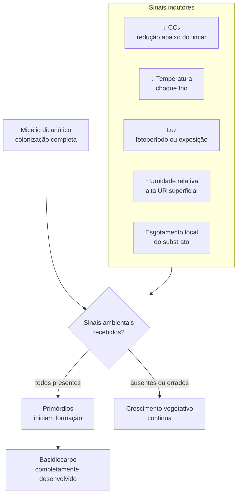

# Indução de frutificação — sinais ambientais

## Definição

A transição do crescimento micelial vegetativo para a formação de primórdios (pinheads) e basidiocarpos não é automática — é desencadeada por um conjunto de sinais ambientais que o micélio usa como indicador de que as condições externas são favoráveis à reprodução. Em condições normais, apenas dicariontes respondem a esses sinais. [EFG p. 46]

## Sinais indutores principais

## Papel de cada sinal por espécie

| Sinal | *Pleurotus ostreatus* | *Lentinula edodes* |
|---|---|---|
| Redução de CO₂ | Crítico — alta [CO₂] bloqueia primórdios | Relevante mas menos documentado |
| Choque de temperatura | Auxilia (queda de 5–10°C) | Crítico — queda necessária para frutificação |
| Luz | Modula orientação e desenvolvimento do píleo | Modula; não essencial |
| Umidade relativa alta | Necessária para expansão do píleo | Necessária |
| Esgotamento local do substrato | Estimula via sinalização de estresse | Estimula |

## CO₂ como sinal central

O dióxido de carbono é um inibidor de frutificação em concentrações acima de ~0,1% (1000 ppm) na maioria das espécies cultivadas. O micélio em substrato colonizando produz CO₂ pela respiração — por isso a concentração interna é sempre alta durante a colonização. A *queda* de CO₂ (com ventilação adequada no momento certo) é um sinal que indica que o micélio "enxergou" o limite do substrato e pode investir em reprodução. Isso explica o dimorfismo de *Lentinus tigrinus* — CO₂ elevado favorece forma secotiante. → [[Plasticidade morfológica e dimorfismo fenotípico]]

## Por que o ágar não induz frutificação

O ágar não fornece os sinais necessários:
1. CO₂ não cai abaixo do limiar crítico (sem ventilação controlada)
2. Não há esgotamento de substrato com textura e estrutura comparável
3. Gradientes de umidade e temperatura são ausentes ou não replicam o cultivo real

Por isso a triagem em placa é útil para crescimento vegetativo, mas não prediz a resposta reprodutiva. → [[Validade preditiva do cultivo em ágar]]

## Conexão com mecanossensibilidade

A hifa detecta o estado do substrato pela via CWI (resistência mecânica, umidade, tensão). Essa informação integra-se com os sinais ambientais externos (CO₂, temperatura) para a decisão de frutificar. O fungo não "decide" apenas com base em um único sinal — a frutificação emerge da integração de múltiplas vias de transdução. → [[Mecanossensibilidade hifal]]

## Fronteira aberta

Os genes que atuam como integradores dos sinais ambientais de frutificação em *Pleurotus ostreatus* e *Lentinula edodes* não estão totalmente caracterizados. Sabe-se que fatores A e B controlam a competência reprodutiva do dicarion [EFG p. 46], mas os receptores de CO₂, temperatura e luz permanecem parcialmente desconhecidos nessas espécies. → [[Lacunas de evidência e protocolos de pesquisa]]

## Recall

Por que a redução de CO₂ é um sinal de frutificação?
?
Durante a colonização, a respiração micelial eleva o CO₂ interno. Quando o micélio chega à superfície ou ao limite do substrato, a ventilação faz o CO₂ cair abaixo de ~0,1%. Essa queda é interpretada pelo fungo como indicador de que o substrato está esgotado e as condições externas são favoráveis — desencadeando a transição para frutificação.
