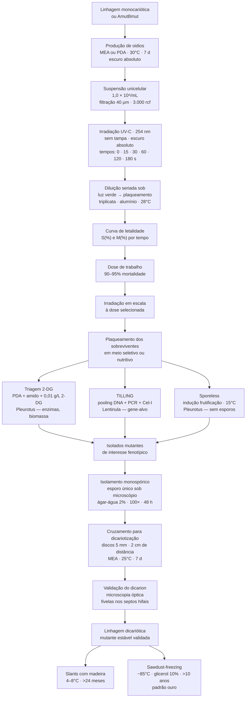

# Mutagênese UV em basidiomicetos

## Definição

Mutagênese por radiação ultravioleta é a aplicação controlada de UV-C (254 nm) para induzir mutações pontuais aleatórias no genoma de fungos, visando obter variantes com fenótipos de interesse agronômico ou biotecnológico — maior produção de enzimas, estabilidade pós-colheita de metabólitos, ausência de esporulação ou resistência a condições adversas. Em basidiomicetos, a execução desse protocolo exige compreensão do ciclo de vida bifásico e da dinâmica nuclear das espécies, pois a organização do genoma determina se uma mutação induzida será expressa ou permanecerá fenotipicamente silenciosa.

---

## O obstáculo nuclear em basidiomicetos

### A natureza dicariótica como barreira

O estado vegetativo dominante dos basidiomicetos é o dicarion (n+n): cada compartimento hifal abriga dois núcleos haplóides geneticamente distintos, mantidos em divisão síncrona pelas conexões de grampo. [EFG p. 13]

Quando o micélio dicariótico é exposto à UV-C, qualquer mutação induzida em um dos núcleos — natureza majoritariamente recessiva — será **mascarada pelo alelo selvagem dominante do núcleo parceiro**. A mutação fica fenotipicamente silenciosa, invisível para qualquer triagem. O EFG confirma esse princípio em termos gerais: "Recessive alleles will not be expressed by heterozygous dikaryotic or heterokaryotic mycelia." [EFG p. 39] — o mesmo mecanismo que confere vigor híbrido ao dicarion o torna refratário à expressão de mutações induzidas.

Para isolar essas mutações, seria necessário realizar desdicariotização (geração de protoplastos + separação dos núcleos parceiros em colônias monocarióticas independentes) — procedimento laborioso e com baixa eficiência. Os protocolos de mutagênese eficientes contornam o problema utilizando estruturas já monocarióticas como material de partida.

### As três fases nucleares e sua relevância para mutagênese

| Atributo | Monocarion primário (n) | Dicarion secundário (n+n) | Homocarion autocompatível (AmutBmut) |
|---|---|---|---|
| Número de núcleos por célula | Um único núcleo haploide | Dois núcleos haplóides geneticamente distintos | Um único núcleo haploide modificado |
| Expressão de mutações recessivas | **Imediata** — hemizigose celular | Mascarada pelo alelo selvagem do núcleo parceiro | **Imediata** — comporta-se geneticamente como monocarion |
| Presença de fivelas (clamps) | Ausentes | Presentes — garantem divisão celular síncrona | Presentes (fivelas modificadas — *fused clamps*) |
| Capacidade de frutificação | Estéril — não forma basidiocarpos | Fértil — frutifica e realiza meiose | Fértil — frutifica de forma autônoma sem acasalamento |
| Marcadores de seleção usados | Auxotrofias basais: *ade8-1*, *pab1-1*, *trp1* | Geralmente prototróficos por complementação nucleotídica | Auxotrofias específicas de laboratório: *pab1-1* |
| Uso em mutagênese | **Alvo padrão** — oidios, basidiósporos monospóricos | Descartado como alvo direto | **Alternativa para triagens de frutificação** |

### Solução: linhagem AmutBmut de *Coprinopsis cinerea*

A linhagem homocariótica autocompatível AmutBmut abriga mutações específicas em ambos os loci de tipo de acasalamento A e B, mimetizando o sinal de acasalamento compatível. O micélio monocariótico dessa linhagem sofre diferenciação e frutificação de forma autônoma — eliminando a necessidade de cruzamento prévio — e mantém a hemizigose celular que garante expressão imediata de qualquer mutação induzida.

Os marcadores genéticos usados nessa linhagem incluem:
- **ade8-1:** mutação missense N231D no domínio GARS (glicinamida ribonucleotídeo sintase), inativa a síntese *de novo* de purinas.
- **pab1-1:** mutação missense que altera o motivo conservado PIKGT para PIEGT no domínio C-terminal PabB da 4-amino-4-desoxicorismatosintase, bloqueando a síntese de ácido para-aminobenzoico (PABA).

---

## Fundamento molecular: dano por UV-C

A absorção direta de fótons de alta energia pelas bases nitrogenadas do DNA ocorre com eficiência máxima a **254 nm**. Dois tipos de fotoprodutos são formados entre pirimidinas adjacentes na mesma fita:

- **CPDs (Dímeros de Pirimidina de Ciclobutano):** ligação covalente C5–C5 e C6–C6 — lesão mais frequente, distorce localmente a dupla hélice e bloqueia DNA e RNA polimerases.
- **6-4PPs (Fotoprodutos pirimidina-pirimidona):** ligação covalente C6–C4 — menos frequentes, distorção estrutural mais severa.

Ambas as lesões reduzem a distância de ligação do esqueleto de fosfato e bloqueiam fisicamente a replicação e a transcrição celular. → Mecanismo detalhado em [[Fotoliase e fotorreativação]].

---

## Sistemas de reparo fúngico e a regra do escuro absoluto

Fungos basidiomicetos expressam duas fotoliases nucleares especializadas: **Phr1** (reverte CPDs) e **Phr2** (reverte 6-4PPs). Ambas utilizam fótons na faixa de 330–480 nm como energia para a clivagem fotoquímica do dímero, via cofator FADH⁻ excitado. A expressão de ambas é induzida pelo fotorreceptor Wco1 sob iluminação.

**Regra central do protocolo:** todo o pós-tratamento — pipetagem, diluição, plaqueamento e incubação — deve ocorrer em **escuro absoluto**. Sem o estímulo luminoso de 330–480 nm, a fotorreativação é totalmente inibida; a célula recorre ao NER (Reparo por Excisão de Nucleotídeos) e à **síntese translesão (TLS)** — vias lentas e propensas a erros cujos erros de incorporação de bases convertem as lesões físicas em mutações genéticas permanentes e herdáveis. → [[Fotoliase e fotorreativação]]

---

## Protocolo: curva de letalidade

A curva de letalidade (*kill curve*) estabelece a dose de trabalho para a mutagênese. O objetivo é atingir **mortalidade de 90–95%** — zona que maximiza mutações pontuais estáveis por genoma sem induzir o acúmulo de mutações letais múltiplas nos sobreviventes.

**Visão geral das 3 etapas:**

1. **Suspensão celular padronizada:** linhagem monocariótica em MEA/PDA, 30°C, 7 dias em escuro; raspagem com surfactante; filtração em membrana de 40 μm (elimina sombreamento físico em agregados); centrifugação 3.000 rcf; ressuspensão a 1,0 × 10⁶ esporos/mL.

2. **Calibração da exposição UV-C:** lâmpada germicida 254 nm; radiômetro calibrado; irradiância medida em μW/cm²; tempos: 0, 15, 30, 60, 120 e 180 s; exposição **única e contínua** (fracionamento ativa regulon *OxyR* e altera sensibilidade).

3. **Plaqueamento e cálculo:** 100 μL transferidos sob luz de segurança verde → diluições seriadas 10⁻⁴ → triplicata em PDA/MEA → envolver em alumínio → 28°C, 3–5 dias → contar UFC → calcular S(%) e M(%).

$$S(\%) = \frac{UFC/mL \, (irradiada)}{UFC/mL \, (controle \, t=0)} \times 100 \quad \mid \quad M(\%) = 100 - S(\%)$$

→ Protocolo completo com fundamentos em [[Curva de letalidade UV]].

---

## Triagem de mutantes de interesse

### Triagem fisiológica: 2-desoxiglicose (2-DG)

A 2-DG é análogo tóxico da glicose: é fosforilada a 2-DG-6-P pela Hxk2 mas não pode prosseguir na glicólise, acumulando-se no citoplasma onde bloqueia a via e ativa repressão catabólica. Mutantes resistentes à 2-DG — com perda de função em *HXK2*, *REG1*, *GLC7* ou *SNF1* — são desreprimidos constitutivamente quanto ao catabolismo de carbono e hiperproduzem enzimas lignocelulolíticas mesmo sob disponibilidade de glicose.

Em *Pleurotus ostreatus*, triagem em PDA + amido + 2-DG (0,01 g/L) seleciona variantes com:
- Hiperprodução de lacases, celulases e peroxidases
- Excreção eficiente de lacase para o meio extracelular
- Até 3× no teor proteico do micélio; 2× na produtividade em palha de trigo

→ Mecanismo e protocolo detalhados em [[Triagem de mutantes por 2-desoxiglicose]].

### Triagem genética reversa: TILLING

O TILLING (*Targeting Induced Local Lesions IN Genomes*) é uma abordagem de **genética reversa**: parte de um gene-alvo previamente sequenciado e busca mutações pontuais nele, sem introduzir DNA exógeno. Aplicado em *Lentinula edodes* para selecionar mutantes com alta estabilidade pós-colheita do polissacarídeo lentinana (imunomodulador farmacológico).

**Protocolo do TILLING em *L. edodes*:**

1. **Mutagênese da população:** Protoplastos da linhagem dicariótica parental *L. edodes* SR-1 são submetidos a UV-C e regenerados em meio sólido. Isolam-se os micélios dicarióticos regenerados que apresentem as fivelas características do dicarion.

2. **Pooling de DNA e amplificação por PCR:** O DNA genômico de cada colônia é extraído individualmente e organizado em pools de até 3 linhagens distintas por poço. Amplifica-se por PCR um fragmento de até **1,5 kb** do gene-alvo — no caso do lentinana, o gene *exg2* que codifica a β-1,3-glucanase responsável pela degradação enzimática da lentinana após a colheita.

3. **Formação de heteroduplexes e clivagem por Cel-I:** Os amplicons são desnaturados a 95°C e resfriados de forma lenta e programada. Onde há uma mutação pontual em uma das fitas do pool, o pareamento com a fita selvagem gera uma distorção estrutural localizada (heteroduplex). A adição da endonuclease purificada Cel-I — obtida a partir de extrato bruto de aipo (CJE) — cliva especificamente as regiões de pareamento incorreto.

4. **Análise por eletroforese:** Os fragmentos clivados são separados em gel de poliacrilamida desnaturante ou agarose de alta resolução. Bandas menores que o fragmento intacto revelam a presença da mutação no pool — o isolado individual é então identificado e validado.

**Resultado:** O mutante ***Mu789*** apresenta supressão na expressão da enzima EXG2 (inibição da degradação da lentinana), mantendo altos teores de compostos ativos de interesse farmacológico mesmo após 4 dias de estocagem pós-colheita — fenótipo invisível à triagem fisiológica convencional.

**Comparação com 2-DG:**

| Critério | 2-DG (genética direta) | TILLING (genética reversa) |
|---|---|---|
| Ponto de partida | Fenótipo desejado | Gene-alvo conhecido |
| Conhecimento prévio necessário | Mínimo | Sequência e função do gene |
| Escopo de mutações detectadas | Restrito à via metabólica do C | Qualquer mutação no gene-alvo |
| Risco de mutações fora do alvo | Presente | Presente (UV é aleatória) |
| Confirmação necessária | Fenotípica + genômica retroativa | Eletroforese + isolamento individual |

### Triagem de linhagens sporeless

Linhagens de *Pleurotus* sem esporos têm valor comercial elevado: eliminam a deposição maciça de basidiósporos nas instalações de produção, prevenindo alergias respiratórias nos operadores e melhorando as condições de trabalho.

**Protocolo de triagem sporeless em *C. cinerea* AmutBmut:**

1. Submeter oidios da linhagem AmutBmut ao protocolo UV-C.
2. Cultivar os sobreviventes em placas profundas com meio ágar nutriente.
3. Induzir frutificação por choque térmico: temperatura reduzida para 15°C + alta umidade (80–90%) + fotoperíodo de 12 horas.
4. Identificar mutantes com bloqueio na meiose ou na diferenciação celular.

Mutantes com defeitos no gene ***cfs1*** — homólogo fúngico das sintases de ácidos graxos ciclopropânicos bacterianas, essencial para o desenvolvimento de primórdios — produzem corpos frutíferos com **lamelas brancas estéreis** e ausência total de deposição de basidiósporos. Diferem facilmente do controle selvagem que apresenta lamelas negras ricas em esporos.

---

## Fluxo completo da mutagênese UV em basidiomicetos

---

## Clonagem e estabilização genética do mutante

Após identificar um mutante com o fenótipo de interesse, o programa de melhoramento deve convertê-lo em uma linhagem produtiva estável e preservar seu germoplasma de forma segura — evitando a deriva genética e a [[Senescência clonal]] causada por subcultivos sucessivos em meios ricos.

### Isolamento monospórico

Para separar geneticamente as hifas modificadas e validar a herança estável das mutações:

1. Recolher depósito de esporos fresco em condições assépticas; diluir em salina estéril até 10⁻⁴.
2. Espalhar 1 mL em placas de ágar-água 2%; incubar a 28°C por 48 horas.
3. Sob microscópio com magnificação de 100×, identificar esporos isolados que emitiram um único tubo germinativo.
4. Retirar individualmente o esporo germinado com microagulha estéril e transferi-lo para tubo com PDA ou MEA → linhagem monocariótica haploide isolada.

### Cruzamento controlado para dicariotização

Discos de micélio de 5 mm retirados de colônias monocarióticas de **tipos de acasalamento compatíveis** são colocados a exatamente 2 cm de distância no centro de uma placa com MEA. Após incubação a 25°C por 7 dias, as hifas se fundem na região de contato (zona de confluência). [EFG p. 45]

A dicariotização não é instantânea — células anucleadas e multinucleadas são observadas durante a migração nuclear. O estado dicariótico estável emerge após um intervalo de crescimento irregular. [EFG p. 47]

### Validação do dicarion por microscopia

Retira-se uma alíquota de micélio da zona de confluência e examina-se sob microscopia óptica comum: a presença de **fivelas ou conexões de grampo** nos septos hifais confirma o estabelecimento do dicarion estável. Essas estruturas celulares são exclusivas da fase dicariótica reprodutora e asseguram a distribuição sincronizada dos dois tipos nucleares em cada divisão mitótica subsequente. → [[Anastomose hifal e dikaryotização]]

---

## Conservação de germoplasma

O cultivo contínuo em subcultivos vegetativos sucessivos em meios ricos induz deriva genética, [[Senescência clonal]] e perda de vigor reprodutivo. Para impedir esse processo, a atividade metabólica deve ser desacelerada ou suspensa por métodos de conservação adequados.

| Método | Temperatura | Suporte | Viabilidade | Indicação |
|---|---|---|---|---|
| Tubos inclinados com madeira (slants) | 4–8°C | Ágar enriquecido com cavacos de madeira + farelo de arroz 5–10% | Estabilidade genética por **mais de 2 anos** sem repiques | Primeiro nível de backup; simples e barato |
| Água destilada estéril (Castellani) | 24°C (ambiente) | Discos de ágar imersos em água destilada estéril | **83,3% de recuperação** em 12 meses | Elimina necessidade de refrigeração; baixo custo |
| Congelamento em serragem (*sawdust-freezing*) | **−85°C** | Serragem de madeira mole colonizada + **glicerol 10% v/v** | Estabilidade genética **> 10 anos; 100% de sobrevivência** | **Padrão ouro** para conservação definitiva de matrizes |
| Criopreservação direta em ágar | −20°C | Discos de ágar sem crioprotetor | Perda rápida de viabilidade após o primeiro mês | **Não recomendado** — ineficaz para a maioria dos basidiomicetos |
| Liofilização convencional | Temperatura ambiente pós-secagem | Suspensões em leite desnatado ou trealose | Perda total de viabilidade celular | **Não funciona** para basidiomicetos — não sobrevivem ao processo |

### Implementação do sawdust-freezing

1. Cultivar o micélio dicariótico estável em meio de serragem de madeira mole (borracha ou pinus) + farelo de arroz 5–10%, umidade ajustada para **65% p/p**.
2. Incorporar glicerol estéril a **10% v/v** diretamente à matriz colonizada. O glicerol preenche as cavidades celulares e desidrata parcialmente as hifas, evitando a formação de cristais de gelo pontiagudos que romperiam as membranas durante a solidificação.
3. Envasar em criotubos e congelar diretamente a **−85°C** — sem necessidade de resfriador linear programado.
4. Para reativação: retirar os criotubos do freezer e permitir que descongelem naturalmente à temperatura ambiente. A estrutura mecânica estável da serragem protege o micélio durante as transições físicas e preserva o vigor biológico inicial.

### Slants com madeira para backup de médio prazo

Preparar tubos de ensaio com ágar extrato de malte enriquecido com cavacos de eucalipto ou carvalho + farelo de arroz 5–10%. Inocular o micélio dicariótico e incubar até colonização completa. Transferir para câmara fria a temperatura constante de 5–8°C. A atividade enzimática mitocondrial do fungo diminui nessa faixa, reduzindo a velocidade metabólica e prevenindo senescência clonal rápida — conservação por mais de 24 meses sem repiques.

---

## Integração com o livro de genética (EFG)

O relatório de mutagênese UV ativa vários conceitos já fundamentados no *Essential Fungal Genetics* (Moore & Novak Frazer):

| Conceito UV | Fundamento em EFG | Página |
|---|---|---|
| Obstáculo nuclear — mutações recessivas mascaradas no dicarion | "Recessive alleles will not be expressed by heterozygous dikaryotic or heterokaryotic mycelia" | p. 39 |
| Dicarion como fase dominante do ciclo de vida dos basidiomicetos | Definição do dicarion: "hyphal compartments contain two sexually compatible haploid nuclei [...] characterized by clamp connections" | p. 13–14 |
| Baixa eficiência de cruzamento em sistema tetrapolar | "About 60% [dos basidiomicetos são] tetrapolar" → apenas 25% dos irmãos são mutuamente compatíveis | p. 37 |
| Dikaryotização não é instantânea → validação por microscopia obrigatória | "anucleate cells and multinucleate cells are observed, so the dikaryotic state is not set up as soon as compatible cells fuse" | p. 47 |
| Fivelas como marcador visual da fase dicariótica | "daughter nuclei have to be sorted so that one of each mating type associate together in each daughter cell" | p. 13 |
| Vigor híbrido do dicarion (heterose) | "such mycelia may show hybrid vigor" — complementação de alelos recessivos entre núcleos | p. 39 |

**Ponto de convergência central:** o mesmo mecanismo genético que confere ao dicarion vigor híbrido e estabilidade fenotípica — a complementação de alelos recessivos entre dois núcleos parceiros [EFG p. 39] — é exatamente o mecanismo que cria o obstáculo nuclear para mutagênese. O dicarion é simultaneamente o estado mais produtivo e o menos adequado como alvo de irradiação UV.

---

## Fronteira aberta

- **Diversidade molecular de fotoliases em basidiomicetos comerciais:** a presença e atividade funcional de Phr1, Phr2 e criptocromos DASH em *P. ostreatus* e *L. edodes* é predita por homologia mas não foi individualmente caracterizada. A sensibilidade espécie-específica à fotorreativação — e o risco de reversão acidental das lesões UV — pode variar entre linhagens, afetando diretamente a reprodutibilidade interlaboratorial dos protocolos.

- **Base genética da resistência à 2-DG em basidiomicetos:** os genes *HXK2*, *REG1*, *GLC7* e *SNF1* foram validados funcionalmente em *S. cerevisiae*, mas seus ortólogos em *P. ostreatus* foram apenas preditos por bioinformática. Nem um único experimento de complementação ou perda de função direcionada confirmou individualmente esses loci em basidiomicetos.

- **TILLING para outros fenótipos de interesse:** a metodologia foi aplicada ao gene *exg2* e estabilidade de lentinana em *L. edodes*. A extensão para outros genes-alvo em basidiomicetos comerciais — parede celular, metabolismo de nitrogênio, tolerância a estresse térmico — permanece como campo aberto.

- **Epigenética do sawdust-freezing:** embora o método preserve 100% da viabilidade e o vigor produtivo, não há dados sistemáticos sobre a estabilidade de marcas epigenéticas (metilação de DNA, H3K27me3) durante os ciclos de congelamento e descongelamento em basidiomicetos. → [[H3K27me3 e silenciamento epigenético]], [[Metilação de DNA na fase micelial]]

---

## Recall

Qual fase nuclear é preferida como alvo de mutagênese UV e por quê?
?
O monocarion primário (n) ou o homocarion autocompatível AmutBmut — ambos uninucleados e haplóides. A hemizigose celular garante que qualquer mutação induzida seja expressa imediatamente no fenótipo do sobrevivente, sem mascaramento pelo alelo selvagem do núcleo parceiro como ocorre no dicarion (n+n). O dicarion é descartado como alvo direto de irradiação porque suas mutações recessivas permanecem fenotipicamente silenciosas.

O que é o regulon OxyR e por que ele torna o fracionamento da dose UV prejudicial?
?
OxyR é um sistema antioxidante adaptativo que responde a estresse oxidativo — incluindo o estresse induzido pela irradiação UV fracionada. Quando a dose é aplicada em múltiplas etapas com intervalo, o fungo ativa OxyR entre exposições, aumentando sua tolerância basal à UV para as etapas seguintes. Isso altera a inclinação real da curva de morte e produz uma dose de trabalho incorreta — subestimando a exposição necessária para atingir 90–95% de mortalidade.

Qual é a diferença entre TILLING e triagem por 2-DG na abordagem genética?
?
TILLING é genética reversa: parte de um gene-alvo previamente sequenciado e busca mutações pontuais nele usando PCR + heteroduplexes + Cel-I. 2-DG é genética direta (ou "forward genetics"): seleciona-se o fenótipo desejado (resistência ao análogo tóxico) sem conhecimento prévio do gene mutado, identificando o loci genético retroativamente. TILLING é indicado quando o gene-alvo é conhecido (estabilidade de metabólito, metabolismo de parede); 2-DG é indicado quando o fenótipo biotecnológico é o ponto de partida (hiperprodução de enzimas).

Por que o sawdust-freezing é o padrão ouro para conservação de germoplasma de basidiomicetos?
?
Porque combina três vantagens únicas: (1) estabilidade genética e de vigor produtivo superior a 10 anos com 100% de sobrevivência documentada; (2) dispensa resfriador linear programado — o congelamento direto a −85°C é viável porque a estrutura mecânica da serragem colonizada protege o micélio de danos criogênicos; (3) descongelamento simples à temperatura ambiente sem perda de vigor. Os métodos alternativos falham na escala de tempo necessária (slants: 2 anos max), na viabilidade após descongelamento (ágar a −20°C: colapso em 1 mês) ou são diretamente incompatíveis com basidiomicetos (liofilização: perda total de viabilidade).
