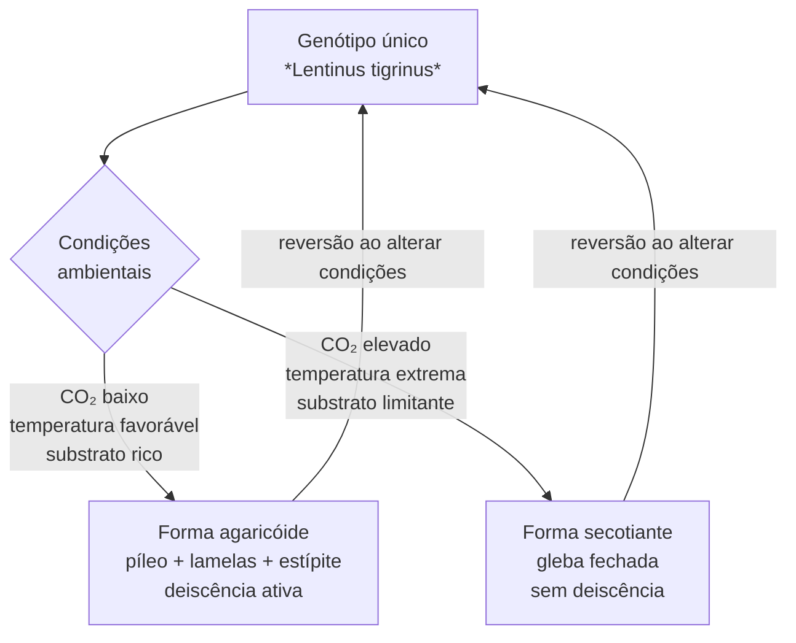

# Plasticidade morfológica e dimorfismo fenotípico

## Definição

Plasticidade fenotípica é a capacidade de um único genótipo produzir fenótipos distintos em resposta a condições ambientais diferentes. Em basidiomicetos, o caso paradigmático é o dimorfismo de *Lentinus tigrinus*: o mesmo isolado produz corpos frutificantes de forma agaricóide (píleo plano com lamelas expostas, esporos liberados por queda) ou de forma secotiante (gleba fechada sem deiscência, esporos retidos), dependendo das condições de cultivo.

## Modelo evo-devo: *Lentinus tigrinus*

## Por que é modelo evo-devo

- O dimorfismo é **reversível**: alterar as condições ambientais reverte o fenótipo, confirmando que a diferença não é genética
- Permite dissecar quais sinais (CO₂, temperatura, substrato) disparam cada estado morfogenético sem transformação genética
- Oferece janela para a transição evolutiva entre formas agaricóides e gasteromicetos (formas fechadas) — transição que ocorreu várias vezes independentemente em Basidiomycota
- O instrumento experimental é manipulação ambiental, não engenharia genética

## Variáveis moduladoras

| Variável | Efeito na morfologia |
|---|---|
| CO₂ > 0,1% | Favorece fechamento da gleba → forma secotiante |
| Temperatura extrema | Favorece forma secotiante |
| Substrato nutricionalmente limitante | Reduz desenvolvimento do píleo |
| Substrato lignocelulósico rico | Favorece forma agaricóide completa |

## Continuum com basidiomicetos cultivados

A resposta morfológica ao CO₂ em *L. tigrinus* não é um fenômeno binário restrito a espécies dimórficas — é o extremo de um continuum presente em basidiomicetos cultivados em geral. Em *Psilocybe cubensis*, CO₂ moderadamente alto durante a frutificação produz cogumelos com caule longo e píleo reduzido; CO₂ muito alto favorece crescimento micelial vegetativo com abortos. Essa é a mesma direção morfológica que CO₂ elevado empurra *L. tigrinus* em direção à forma secotiante — o fechamento progressivo do píleo e a retenção de esporos. A diferença é de grau, não de tipo. → [[CO2 como ponto de controle por fase de cultivo]]

## Relação com mecanossensibilidade

Os mesmos sinais ambientais (CO₂, rigidez mecânica do substrato) que afetam a morfologia da colônia em placa via via CWI → [[Mecanossensibilidade hifal]] — determinam a arquitetura do corpo frutificante. Isso conecta a biofísica hifal à morfologia macroscópica: a plasticidade observada no nível de colônia e a plasticidade observada no corpo frutificante compartilham mecanismos de transdução de sinal.

## Fronteira aberta

Quais genes de transcrição são diferencialmente expressos entre os dois estados morfológicos de *L. tigrinus*? Existe um comutador transcricional análogo ao que controla dimorfismo em fungos patogênicos (ex. *Candida*)? → [[Lacunas de evidência e protocolos de pesquisa]]

## Recall

Por que *Lentinus tigrinus* é modelo útil para evo-devo de basidiomicetos?
?
Porque exibe dimorfismo reversível — mesmo genótipo produz forma agaricóide ou secotiante dependendo de CO₂, temperatura e substrato — permitindo dissecar os sinais ambientais que controlam transições morfogenéticas sem manipulação genética. Modela transições evolutivas entre basidiomicetos agaricóides e gasteromicetos, ocorridas múltiplas vezes de forma independente em Basidiomycota.
