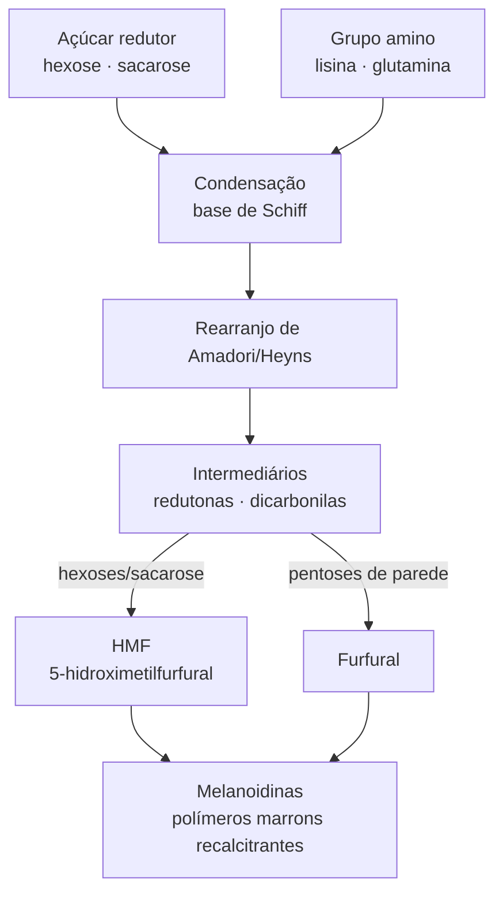

# Reação de Maillard em esterilização úmida de grãos

## Definição

O escurecimento não enzimático em grãos autoclavados é dominado pela Reação de Maillard (RM) e pela formação de intermediários furânicos — não pela caramelização clássica de forno seco, que exige baixa atividade de água, ausente em grãos hidratados. Em alta atividade de água, a RM produz melanoidinas, HMF e furfural como subprodutos de estágio intermediário e final.

## Fluxo da reação

## Mecanismo em três estágios

1. **Início:** açúcar redutor + grupo amino (N-terminal, lisina lateral) → condensação → base de Schiff → rearranjo de Amadori/Heyns
2. **Intermediários:** redutonas e compostos furânicos; HMF (5-hidroximetilfurfural) surge sobretudo da desidratação intramolecular de hexoses e da degradação de sacarose/frutose; furfural surge preferencialmente de pentoses liberadas de polissacarídeos de parede celular
3. **Estágio final:** polimerização → melanoidinas (fração polimérica marrom recalcitrante)

**Regra operacional:** hexoses e sacarose alimentam a via de HMF; pentoses alimentam a via de furfural.

## Comportamento por cereal na autoclavagem

**Trigo:** pool de sacarose/rafinose/frutanos + glutamina/prolina de gliadinas/gluteninas → substrato duplo para RM (açúcar + amino abundantes). Risco de "Maillard nutricionalmente custosa" quando binômio hidratação-tempo sai do ponto: consome lisina disponível (já limitante) e escurece o grão de forma irreversível.

**Sorgo:** pool de açúcares redutores mais baixo → menor substrato Maillard inicial. Entretanto, o calor promove reticulação kafirina-amido por pontes dissulfeto (mecanismo distinto da RM): o resultado não é mais escurecimento, mas maior "fechamento" da matriz → penaliza acessibilidade mecânica ao micélio, independentemente do escurecimento visual. Em cultivares pigmentadas, polifenóis mascararam a leitura de escurecimento: cor final não é indicador limpo de intensidade de Maillard.

## Por que autoclavagem ≠ torra ou caramelização

O interior do grão hidratado opera como sistema hidrotérmico de alta atividade de água. Nesse regime, o risco é RM moderada e desidratações locais em superfícies e fissuras ricas em solutos — não caramelização macroscópica. A carga de HMF em esterilização úmida bem conduzida deve ser substancialmente menor do que em crostas de pão ou grãos torrados.

## Parâmetros críticos

| Parâmetro | Efeito sobre RM |
|---|---|
| Hidratação excessiva | Dilui reagentes → RM menor, mas aumenta pegajosidade |
| Tempo prolongado acima do necessário | Acúmulo de melanoidinas; consumo de lisina |
| pH alto | Acelera RM |
| Temperatura de pico | Cinética aumenta ~3–5× a cada +10 °C |
| Fração de açúcares redutores exposta | Principal determinante da velocidade inicial |

## Aditivos que modulam pH

CaCO₃ (carbonato de cálcio, calcário): correção e estabilização de pH do grão — uso padrão em spawn labs (~0,5% base seca). CaSO₄ (gesso): condicionador físico antiaderente (~2% base seca), sem efeito direto na RM. → [[Composição química de cereais para spawn]]

## Fronteira aberta

Qual a carga quantificada de HMF e furfural em grãos de trigo e sorgo autoclavados a 121 °C/60 min? A literatura de spawn não fornece medições diretas; a comparação com produtos de panificação é inferencial. → [[Lacunas de evidência e protocolos de pesquisa]]

## Recall

Por que furfural e HMF são subprodutos distintos da RM e da degradação de açúcares em grãos?
?
HMF deriva principalmente da desidratação de hexoses (glicose, frutose) e da degradação de sacarose/frutose — portanto é indicador de processamento de açúcares hexosídicos. Furfural deriva preferencialmente de pentoses liberadas de polissacarídeos de parede celular (arabinose, xilose). Em grãos autoclavados, ambos podem coexistir, mas HMF domina quando a fração sacarose/hexoses do substrato é maior — o que favorece o trigo em relação ao sorgo.
