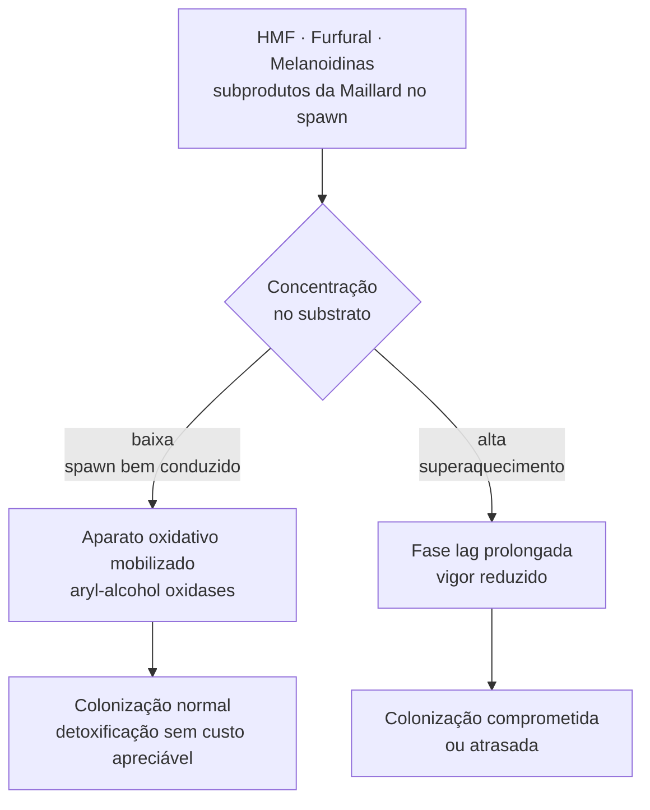

# Resposta micelial a subprodutos furânicos

## Definição

HMF (5-hidroximetilfurfural), furfural e melanoidinas são subprodutos da Reação de Maillard e da degradação térmica de açúcares que podem acumular em spawn de grãos durante a autoclavagem. Para o micélio de basidiomicetos, esses compostos atuam como estressores metabólicos potencialmente detoxificáveis — não como nutrientes nem como inibidores universais letais.

## Fluxo de resposta

## Capacidade de detoxificação em basidiomicetos ligninolíticos

Basidiomicetos ligninolíticos possuem repertório enzimático oxidativo que permite metabolizar compostos furânicos:

- *Pleurotus ostreatus*: expressa aryl-alcohol oxidases e álcool desidrogenases em resposta a HMF; detoxificação documentada
- *Trametes versicolor*: crescimento e metabolismo de açúcares mantidos com HMF + furfural em 0,2–0,6 g/L
- *Bjerkandera adusta* e white-rots em geral: conseguem descolorir e biodegradar melanoidinas

**Regra operacional:** furfural é mais inibitório do que HMF em concentrações equivalentes (sistemas fermentativos gerais); essa hierarquia vale como referência, mas dados diretos em spawn de basidiomicetos são escassos.

## O que "detoxificável" não significa

Ausência de inibição letal ≠ ausência de custo fisiológico. As consequências esperadas em concentrações intermediárias são:
- Extensão da fase lag (o micélio precisa mobilizar enzimas de detoxificação antes de retomar crescimento)
- Redução de vigor de colonização
- Sobrecarga do aparato oxidativo — custo que compete com recursos destinados à exploração do substrato

**Corolário crítico:** "mais escurecimento visual" não equivale a "mais alimento para o fungo". Não há evidência sólida de que melanoidinas geradas pela autoclavagem estimulem crescimento micelial em spawn. A leitura inversa — melanoidinas como estressores recalcitrantes — é a mais suportada pela literatura de biotratamento.

## Limite prático em spawn

| Condição do spawn | Risco fisiológico esperado |
|---|---|
| Grão íntegro, hidratação correta, tempo adequado | Carga furânica baixa; provavelmente sem efeito significativo na maioria das espécies ligninolíticas |
| Grão superaquecido localmente ou tempo excessivo | Acúmulo de HMF, furfural e melanoidinas; fase lag alongada, vigor reduzido |
| Grão supercozido (trigo) | Lisina consumida pela RM + pegajosidade → dupla penalidade: nutricional + física |
| Grão supercozido (sorgo) | Reticulação kafirina-amido → penalidade mecânica de acessibilidade, não necessariamente maior carga furânica |

## Diferença entre os cereais

- **Trigo mal processado:** penalidade via acúmulo de melanoidinas + consumo de aminoácidos (Maillard); carga furânica possivelmente maior pelo pool de hexoses/sacarose
- **Sorgo mal processado:** penalidade via fechamento mecânico da matriz proteína-amido; a carga furânica pode ser comparativamente menor, mas o substrato torna-se inacessível independentemente disso

⚠️ Dados de tolerância a furanos documentados principalmente em *Trametes* e *Pleurotus*. Transferência para *Lentinula*, *Grifola*, *Agaricus subrufescens* e outras espécies cultivadas é plausível mas não medida diretamente.

## Relação com o aparato ligninolítico

As aryl-alcohol oxidases e peroxidases envolvidas na detoxificação de HMF são as mesmas enzimas usadas na degradação de lignina e compostos recalcitrantes. Isso sugere que basidiomicetos ligninolíticos agressivos têm maior capacidade de lidar com furânicos — um possível fator de confusão em comparações espécie-específicas de desempenho em spawn. → [[Validade preditiva do cultivo em ágar]]

## Fronteira aberta

Qual o limiar de concentração de HMF e furfural que causa extensão da fase lag mensurável em *Pleurotus* ou *Lentinula* em spawn de grãos, em condições reais de cultivo (não laboratório)?→ [[Lacunas de evidência e protocolos de pesquisa]]

## Recall

Por que "mais escurecimento" no spawn de grãos não deve ser interpretado como substrato mais nutritivo para o fungo?
?
O escurecimento resulta da Reação de Maillard, que consome aminoácidos (especialmente lisina, já limitante em cereais) e produz melanoidinas — polímeros recalcitrantes que basidiomicetos white-rot podem degradar, mas com custo energético. Não há evidência de que melanoidinas estimulem crescimento. Ao contrário: em biotratamento, melanoidinas são tratadas como estressores que fungos como *Bjerkandera* são capazes de biodegradar — o que é diferente de serem nutrientes.
