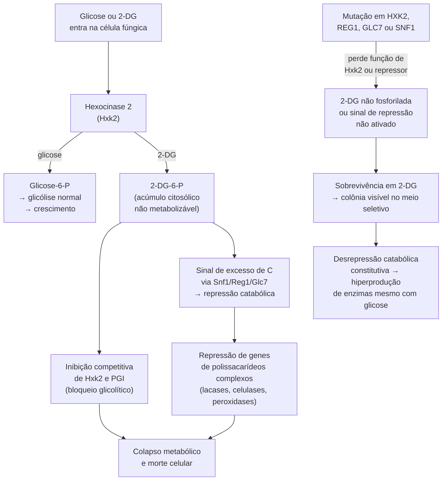

# Triagem de mutantes por 2-desoxiglicose

## Definição

A triagem por 2-desoxiglicose (2-DG) é um método de seleção fisiológica que isola, de uma população pós-mutagênese, fungos com mutações que desreprimem o catabolismo de carbono. Colônias que crescem em meio suplementado com 2-DG são candidatas a hiperprodutoras de enzimas lignocelulolíticas — fenótipo de alto valor biotecnológico em cultivos de *Pleurotus ostreatus*.

## Mecanismo de toxicidade da 2-DG

A 2-DG é análogo estrutural da glicose que entra nas células fúngicas pelos mesmos transportadores de hexose e é fosforilada pela hexocinase 2 (Hxk2) a 2-DG-6-fosfato (2-DG-6-P). Esse intermediário não pode prosseguir na via glicolítica e acumula-se no citoplasma, onde produz toxicidade por três mecanismos paralelos:

## Genes responsáveis pela resistência à 2-DG

| Gene | Função na célula | Mecanismo de resistência por perda de função |
|---|---|---|
| *HXK2* | Hexocinase 2 — fosforila glicose e 2-DG | 2-DG não é fosforilada → 2-DG-6-P não acumula → sem toxicidade |
| *REG1* | Regulador da fosfatase Glc7 na via Snf1 | Desinibe Snf1 constitutivamente → desrepressão catabólica permanente |
| *GLC7* | Fosfatase de proteínas serina/treonina | Altera o estado de fosforilação de Snf1 → modifica a resposta ao carbono |
| *SNF1* | Quinase ativada por AMP (homóloga a AMPK) | Constitutivamente ativa → desrepressão constitutiva do metabolismo de carbono alternativo |

## Protocolo de triagem em *Pleurotus ostreatus*

1. Plaquear os sobreviventes da mutagênese UV (pós-irradiação à dose de 90–95% mortalidade) em meio sólido PDA + amido + **2-DG a 0,01 g/L**.
2. Incubar em condições padrão de crescimento para *P. ostreatus*.
3. Identificar colônias com crescimento radial (ur) superior ao controle selvagem — o crescimento rápido indica resistência à repressão metabólica induzida pela 2-DG.
4. Isolar e confirmar os fenótipos de interesse antes de prosseguir para a estabilização genética:

| Fenótipo selecionado | Método de confirmação |
|---|---|
| Hiperprodução de enzimas (insensível à repressão catabólica por glicose) | Ensaio de atividade enzimática em meio com glicose + substrato (ex.: guaiacol para lacase) |
| Excreção eficiente de lacase extracelular | Alta atividade extracelular no sobrenadante + baixa atividade intracelular |
| Aumento de biomassa e taxa de colonização | ur superior ao selvagem em substrato lignocelulolítico; peso seco do micélio |
| Produtividade em corpo frutífero | Teste piloto em substrato de palha de trigo — indicador final de viabilidade comercial |

## Fenótipos biotecnológicos documentados

Mutantes de *P. ostreatus* estáveis em 2-DG apresentam:
- **Desrepressão catabólica:** secretam lacases, celulases e peroxidases mesmo na presença de glicose — eliminando a necessidade de regime de carbono restrito nos cultivos.
- **Excreção eficiente de lacase:** alta atividade enzimática extracelular; aceleração da degradação da lignina no substrato.
- **Aumento de biomassa:** velocidade de crescimento radial ur superior; incremento de até **3× no teor de proteína** do micélio.
- **Produtividade comercial:** até **2× a produtividade** em cultivos de palha de trigo em relação à linhagem parental selvagem.

## Relação com enzimas lignocelulolíticas

O fenótipo de hiperprodução enzimática obtido pela seleção em 2-DG é a manifestação direta do desacoplamento entre a disponibilidade de carbono simples (glicose) e a repressão dos genes de degradação de polissacarídeos complexos. Lacases, peroxidases de manganês e celulases são reguladas negativamente pela repressão catabólica em linhagens selvagens — e constitutivamente expressas em mutantes 2-DG-resistentes. → [[Enzimas lignocelulolíticas]]

## Limitação do método: triagem direta vs. triagem reversa

A triagem por 2-DG é uma abordagem de **genética direta** (ou "forward genetics"): seleciona-se um fenótipo (resistência ao análogo tóxico) sem conhecimento prévio do gene mutado. Essa vantagem — não exige genômica — é acompanhada de uma limitação: o espectro de fenótipos selecionados é restrito à via metabólica afetada (repressão catabólica de carbono). Mutações benéficas em outras vias (parede celular, resistência a estresse, metabolismo do nitrogênio) não são capturadas. Complementar com [[Mutagênese UV em basidiomicetos#TILLING]] quando o alvo é um gene específico.

## Fronteira aberta

A base genética da resistência à 2-DG em basidiomicetos é muito menos caracterizada do que em *Saccharomyces cerevisiae*, onde os loci *HXK2*, *REG1* e *SNF1* foram funcionalmente validados por análise epistática e complementação. Em *P. ostreatus* e *L. edodes*, os ortólogos fúngicos desses genes foram preditos por bioinformática mas ainda não foram individualmente confirmados por perda de função direcionada. A interpretação mecanística dos mutantes 2-DG-resistentes em basidiomicetos baseia-se em transferência de conhecimento de leveduras. → [[Mutagênese UV em basidiomicetos#Fronteira aberta]]

## Recall

Por que mutantes resistentes à 2-DG tendem a hiperproduzir enzimas lignocelulolíticas?
?
A 2-DG induz repressão catabólica ao acumular 2-DG-6-P, que sinaliza excesso de carbono simples via Snf1/Reg1/Glc7 e reprime genes de degradação de polissacarídeos complexos (incluindo lacases e outras lignocelulases). Mutantes com perda de função em HXK2 (não fosforila 2-DG) ou em reguladores da via Snf1 (Reg1, Glc7) não recebem esse sinal de repressão — expressando constitutivamente as enzimas de degradação mesmo sob disponibilidade de carbono simples.

Qual a concentração de 2-DG usada na triagem de *Pleurotus ostreatus* e por que ela é baixa?
?
0,01 g/L em meio sólido PDA + amido. A concentração é baixa porque o fungo é intrinsecamente mais sensível à 2-DG do que bactérias ou leveduras — concentrações mais altas eliminam também os mutantes resistentes de interesse, reduzindo a eficiência da triagem. A adição de amido como fonte de carbono complexo mimetiza o substrato lignocelulolítico e favorece a expressão das enzimas de interesse nas colônias resistentes.
